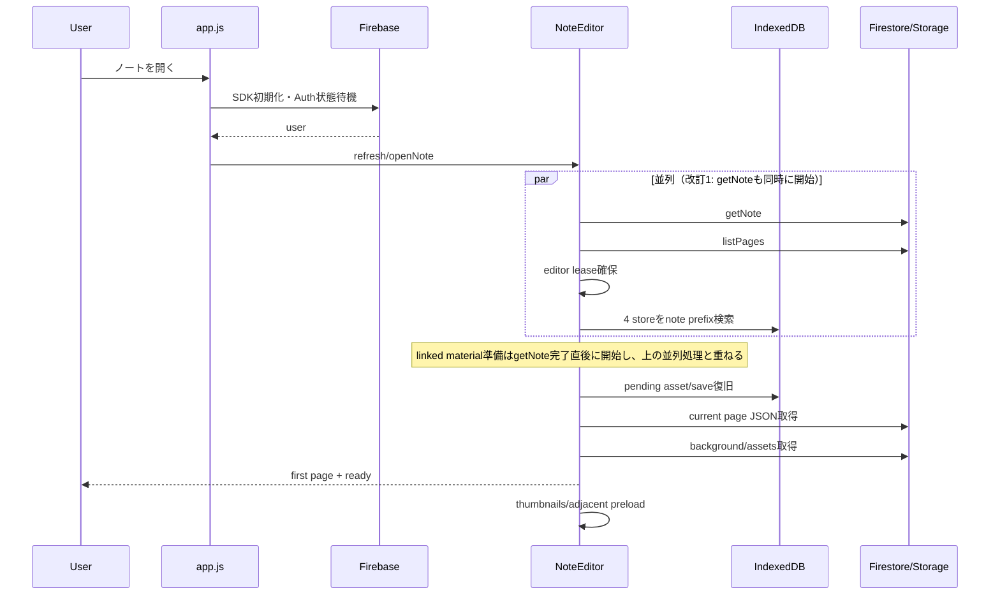
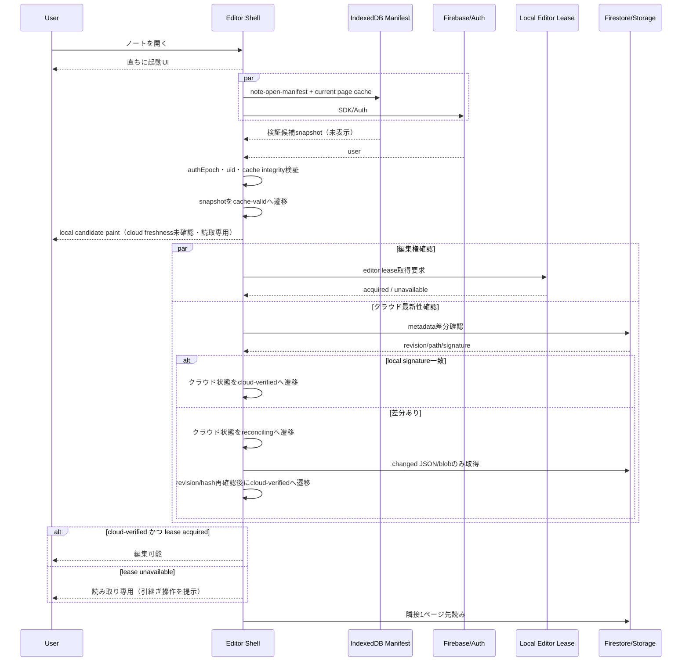
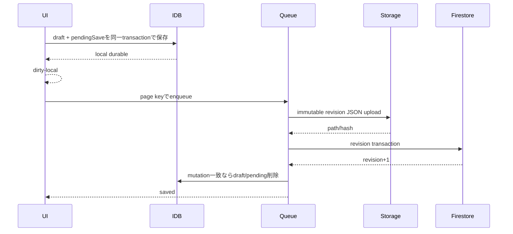

# Dental QA App 学習ノート機能 仕様書・詳細設計書

## 0. 文書情報

| 項目 | 内容 |
|---|---|
| 文書名 | Dental QA App 学習ノート機能 仕様書・詳細設計書 |
| 対象リポジトリ | `/Users/sakin/dev/dental-qa-app` |
| 調査基準HEAD | `e8c4f8e95e6401d722fa5e1dcb035ec044f583b1` |
| 改訂1 | 2026-09-28。不具合修正と水平展開、CRUD高速化、テキスト描画の修正を実装し本文へ反映（コミット`7315b12`、変更一覧は付録C） |
| 改訂2 | 2026-09-28。iPad実機確認で見つかったStorageのCORS設定漏れとApple Pencilのstroke欠落（Scribble）を修正（付録D） |
| 改訂3 | 2026-09-29。iPad実機で連続して書くと途中からstrokeが欠ける不具合と、筆跡のブレを修正（付録E） |
| 改訂4 | 2026-09-29。スキャナーで読み込んだPDFからPDFノートを作成できないことがある不具合を修正。PDF作成タブの表示を選んだ作成方法だけにし、編集タブ上部の案内表示を削除（付録F） |
| 改訂5 | 2026-09-29。改訂4の公開直後、一覧からノートを開くと「ログイン状態を確認中」のまま読み込みが終わらない不具合を修正。起動が進まないときと起動処理で例外が起きたときに、再読み込みなどの操作を表示する（付録G） |
| 改訂6 | 2026-09-29。スキャンしたPDFからのノート作成を、画質を変えずに高速化（ページ画像の並行変換、保存先記録の一括化、同時アップロード。付録H） |
| 改訂7 | 2026-09-29。改訂6の並行変換で、iPadでPDFノートの作成が途中で落ちる不具合を修正。画像化を1ページずつに戻し、保存先記録の一括化と同時アップロードは残す（付録I） |
| 改訂8 | 2026-09-30。白黒のページを含むスキャンPDF（56.3MB）で、改訂7でもPDFノートの作成が途中で落ちる不具合を修正。白黒ページ（1ビット・1200dpi）を少しずつ展開しながら縮小して描き、PDF全体の複製をメモリに持たないようにした。作成中にタブが終了した場合は、次に開いたPDF作成画面で止まったページを案内する（付録J） |
| 改訂9 | 2026-09-30。ノートのマスクの見た目を暗記学習と同じにし、ズームしても線を細いままにした。ピンチで指の位置を中心に拡大されない不具合、指のスワイプでページを送りにくい問題、ノートを開くと上部に「〜pxずれています」と出る不具合を修正（付録K） |
| 改訂10 | 2026-10-06。「ノート一覧へ戻る」で保存してから編集タブを閉じるようにした。指の移動・ピンチの感覚を暗記学習に合わせ（離した後の慣性、暗記モードとページの外側での移動、ピンチ後に残した指での移動）、2本指タップでペンと消しゴムを切り替えられるようにした（Apple Pencilのダブルタップの代わり）。教材連携ノート・マスクの多いノートを開く・編集する処理を、画質を変えずに高速化した（付録L） |
| 改訂11 | 2026-10-06。iPadで2本指タップが効かない不具合を修正。iPadのSafariは指の接触の大きさを半径の2倍（指先でも約40px以上）で報告し、34px以上を手のひらとみなす判定が全ての指を手のひら扱いしていた。2本指タップは大きさを見ずPencil使用中・直後だけを除き、2本指のダブルタップは1回分の切替にした。手のひらの基準を100pxへ改め、指での移動・マスクのタップ・ページの外側での移動・ピンチもiPadの指で働くようにした（付録M） |
| 改訂12 | 2026-10-07。テキストの選択枠・当たり判定を書いた文字の範囲に合わせ、すぐ横に別のテキストを書けるようにした。テキストを書いている途中で、続きの文字や選んだ文字の色を変えられるようにした（1つのテキストの中で色を混在）。選択枠の右上の斜め外に移動用の取手を付け、小さな項目・複数選択・複数のマスクをまとめて移動できるようにした（付録N） |
| 改訂13 | 2026-10-07。改訂12を公開した後、iPadで「何も改善されていない」状態になった。公開サイトには改訂12が出ており、iPadが取得済みの前版のJS・CSSを使い続けていたと判断した。JS・CSSを内容の版付きURL（import map）で読み込み、公開後にノートを開けば必ずその版が動くようにした。入力設定にアプリの版を表示した（付録O） |
| 作成日 | 2026-09-28 |
| 対象クライアント | iPad Safari、Desktop Safari／Chrome、ホーム画面追加版 |
| 本番配信 | GitHub Pages |
| バックエンド | Firebase Authentication、Firestore、Storage |
| ローカル検証 | Firebase Local Emulator Suite、project ID `demo-dental-qa` |
| 文書状態 | 設計ドラフト（改訂13）。現行実装の監査結果と目標仕様を分離して記載したもので、受入値の合意や全項目の実装済みを意味しない。「改訂1」〜「改訂13」と明記した記述は、各改訂のコミットで実装済みの事実を表す |
| 今回の検証 | 改訂1: `npm run check`、unit、Rules、E2E（未認証・認証）をLinux Chromium＋`demo-dental-qa` Emulatorで実行し成功（結果は付録C.6）。改訂3の結果は付録E.1、改訂4は付録F.1、改訂5は付録G.1、改訂6は付録H.2、改訂7は付録I.2、改訂8は付録J.2、改訂9は付録K.2、改訂10は付録L.2、改訂11は付録M.2、改訂12は付録N.2、改訂13は付録O.2。WebKit（iPad Portrait／Landscape）プロジェクトは未実行、iPad実機での改訂4・改訂5・改訂7〜改訂13の確認は未実施 |

> **最重要事項**
> 2026-09-28時点で、GitHub Pages上のiPad実機における「ノートを開いてから操作可能になるまでの時間」は、利用者が改善を体感できていない。自動テストが成功しても、それだけで実機の性能達成を意味しない。本書では読込遅延を未解決のP0として扱い、実測値が受入基準を満たすまで「改善済み」と判定しない。

---

## 1. 目的

本書は、Dental QA Appの学習ノート機能について、次を一つの基準へ統合する。

1. 利用者から見た機能仕様
2. 画面・操作・エラー時動作
3. Firestore、Storage、IndexedDBのデータ設計
4. ノート起動、描画、保存、復旧、PDF出力の内部設計
5. iPad SafariおよびApple Pencil固有の設計制約
6. 性能・可用性・セキュリティ要件
7. 自動テストとiPad実機受入テストの合格基準
8. 現行実装と目標設計の差分

本書を、今後の修正、コードレビュー、受入テスト、リリース可否判断の共通基準とする。

## 2. 適用範囲

### 2.1 対象

- 学習ノート一覧
- 白紙ノート、横罫線ノート、PDFノート、教材連携ノート
- 専用ノート編集タブ
- ペン、蛍光ペン、消しゴム
- 図形、直線、矢印、テキスト、画像
- 選択、投げ縄、移動、拡大縮小、回転、トリミング
- ノート専用暗記マスクと教材由来マスク
- Undo／Redo
- ページ追加、複製、削除、並び替え、ページ移動
- 保存、オフライン下書き、競合、編集タブロック、復旧コピー
- PDF書き出し
- Emulatorを用いるローカル確認
- 起動性能、入力性能、診断情報

### 2.2 対象外

- 問題管理機能そのもの
- 画像教材管理機能そのもの
- Firebase Hostingへの移行
- Apple Pencilの傾き・側面描画
- Safariが公開していないApple Pencil軸ダブルタップ専用イベント（代わりに2本指タップでクイック切替を行う。9.8節、改訂10）
- 本番データを使う自動テスト

## 3. 状態の表記

本書では、実装状況を次の4種類に分ける。

| 表記 | 意味 |
|---|---|
| 実装済み・自動検証済み | 現行コードに存在し、対応する自動テストがある |
| 実装済み・実機確認要 | 現行コードに存在するが、iPad実機での合否が必要 |
| 既知不具合 | 現行コードまたは実機で不具合が確認されている |
| 目標設計 | 今後の修正で満たすべき仕様 |

自動テストの成功、Emulator上の成功、iPad実機の成功は別の判定とし、相互に代用しない。本文で「現行」と書く場合は調査基準HEADの事実、「目標」と書く場合は未実装を含むTo-Be設計を表す。

### 3.1 章ごとの位置付け

| 領域 | 現行の位置付け | 本書での扱い |
|---|---|---|
| ノート一覧・作成・編集・PDF | 実装あり | 機能仕様と回帰条件を定義 |
| 保存queue・競合・編集lease | 実装あり | 不変revision、冪等再送、復旧の目標を追加 |
| `note-open-manifest`・`cache-valid` snapshot | 未実装 | 読込P0に対する目標設計 |
| command型Undo | 未実装または部分実装 | 入力hot pathから全ページcloneを外す目標設計 |
| `startupDebug=1`による安全な本番観測 | 未実装 | 実機P95判定の前提工程 |
| 読込性能 | 実機で未達または未立証 | P0の既知不具合 |
| テキスト入力と確定表示の一致 | 改訂1で実装・Chromiumで自動検証済み、iPad実機確認要 | 9.5節と25.5節の規則を回帰条件とする |

---

# Part I 機能仕様

## 4. 利用者と利用環境

### 4.1 利用者

- 歯科分野の学習者
- iPadとApple Pencilを用いてPDF教材へ書き込む利用者
- PCで教材・ノートを整理する利用者

### 4.2 利用環境

| 環境 | 用途 | 接続先 |
|---|---|---|
| GitHub Pages | 本番利用 | 本番Firebase |
| Mac／PC localhost | 開発確認 | `demo-dental-qa` Emulator |
| Mac LAN + iPad | iPad実機受入 | `demo-dental-qa` Emulator |

`?firebaseEmulator=1`が指定された場合はAuth、Firestore、Storageの全てをEmulatorへ接続し、一つでも接続確認に失敗した場合はクラウド操作を停止する。本番Firebaseへフォールバックしてはならない。

Firestore Emulatorの接続確認は、ルートへの`no-cors`到達確認で行う（改訂1）。以前の`ruleCoverage`取得は長時間の検証後に集計へ数秒以上かかり、正常なEmulatorを停止中と誤判定してエディタ起動を`fatal-error`にしていた。

## 5. 画面構成

### 5.1 メイン画面

メイン画面は次を提供する。

- 学習ノート一覧
- 新規ノート作成入口
- ノートカードからの編集開始
- 削除済み／作成失敗ノートの復旧操作
- ノートの保存状態、競合状態、ページ数、マスク数、最終編集日時、先頭ページサムネイル

### 5.2 専用ノート編集画面

ノート編集は原則として専用タブで開く。

```text
固定上部バー
├─ ノート一覧へ戻る
├─ ノート名
├─ ページ番号
├─ Undo / Redo
├─ 編集 / 暗記モード
├─ 保存状態
└─ PDF書き出し

編集領域
├─ 表示切替可能なページ一覧
└─ ニュートラルグレーの作業領域
   └─ 中央の用紙

画面端
└─ 上下左右へドッキング可能なツールパレット
```

「ノート一覧へ戻る」（左上の←と、保存状態のポップオーバーのボタン）は、ノート名・ページ構成の変更とページ内容の保存を確定してから、編集タブを閉じる（改訂10）。編集タブはノート一覧のタブから開くため、閉じると一覧のタブへ戻る。ブラウザがページからタブを閉じさせない場合（ブックマークから直接開いたタブなど）は、0.3秒後にそのタブでノート一覧を表示する。改訂9までは、編集タブの中でノート一覧へ移動していたため、一覧のタブと合わせて一覧が2つ残った。ノートの削除、起動画面・競合表示の「ノート一覧へ戻る」、PDF作成タブの「戻る」も同じくタブを閉じる。

専用URLは次の形式とする。

```text
/?noteEditor=1&noteId={NOTE_ID}&editorTabId={TAB_ID}
```

一覧が教材連携ノートと分かっているノートを開くときは`&material=1`を付け、編集タブはノートの情報と並行して教材の情報を読む（23.5.1節、改訂10）。

Emulator利用時は次を引き継ぐ。

```text
firebaseEmulator=1
emulatorHost={MAC_LAN_IP}
```

## 6. ノート一覧

### 6.1 表示項目

各ノートカードに次を表示する。

- 実際の先頭ページを使った軽量サムネイル
- ノート名
- ノート種別
- ページ数
- 最終編集日時
- 保存状態
- 競合状態
- マスク数

サムネイルはキャッシュを利用し、一覧表示のたびに全ページを高解像度描画しない。生成失敗時のみ種別ラベルへフォールバックする。

改訂1: ノートルートの`updatedAt`がキャッシュ時と一致し、端末内に未同期の下書き・保存待ち・未送信画像がない場合は、IndexedDB `thumbnails`ストアの一覧サムネイル索引（kind `note-card-thumbnail-index`）から表示し、ページ一覧とページJSONの取得を省略する。教材連携ページは教材の画像とマスクの識別子も一致を確認する。ページ内容の保存、ページ背景・種別の変更、並び替え、追加、削除はいずれもノートルートの`updatedAt`を更新する。

### 6.1.1 編集タブでの変更の反映（改訂10）

編集タブは、ノートを閉じる・削除する・名前を変える・複製する、PDF作成タブがノートを作成し終える時点で、同じブラウザの一覧タブへ変更を知らせる（`BroadcastChannel`「`dental-qa-notes`」、メッセージ`{ type: "note-changed", uid, noteId }`）。一覧タブは、同じユーザーの知らせを受けると一覧を読み込み直す。一覧タブが裏にある間（別のタブが前面、またはノート以外の画面を表示中）は読み込まず、一覧が表示された時点で1回読み込む。改訂9までは、編集タブで変えた名前やマスク数は、一覧を手動で開き直すまで古いままだった。

一覧から新しいノート（白紙・横罫線・教材・PDF）を別のタブで開いたあと、一覧のタブは作成画面ではなくノート一覧を表示する。編集タブを閉じたときに一覧へ戻るためである。このとき一覧の読み込みは、一覧のタブが前面に戻るまで行わない（iPadのSafariでは、開いたタブと一覧のタブが同じ処理スレッドで動くことがあり、編集タブの起動を先にする）。一覧のカードのサムネイル生成も、一覧のタブが裏にある間は止める。

同時に要求された一覧の読み込み（ノートの画面を開いたときに2回要求されていた）は、1回の読み込みにまとめる。

### 6.2 一覧対象

- `status`が未設定または`ready`で、`deletedAt`がないノートだけを通常一覧へ表示する。
- `creating`、`failed`、`deleting`は通常一覧へ表示しない。
- 復旧可能な失敗ノートは、専用の復旧導線から再試行または削除できる。
- 最終編集日時の新しい順に並べる。比較はタイムスタンプの数値で行う（改訂1で、日付文字列の辞書順比較により曜日名順に並ぶ不具合を修正）。

## 7. ノート作成

### 7.1 ノート種別

| 種別 | `type` | 初期ページ |
|---|---|---|
| 白紙 | `standalone` | 白紙1ページ |
| 横罫線 | `standalone` | 横罫線1ページ |
| PDF | `pdf-imported` | PDF各ページを画像化したページ |
| 教材連携 | `material-linked` | 教材ページと対応するページ |

### 7.2 failure-atomicな段階作成

FirestoreとStorageを跨ぐ厳密なatomic transactionではない。すべての必須ページが完成するまで外部公開を`ready`にせず、失敗時は補償削除するfailure-atomicな段階処理とする。全種別で次の状態遷移を用いる。

```text
creating
  ↓ 全ページ作成成功
ready

creating
  ↓ 途中失敗
failed
```

作成途中に失敗した場合は次を行う。

1. `ready`へ変更しない。
2. 作成済みページを補償削除する。
3. 作成済みStorageファイルを補償削除する。
4. 削除に失敗したパスをクリーンアップ待ちキューへ記録する。
5. `failedPageIds`、`orphanedPaths`、`errorPhase`、`errorMessage`を記録する。
6. 利用者へ再試行または削除を提示する。

### 7.3 PDFノート作成

Safariのポップアップ制限を回避するため、「PDFから作成」を直接タップした同期処理内で編集タブを開き、そのタブ内でPDF選択、変換、作成、編集へ遷移する。非同期変換後に新しい`window.open()`を実行しない。

新規タブを開けない場合は同一タブへ遷移し、Safari設定変更を必須にしない。

PDF作成タブ（`?noteEditor=1&create=pdf`）には、見出し「PDFからノートを作成」、ノート名、「PDFファイルを選択」だけを表示する。白紙・横罫線・既存教材からの作成は一覧画面の選択肢であり、PDF作成タブには出さない（改訂4）。

#### 7.3.1 PDFページの画像化（改訂4）

各ページを1枚のJPEG（品質0.92）にして、ノート専用Storageへ保存する（`js/core/pdf-converter.js`）。

| 項目 | 規則 |
|---|---|
| 解像度 | 幅約2200px（1.8〜3.2倍）。ただし1ページ1,000万画素以内に抑える。iPad SafariはCanvasが約1,677万画素を超えると画像化できないため、1pt＝1pxの大判ページ（例: iPhone／iPadの書類スキャンで3933×2667pt）も上限内で描く |
| スキャンページ | ページ全面のJPEG画像1枚と、不可視のOCR文字（描画モード3）だけのページは、pdf.jsを使わず埋込みJPEGをブラウザのデコーダで直接描く（`js/core/pdf-scanned-page.js`）。ページ上の位置・回転・CropBox・矩形clipはPDFのとおりに再現する。Annots、可視の文字、線・塗り、グラフィック状態辞書、オプションコンテンツ、マスク付き画像、EXIF回転、CMYKなどを含むページはpdf.jsで描く |
| 白黒ページ（改訂8） | スキャナーは白黒のページを、1ビットのグレー画像（FlateDecode）として最大1200dpi（A4で約9,800×14,000px、約1億3,800万画素）で保存する。pdf.jsはこれを1画素4バイトへ展開してから縮小するため、1ページで500MBを超え、iPadではタブが終了していた。この画像だけのページ（不可視のOCR文字は可）は、圧縮された行をブラウザ（DecompressionStream）で少しずつ展開しながら、出力画素の下の白の面積の割合（面積平均）でページ画像の大きさへ縮小して描く（`js/core/pdf-bilevel-image.js`）。全画素を展開した画像は作らない。DecompressionStreamのないSafari（16.4より前）と、ブラウザが受け付けない圧縮データ（末尾のチェックサムの誤りなど）は、pdf-libの展開処理で同じように描く。縮小用のCanvasは1,600万画素以内にする。Decode配列`[1 0]`（白黒の反転）に対応する。予測子（DecodeParms）付き、CCITTFax、JBIG2の白黒画像はpdf.jsで描く |
| pdf.jsの画像 | 1,677万画素を超える埋込み画像は、pdf.jsのworkerで縮小してから描画する（`canvasMaxAreaInBytes`） |
| 失敗時 | 描画またはJPEG化に失敗したページは、文書のキャッシュを解放して待ったうえで、0.75倍、0.5倍の解像度で再試行する。3回とも失敗した場合だけ、ページ番号と対処（ほかのタブやアプリを閉じる）を示して作成を中止し、作成途中のページとファイルを補償削除する |
| 変換の順序（改訂7） | スキャンページを含め、ページは本体で1ページずつ画像化する。デコードしたスキャン画像（600dpiのA4で約138MB）を同時に2ページ分持たない。改訂6で2つのworkerによる2ページ並行の画像化を入れたところ、iPadで作成が途中で落ちたため取り消した（付録I） |
| メモリ（改訂8） | PDFファイル全体は、スキャンページの画像の位置を調べるために1回だけ読み（pdf-libで解析。ストリームはそのバッファを参照し、複製しない）、ページを描く前に解放する。スキャンページの画像は、描くときにファイル内の位置から読む（`File.slice()`）。pdf.jsには、必要な範囲だけを1MB単位でファイルから読ませる（`PDFDataRangeTransport`、自動の先読みなし）。改訂7までは、pdf.jsとpdf-libがそれぞれPDF全体の複製を持っていた |
| 中断の案内（改訂8） | 作成中は、PDF作成タブごと（URLの`creationSessionId`）に、ファイル名と変換中のページ番号を端末（localStorage、キー`dentalQaPdfCreationProgress:<creationSessionId>`）へ記録する。作成が終わる（成功・失敗・キャンセル）か、タブを離れる（`pagehide`）と消す。メモリ不足などでタブが終了し、Safariがそのタブを再読み込みした場合は、PDF作成画面に「前回のPDFノート作成は、「ファイル名」の41ページ中18ページ目の変換中に終了しました。…」と1回だけ表示する（`js/core/pdf-creation-progress.js`）。別のユーザーの記録は表示せず、1日より古い記録は消す |
| アップロード | ページ画像は最大3枚を同時にアップロードし、その間に後続のページを画像化する。変換済みでアップロードを待つページ画像は最大2枚。保存先のパスは、ページ数が分かった時点で全ページ分を1回の書込みでノートの`pendingStoragePaths`へ記録する（改訂6。改訂5までは1ページごとにノートの読込みと書込みを1回ずつ行っていた）。作成に失敗した場合は、アップロードを始めたすべてのパス（失敗した要求を含む）を削除する。Firebase Emulatorに対しては、その不具合（付録H）のため同時アップロードを1件にする |
| 先読み（改訂6） | PDF作成タブを開いた時点で、pdf.jsとpdf-libの読込みを始める |

スキャンページの直接描画は、pdf.jsがJavaScriptで行うJPEGの全画素デコードと、縮小のための再符号化を避けるためのものである。600dpiのA4スキャン（約3,450万画素）では、pdf.jsの処理だけで1ページ数百MBを使い、iPadではページ画像のCanvasを確保できなくなっていた（付録F）。

## 8. ノート起動

### 8.1 起動状態

エディタ起動は次の状態を持つ。

```text
initializing
checking-emulator
authenticating
acquiring-editor-lock
loading-note-metadata
loading-pages
loading-content
reconciling-local-draft
loading-assets
ready
recoverable-error
fatal-error
```

`ready`になるまで、灰色背景だけを表示してはならない。現在の処理、8秒超過時の遅延案内、復旧操作を表示する。

同じ状態が8秒を超えて続いた場合は、遅延案内とあわせて、実行中の起動処理と競合しない操作（ページを再読み込み、ノート一覧へ戻る、診断情報をコピー）を表示する。再試行や端末内下書きからの復元など、起動処理をもう一度始める操作は出さない。ログイン状態を画面へ反映する処理で例外が起きた場合は、編集をロックしたまま`fatal-error`とし、再読み込みを案内する（改訂5）。

### 8.2 復旧可能エラー

次の失敗は`recoverable-error`とする。

- ページJSON取得失敗
- 背景画像取得失敗
- IndexedDB下書き読込失敗
- 編集ロック取得失敗
- Emulator切断
- revision不整合
- 復元コピーの不整合

表示操作は次の通り。

- 再試行
- ページを再読み込み（改訂5）
- 端末内下書きから復元
- クラウド版を開く
- 読み取り専用で開く
- ノート一覧へ戻る
- 診断情報をコピー
- 診断情報をダウンロード

### 8.3 認証・キャッシュ検証gate（目標設計）

- 起動shellとIndexedDBの読込みはAuth待ちと並行できるが、ノート名、本文、背景、注釈、assetはAuth確定後かつ`manifest.uid === auth.uid`の場合だけ表示する。
- Auth確定前は機密情報を含まないshellとskeletonのみを表示する。既存の`authEpoch`、`isSyncSessionCurrent()`、`assertUserSession()`の同一世代検証をmanifestにも適用し、独立した別の認証世代を作らない。
- Authとuid一致後、cache整合性検証を通過した`cache-valid` snapshotは表示に使えるが、これはクラウド最新性の確認を意味しない。編集を開放するにはクラウド最新性の確認とローカルleaseの取得が別々に必要である。
- クラウド再検証は2秒を目安とし、`cloud-verified`（クラウドのrevision/hash一致）、`reconciling`（差分取得中）、`offline-local`（検証不能・端末内保存）を区別する。ローカルcacheの状態は`cache-valid`に固定し、クラウド最新性の状態名と混同しない。
- `offline-local`で編集する条件は、Auth済み、uid一致、ローカルlease取得済み、さらに端末下書きを耐久化できることとする。
- 再検証要求ごとに`verificationGeneration`、ローカル変更ごとに`localMutationGeneration`を持つ。timeout後に到着した古い応答は直接適用せず、世代一致を再確認し、dirtyなら直列reconcile queueへ送る。
- pending mutationが0、ローカルとクラウドのrevision/hashが一致した後だけ`saved`へ遷移する。遅延応答で新しい内容を上書きしない。


### 8.4 公開直後の版ずれ（改訂5）

GitHub Pagesは全ファイルを`Cache-Control: max-age=600`で配信するため、ブラウザは取得から最大10分間、JS・CSSをキャッシュから使う。専用エディタのURLは開くたびに`editorTabId`が変わるため、HTMLは毎回サーバーから取得される。このため公開直後は、新しいHTMLと前版のJS・CSSが同じタブで動くことがある。キャッシュに残った古いHTMLと新しいJS・CSSが組み合わさることもある。

- HTMLから要素を削除・改名するときは、前版のJSが存在を確認せずに参照する要素を、表示しない互換要素（`hidden`属性と`style="display:none"`を付け、クラスは付けない）として残す。現行の互換要素は`#pdfLockBanner`（改訂3以前の`app.js`がログイン状態の反映ごとに更新する）である。
- JSは、新しく追加した要素がない古いHTMLでも起動を止めない。
- ログイン状態の反映で例外が起きても、起動画面を読み込み中のまま止めない（8.1節）。
- HTMLの要素を削除・改名する改訂では、新しいHTMLと前版のJS・CSS、前版のHTMLと新しいJS・CSSの両方の組合せで既存ノートを開けることを確認する（方法は付録G.1）。

改訂13から、`index.html`はJS・CSSを内容の版付きURL（`?v=`＋内容のSHA-256の先頭10文字）で読み込む。CSSと入口の`js/app.js`は`index.html`に直接書き、ほかのモジュールは`<script type="importmap">`で版付きURLへ置き換える（相対`import`も解決後のURLで置き換わる）。内容が変わったファイルだけURLが変わり、どのキャッシュにもないため、そのHTMLを読んだタブは必ずその版のJS・CSSを使う。専用エディタのHTMLはタブごとに新しいURLで取得されるため、公開後にノートを開けば公開した版が動く。一覧のタブのHTMLは最大10分前のものが使われることがあるが、そのHTMLが指す版の組合せで動き、前版と新版のモジュールが混ざることはない。

- JS・CSSを変更したら`npm run stamp`で`index.html`の版を書き換える。`npm run check`は、版が古いファイル、import mapにないモジュール、存在しないファイルの指定を検出して失敗する（`scripts/lib/asset-versions.mjs`）。
- 版の全体（ビルドID）は`<meta name="app-build">`に書き、編集画面の「入力設定」の最下部に「アプリの版」として表示する。iPadで新しい版が届いているかを確かめるのに使う。
- import mapに対応しないブラウザ（Safari 16.3以前）は版の付かないURLで読み込み、改訂12までと同じく動く。

## 9. 編集ツール

### 9.1 共通規則

- 操作領域は44×44 CSS px以上とする。
- ツールは独自SVGアイコン、`aria-label`、`title`、ツールチップを持つ。
- 一時UIは同時に一種類だけ表示する。
- 別ツールへ切り替えると、前ツールの設定、選択枠、コンテキストメニュー、ポインターキャプチャ、一時プレビューを閉じる。
- 設定パネルの開閉状態は永続化しない。
- ペン色、線幅、透明度等の値はユーザー単位で端末内へ保存する。

### 9.2 ペン／蛍光ペン

- Apple Pencilおよび許可時の指入力で描画する。
- 新規ストロークは利用者が選択した固定線幅とする。
- 1点ストロークは丸い点として保存・表示する。
- 2点および短い払いを破棄しない。
- 既存線、画像、背景、マスクの上から新しいストロークを開始できる。
- 終点保持による直線補正をON／OFFできる。
- ペンと蛍光ペンは色、線幅、透明度を別々に保持する。

### 9.3 消しゴム

- オブジェクト消しゴムとピクセル消しゴムを切り替える。
- ピクセル消しゴムのカーソルは実際の消去範囲と一致する半透明の正円とする。
- カーソルは保存、Undo、PDFへ含めない。

### 9.4 図形

- 直線、矢印、四角形、角丸四角形、円、三角形、星を扱う。
- 直線と矢印は`start`、`end`を独立して保存する。
- 旧形式の`bounds`対角線データは読込時に`start`、`end`へ正規化する。
- 始点、終点、全体移動を直接操作できる。

### 9.5 テキスト

- HTML `textarea`をページ上へ重ね、日本語IME、複数行、貼り付けを扱う。
- 入力中はフォントサイズ16px以上とし、Safariの自動拡大を防ぐ。
- 明示改行と自動折返しを共通レイアウト処理へ渡す。
- `autoHeight: true`を既定とし、内容に必要な高さ未満へ切り詰めない。
- 左、中央、右揃え、フォント、太字、斜体、色、透明度、行間、ボックス幅を再編集できる。
- 編集画面とPDFで同じ行分割、行高、配置を用いる。
- テキストツールで短くタップした場合（ドラッグ幅がページ幅の4%未満）は、既定のボックス（ページ幅の35%、高さ12%）を作る。ドラッグした場合は最小幅8%、最小高さ4%とする。Apple Pencilの微小な揺れで、1文字ごとに改行される極細ボックスを作らない（改訂1）。
- 旧版で保存された幅4%未満のボックスは、再編集時に既定幅へ補正する（改訂1）。
- テキストツールの当たり判定はテキスト要素だけを対象とし、上に描いた線や図形でテキストの再編集を妨げない（改訂1）。
- 入力中にボックスの外をタップした場合は入力を確定するだけで、新しいボックスを作らない。iPadのキーボードを閉じられることを優先する（改訂1）。
- 既存テキストの文字を全て消して確定した場合は要素を削除し、Undoで戻せる。履歴名は「テキスト削除」とする（改訂1）。
- 入力中の`textarea`は16px以上で描画し、実寸が16px未満の場合はCSS transformで縮小表示する。折返し幅、文字サイズ、行位置は確定後のSVG表示と一致させ、ズームや画面回転でページ寸法が変わった場合も追従する（改訂1）。
- 日本語変換中はUndo／Redoと確定を行わず、変換確定を促す。描画操作中のUndo／Redoも操作終了後に行う（改訂1）。
- 行分割、計測、ベースラインの規則は25.5節に従う。
- テキストの枠は書いた文字に合わせる（改訂12）。確定時、ボックスの幅を一番長い行の幅（＋文字サイズの1割、最小2pxの余白）へ、高さを行数ぶんへ縮める。行の折り返し位置は変えない（一番長い行の幅以上なら同じ位置で折り返す）。中央揃え・右揃えでは文字の位置が変わらないよう、中央・右端を基準に縮める。回転したテキストは枠を変えない（ボックスの中心で回るため）。
- 選択枠、テキストツールのタップ、選択ツールのタップ、オブジェクト消しゴム、投げ縄は、テキストを書いた文字の範囲で判定する（改訂12）。改訂11までに保存した、既定の大きな枠のテキストも、データを書き換えずに文字の範囲で判定し、選択枠も文字の範囲で表示する。移動・拡大縮小・回転・書式変更で動かしたときに、そのテキストの枠を文字に合わせて保存する（タップしただけでは保存しない）。
- 書いた文字に合わせた枠のテキストを開き直すと、行が折り返していなければ新しいボックスの幅（ページ幅の35%）まで広げて開き、続きを同じ行に書けるようにする。折り返している場合は幅を変えず、折り返し位置を保つ（改訂12）。
- フォント・文字サイズ・太字などを変えたとき、折り返していなかったテキストは、行が折り返さないように枠を広げてから文字に合わせる（改訂12）。
- 色（改訂12）: 書いている間、ボックスの上（ページの上端近くでは下）に色のパレット（黒・赤・青・緑・黄・オレンジ・紫・白。ペンと同じ色）を表示する。色を選んでも入力は終わらない。キャレットのまま選ぶと、その場所に続けて書く文字からその色になる。文字を範囲選択して選ぶと、その文字だけ色が変わる。最後に選んだ色は、次に作るテキストの色になる。書いている間、色の違う部分は入力欄の下の層に描き、入力欄の文字は透明にする（キャレットと選択範囲だけを表示）。1色だけのテキストは従来どおり入力欄に直接表示する。
- 入力中の文字の色は、入力欄の値の変化（文字入力・日本語変換・Scribble・貼り付け・削除）から追う。挿入した文字には、その場所で選んだ色、置き換えた先頭の文字の色、直前の文字の色（文頭では直後の文字の色）の順に付ける。
- 選択ツールで選んだテキストに「ツール設定」の文字色を選ぶと、テキスト全体がその色になる（部分ごとの色は消える）。文字色以外の書式を変えても部分ごとの色は残る（改訂12）。

### 9.6 画像

画像追加メニューは次だけを表示する。

- クリップボードから貼り付け
- 写真から選択
- ファイルから選択

選択画像メニューは次だけを表示する。

- 複製
- 削除
- 固定／固定解除
- トリミング
- 左／右へ90度回転
- 前面／背面

両メニューを同時表示しない。元Blobは変更せず、トリミングは0〜1の`crop`へ保存する。

### 9.7 選択・変形

- ペン、蛍光ペン、図形、テキスト、画像、ノート専用マスクを選択できる。
- 自由形投げ縄は閉領域との交差または内包で選択する。
- 選択枠へ四隅、上下左右、回転ハンドルを表示する。
- 四隅は既定で縦横比を維持する。
- 上下左右は縦横比固定解除時に自由変形する。
- 1回のドラッグを1回のUndoとし、`pointermove`ごとに履歴を追加しない。
- 変形中もPDF背景、罫線、画像、非選択要素、マスクを表示し続ける。
- 選択枠の右上の角から右へ32px・上へ32px（ズーム前のCSS px）の位置に、移動用の取手（青い丸に十字矢印、当たり判定44px）を表示する（改訂12）。取手をドラッグすると選んだもの全てを移動する。複数選んだ場合も外枠に1つだけ表示する。ペン・指・マウスのどれでも使える。ページの右に余白がなければ左上、上に余白がなければ右下（どちらもなければ枠の内側）に置く。小さい線や細い項目は、枠の四隅・辺の拡大縮小用の取手に覆われて掴めなかった。
- 移動はまとめて行い、選んだもの全体がページの外へ出ない範囲で止める（各項目を別々に止めて並びが崩れることはない）。固定した画像は動かさない（改訂12）。
- マスクツールで複数のマスクを選んだ場合（「このページの全選択」など）も、取手でまとめて移動できる。Undoは1回で全てを戻す（改訂12）。
- 指で取手を動かしたときは、ページ送りのスワイプにしない（改訂12。拡大縮小・回転の取手も同じ）。

### 9.8 クイック切替と2本指タップ（改訂10、改訂11）

ツールパレットの「クイック切替」ボタンは、入力設定で選んだ動作（既定は「現在ツール ↔ 消しゴム」。ほかに「前回ツール」「選択」「すべて選択」「カラーパレット表示」）を行う。SafariはApple Pencil本体のダブルタップ（`UIPencilInteraction`）をWebページへ通知しないため、Webアプリからは検出できない。その代わりに、編集モードで画面を2本の指で軽くタップすると、クイック切替を行う（入力設定「2本指タップでクイック切替」、既定オン）。既定の動作では、ペン（または蛍光ペンなど）と消しゴムを切り替え、もう一度で元のツールへ戻る。切り替えたツール名を1.5秒表示する。2本指で続けて2回タップ（ダブルタップ）した場合も1回分だけ切り替える（改訂11。改訂10では2回切り替わり、元のツールへ戻っていた）。

2本指タップの条件（`js/core/note-two-finger-tap.js`）:

| 項目 | 条件 |
|---|---|
| 指 | 2本だけ（3本目が触れたら不成立）。Apple Pencilが触れたら不成立。Pencilで書いている間・書き終えた直後（0.35秒）の接触では成立しない。接触の大きさは見ない（改訂11。iPadのSafariは指先でも幅約40px以上と報告するため、改訂10の「34px以上は手のひら」の判定でiPadのほとんどの指が除外され、2本指タップが成立しなかった） |
| 置く時間差 | 2本目は1本目から250ms以内 |
| 長さ | 1本目を置いてから最後の指を離すまで500ms以内（改訂10は400ms） |
| 続けてのタップ | 前の2本指タップを離してから450ms以内に始めた2本指タップは、前のタップの続き（ダブルタップの2回目）として切り替えない（改訂11） |
| 動き | 各指の移動14px以内、2本の指の間隔の変化24px以内（ピンチ・2本指の移動はタップにしない） |
| 取消し | `pointercancel`で不成立 |

タップの間にピンチ処理がわずかに拡大率・表示位置を変えた場合は、タップ前の状態へ戻す。暗記モード、テキスト入力中、トリミング中は切り替えない。

## 10. ページ操作

- ページ一覧の表示／非表示を切り替える。
- ページ追加、複製、削除、並び替えを行う。
- Apple Pencilモードでは、Pencilを描画、1本指をパン／左右ページ移動、2本指をピンチズームへ割り当てる。
- ページ移動設定は「左右スワイプ」「ボタンのみ」を持つ。
- ページ切替前にIndexedDB下書きを確定し、クラウド保存は直列キューへ送る。ページ切替はIndexedDB下書きの確定だけを待ち、クラウド保存の完了を待たない（改訂1で既定化）。
- 離れたページのクラウド保存の失敗・競合は保存状態へ集約して表示し（13.2節）、ページ一覧の該当ページに競合表示を付ける（改訂1）。
- ページ切替ではページ一覧を再構築せず、生成済みサムネイルを保持する（改訂1）。
- ページ一覧のサムネイルは、一覧の中で画面に見えている項目（上下200pxを含む）だけ作り、スクロールして見えた項目を順に作る（`IntersectionObserver`、改訂10）。ページ一覧を隠しているときは作らない。改訂9までは、ノートを開いた直後に全ページのサムネイルを作るため、全ページの背景画像（教材連携ノートでは教材の画像）を取得・デコードしていた。並び替え・複製・削除・Undoでページ一覧を作り直したときも、サムネイルを端末のキャッシュから表示し直す（改訂9までは空欄のままになった）。
- 現在ページの前後1ページだけを軽量に先読みする。改訂10からは、読む方向（直前のページ移動の向き）へ2ページ先と、反対へ1ページを先読みする（サムネイルのために全ページの画像を取得しなくなったため、続けてめくったときに次のページの画像を待たないようにする）。
- 指の左右スワイプ（改訂9）: 離すまでの横の移動が表示幅の15%（最小56px）以上か、離す瞬間の横の速さ（最後の約100msの移動）が0.3px/ms以上で36px以上動かしたときに、隣のページへ送る（`js/core/note-page-swipe.js`）。指は弧を描くため、縦のずれは距離ではなく角度で判定し、横の移動の0.84倍（約40度）までを横スワイプとする。離す瞬間に戻す向きへ速く動いていれば取り消す。拡大中は、横スクロールの端に達しているときだけ送る。改訂8までは、縦のずれが48pxを超えるか、表示幅の22%未満の移動を全体の平均0.28px/ms未満で行うと送らなかった。
- スワイプで送るとき（改訂9）: 隣のページのプレビューが元のページの位置まで滑り込み、次のページの背景画像が表示されるまで（最長0.8秒）その位置に残る。改訂8までは、滑り終えた直後に元のページが中央へ戻ってから次のページに切り替わっていた。

## 11. ズーム・パン

- ノート内部ズーム範囲は0.8〜5倍とする。
- 上部バー、ページ一覧、ツールパレットの表示倍率は変えない。
- Safari画面全体のズームをノートズームとして扱わない。
- ピンチ中はCSS transformを`requestAnimationFrame`単位で更新し、終了時に倍率とアンカー位置を確定する。
- ピンチの開始時に2本の指の中心にあったページ上の点を、拡大・縮小の間も指の中心に保つ（改訂9）。ページは表示領域の中央寄せ・余白の下にあるため、その点はスクロール量ではなくページの表示位置（`getBoundingClientRect()`）から求める。改訂8までは、ページの位置のずれ（ページの左端の余白、上部の余白）に倍率を掛けた分だけ拡大の中心がずれた（例: 2.75倍で横135px、縦53px）。
- ピンチ中に描画、選択、ページ切替を開始しない。
- 「表示をリセット」でノート倍率とビューアスクロールを初期化する。編集内容は変更しない。

### 11.1 指の移動（改訂10）

暗記学習の教材画像（ブラウザのスクロール）と同じ感覚にする。ページ送りの左右スワイプ（10節）はそのまま残す。

| 操作 | 動き |
|---|---|
| 指を動かして離す | 離す瞬間の速さ（最後の約100msの移動）が0.12px/ms以上なら、ページはその速さで流れ続け、1msごとに0.998倍へ減速して止まる（iPadのスクロールと同じ減速）。端に達した方向は止まる（`js/core/note-pan-momentum.js`）。改訂9までは指を離した位置で止まった |
| 流れている途中で触れる | Pencil・指・マウスのどれでも、ホイール、ピンチ、ページ切替、「表示をリセット」、タブの非表示でもすぐ止まる。止まってから描くため、線の位置はずれない |
| 暗記モードで指（またはPencil）を動かす | ページを動かす（改訂9までは動かせなかった）。マスクのタップと区別するため、8px動くまではページを動かさず、その後は指から8px遅れて追う（跳ばない） |
| 編集モードで描かない指（Apple Pencilを使う設定）を動かす | ページを動かす。2本指タップや、Pencilを置く直前に手が触れたときにページがずれないよう、暗記モードと同じく8px動くまではページを動かさない（改訂11。改訂10までは1pxから動いた） |
| ページの外側（灰色の部分）で指を動かす | ページを動かす（改訂9までは何も起きなかった）。8px動くまではページを動かさない（改訂11）。Pencilで書いている間と書き終えた直後（0.35秒）、大きな接触（手のひら）は無視する |
| ピンチの後に1本の指を残して動かす | 残した指でそのままページを動かす（改訂9までは指を全部離すまで動かせなかった） |
| マウスでドラッグ（移動ツール） | 慣性なし |

手のひらとみなす接触は幅または高さ100px以上（改訂11。改訂10までは34px）。iPadのSafari（WebKit）はPointerEventの`width`／`height`を`UITouch`の接触半径の2倍で報告し、指先の軽いタップでも約40px、指の腹や親指では80px前後になる。34pxの基準ではiPadのほとんどの指が手のひら扱いになり、編集モード・暗記モード・ページの外側での指の移動、暗記モードでのマスクのタップ、指のピンチ（PointerEvent経路）、ツールボタンの長押しが働かなかった（ピンチはSafari独自の`gesturechange`経路で動いていた）。手のひらへの備えは、Pencilで書いている間と直後の接触を描画・ページ送りへ使わないこと（26.2節）を主とし、大きさは補助とする。

ページの左右の端（ページ上で端から36px以内）から始めた指は、指で描く設定のときだけ、方向にかかわらずページ送りとして扱う。指で描かない設定（Apple Pencilを使う場合）では、ページの端でも方向で判断し、縦に動かせばページを動かす（改訂10。改訂9までは端から始めた縦の動きでページを動かせず、ページの外側の指も「端」として扱っていた）。

## 12. 暗記マスク

### 12.1 ノート専用マスク

- 編集画面内で矩形マスクを連続追加できる。
- 0〜1の正規化座標でページ内容JSONへ保存する。
- 移動、リサイズ、複製、削除、苦手色、レイヤー内順序変更を行える。
- 複数選択、一括削除、一括苦手設定を行える。
- 別ツールへ切り替えた時は操作UIだけを閉じ、マスクデータは残す。
- 通常編集時は、暗記学習でめくったマスクと同じ細い破線で表示するか、非表示にできる（12.4節。改訂8までは薄い灰色の塗りと太い破線）。
- マスクツール以外では`pointer-events: none`とし、上から描画できる。

### 12.2 教材マスク

- 教材連携ノートで暗記モードへ表示する。
- ノート編集画面では読み取り専用とする。
- ノート専用マスクへ二重保存しない。

### 12.3 暗記モード

- 脳アイコンで直接切り替える。
- 編集アイコンで編集モードへ戻る。
- マスクをタップすると答えを表示し、再タップすると再び隠す。指を置いたまま動かした場合（パン、ピンチ、ページ送り）はめくらない（改訂9。改訂8までは指が触れた時点でめくっていた）。
- 表示済みマスクには、暗記学習と同じ細い青の破線を残す（12.4節）。
- 「すべて表示」「すべて隠す」を提供する。
- マスクのタップ、「すべて表示」「すべて隠す」は、マスクの表示状態（class）だけを変え、ページ全体（手書きの線など）を描き直さない（改訂10。改訂9まではタップのたびにページ全体を描き直していた）。
- 指（またはPencil）でページを動かせる（11.1節）。

### 12.4 表示（改訂9）

ノートのマスクは、暗記学習の教材画像のマスク（`css/app.css`の`.pdf-mask`）と同じ見た目にする（`css/study-notes.css`）。ノートのページはCSS transformで拡大するため、線の太さと角の丸みをズーム倍率（`--page-zoom`）で割り、どの倍率でも画面上で同じ細さに保つ。改訂8までは、拡大すると線が倍率に比例して太くなっていた。

| 状態 | 見た目 |
|---|---|
| 暗記モードで隠している | 塗り`#111827`、白（75%）の2pxの実線、角の丸み6px |
| 暗記モードで隠している（苦手） | 塗り`#b91c1c`、`#fecaca`の2pxの実線 |
| 暗記モードでめくった／編集中 | 塗りなし、青（`rgba(37,99,235,.55)`）の1pxの破線 |
| 同上（苦手） | 薄い赤（`rgba(185,28,28,.18)`）の塗り、`#dc2626`の2pxの破線 |
| 選択中（マスクツール） | オレンジ（`#f59e0b`）の3pxの枠、2px外側。サイズ変更のハンドルは他の要素と同じ青 |
| 作成中（マスクツールでドラッグ中） | 半透明の黒（`rgba(17,24,39,.55)`）の塗り、白の2pxの破線 |

サムネイルとPDF書き出し（`js/core/note-renderer.js`）の塗り・枠の色も同じにする（苦手の塗り`#b91c1c`、めくったマスクの枠は青の破線、苦手は薄い赤の塗りと赤の破線）。

## 13. 保存状態

### 13.1 状態

```text
idle
editing
dirty-local
saving
saved
offline-local
recoverable-error
local-storage-error
conflict
```

### 13.2 表示

- 上部バーの固定幅・高さ44pxの角丸長方形へ短い状態名を表示する。
- 4文字分を基本とし、長い表示は三点リーダーで省略する。
- 完全な説明はタップ時ポップオーバー、`title`、`aria-label`で確認できる。
- 状態切替でヘッダー、ページ位置、ズーム、スクロール、ツールパレット位置を変えない。
- 保存状態はページごとに保持し、次の優先順で一つを表示する（改訂1）: 現在ページの競合、他ページの競合、端末内保存の失敗、クラウド保存の失敗、オフライン、保存中、現在ページの未保存、他ページのクラウド保存待ち、保存済み。原因が他ページの場合は、詳細文にページ番号を示す。

### 13.3 保存失敗

IndexedDB保存に成功しクラウド保存に失敗した場合は次を表示する。

```text
クラウドへ保存できませんでした。
このiPad内には保存されています。
```

操作は次の通り。

- 再試行
- 編集を続ける
- 診断情報を見る
- ノート一覧へ戻る
- 端末下書きから復元
- 競合コピーを作成

保存失敗で編集画面全体を永久ロックしない。

## 14. 競合と複数タブ

### 14.1 保存識別子

保存は次を持つ。

```text
clientInstanceId
editorTabId
writerSessionId
clientMutationId
baseRevision
```

### 14.2 競合判定

- 自分自身の保存応答はrevision更新として受理し、競合にしない。
- 他タブ／他端末の更新でローカル変更がない場合はクラウド版を自動反映する。
- 他タブ／他端末の更新でローカル未保存変更がある場合だけ真の競合とする。
- 競合範囲は該当ノート・該当ページに限定する。

### 14.3 編集ロック

- ノート単位で`editorTabId`を所有者とする編集リースを確保する。
- BroadcastChannelを優先し、未対応時はlocalStorageの`storage`イベントを使用する。
- 2秒間隔のheartbeat、8秒TTLを基本とする。
- 同じタブの再読み込みは`sessionStorage`のIDを再利用する。
- stale lockは明示的に引き継げる。
- 読み取り専用タブはページ内容を保存しない。

## 15. 復元コピー

復元コピーは元ノートと独立させる。現行の`createRecoveredDraftCopy()`と、通常のノート複製は仕様を分けて扱う。

- `createRecoveredDraftCopy()`は新しい`noteId`と全ページの新しい`pageId`を作る。
- 背景と貼付画像は新ノートのStorage namespaceへコピーし、新しい`assetId`へ置き換え、復元コピーの要素から`assetNoteId`を削除する。元ノート削除後も復元コピーが自立して表示できることを受入条件とする。
- `createRecoveredDraftCopy()`が使う`createNote()`経路では、ページ文書の予約作成時は`contentRevision = 0`、復元内容の初回保存完了後は各ページ`contentRevision = 1`となる。完成後の初期`orderRevision`は1とする。
- `createNote()`経由の復元コピーはルート予約時から`orderRevision = 1`、`createCreatingNote()`経由の通常新規作成は予約中`orderRevision = 0`であり、関数と状態遷移を混同しない。
- `editorTabId`はタブの識別子なので、同一タブ内の復元では継続する。一方、ノート固有の`writerSessionId`、`clientMutationId`系列、pendingSave、conflict、編集lockは元ノートから引き継がない。
- 監査情報として`recoveredFromNoteId`、`recoveredAt`だけを関係情報に使い、競合判定には使わない。
- 通常複製側が`assetNoteId`でimmutable assetを共有する場合は、参照数または参照元走査で物理削除を抑止する。

## 16. PDF書き出し

### 16.1 目的

| 目的 | マスク |
|---|---|
| AI共有用 | 全て除外 |
| 学習用 | 全て不透明で表示 |
| 画面どおり | 現在の表示／非表示状態を反映 |

### 16.2 出力規則

- 編集UI、選択枠、カーソル、ツールパレットを含めない。
- IndexedDB `pendingAssets`から未送信画像を復元できる。
- 背景または画像が欠落した場合、欠けたPDFを成功扱いにしない。
- 日本語の明示改行、自動折返し、左・中央・右揃え、行間を反映する。
- ページ番号ONでは本文を縮小せず、本文下へフッター領域を追加する。
- 最終ダウンロード直前にファイル名を再サニタイズする。
- `/ \\ : * ? " < > |`、前後空白、末尾ドット、空文字、過長、`.pdf.pdf`を処理する。
- 画像取得とページ描画中はキャンセル可能にする。
- 最終シリアライズ中は「仕上げ中・キャンセル不可」を明示する。

---

# Part II 非機能仕様

## 17. 性能要件

### 17.1 計測区間

| 指標 | 開始 | 終了 |
|---|---|---|
| Launch | ノートカードのユーザー操作 | 新規タブnavigation開始 |
| Shell | navigation開始 | 起動状態UI表示 |
| First Page Metadata | navigation開始 | ノート・ページ情報取得完了 |
| First Visible Page | navigation開始 | 背景と保存済み注釈の初回表示 |
| First Visual Complete | navigation開始 | 必須背景・注釈・可視assetのdecode、最新render token、二重rAFが完了 |
| Can Edit | navigation開始 | 認証、編集リース、ローカル復旧が完了しpointer入力可能 |
| Full Auxiliary | navigation開始 | サムネイル・隣接ページ先読み完了 |

`Can Edit`は起動状態が`ready`、クラウド状態が`cloud-verified`となり、編集leaseを保持してpointer入力を受理した時点で記録する。差分があった試行も、`reconciling`完了後にrevision/hashを再確認して`cloud-verified`へ遷移するまで通常の`Can Edit`を記録しない。`offline-local`／degraded到達は同じmark名で通常性能へ混入させず、障害耐性用の別markとする。性能受入の視覚指標は現行の`first-visible-page`ではなく、目標仕様の`first-page-visual-complete`に結び付ける。

本章の`First Visual Complete`は23.6節の目標`first-page-visual-complete` markで計測する。現行実装の同名markはdecode失敗時にも記録され、完了直前のrender token再検証と二重rAFを備えていないため、17.2節のP95ゲートを有効化する前に23.6節の意味論を満たすコード修正を必須とする。

### 17.2 受入性能値

性能目標は直近2世代以内のiPad、Safari、一般的な家庭内Wi-Fiを想定する。制御した自動・反復測定は`demo-dental-qa` Emulatorまたは今後用意する専用stagingに限り、本番Firebaseで自動反復しない。GitHub Pages＋本番Firebaseでは、通常利用時に利用者が明示的に開始した安全な診断を観測値として収集する。正式判定はcoldとwarmの各条件30回以上を別々に測定しP95で判定する。

| シナリオ | First Visual Complete P95 | Can Edit P95 |
|---|---:|---:|
| キャッシュあり・白紙1ページ | 1.5秒以内 | 2.0秒以内 |
| キャッシュあり・PDF10ページ | 2.0秒以内 | 2.5秒以内 |
| キャッシュなし・白紙1ページ | 3.0秒以内 | 3.5秒以内 |
| キャッシュなし・PDF10ページ | 4.0秒以内 | 5.0秒以内 |
| 低速回線・PDF10ページ | 8.0秒以内にページ骨格、15秒以内に復旧可能な状態 |

上記は暫定目標値であり、現行HEADで達成確認されていない。実測結果をリリース報告へ添付しない限り性能修正を完了扱いにしない。

`Can Edit`の通常P95に算入するのは、起動状態`ready`かつ保存状態`saved`で`cloud-verified`へ到達した試行だけとする。差分があった試行は、`reconciling`解決後にrevision/hash一致を再確認して`cloud-verified`へ遷移した時点から算入する。`offline-local`／degradedな到達は通常P95から除外し、「障害時に端末内下書きで編集継続できた時間」として別集計する。この除外でクラウド常時失敗を性能合格に見せかけてはならない。`offline-local`で端末内編集を開始できるのは、Auth済み、uid一致、ローカルlease取得済み、かつIndexedDBへ下書きを耐久化できる場合だけとする。

無効runは事前定義したインフラ障害に限る。対象は、計測制御チャネルが`navigationStart`前に30秒応答しない場合、GitHub Pages／FirebaseがHTTP 5xxを返した場合、DNS名前解決失敗、ブラウザprocess異常終了とする。各条件30回中1回までは理由付きで別集計して補充し、2回以上発生した場合はその条件を全数再測定する。アプリ内エラー、Auth遅延、Storage遅延、decode遅延、`navigationStart`後のアプリtimeoutは無効runにせず、通常性能または障害耐性の結果へ含める。

### 17.3 入力性能

- pen `pointerdown`同期処理: 8ms未満
- pen `pointermove`受信処理: 4ms未満
- pen `pointerup`同期確定: 8ms未満
- 入力中のLong Task: 50ms超を0件とする
- 1点、2点、0〜32ms間隔の100ストロークで受信数＝session数＝commit数、破棄0
- 横型・縦型ページの9地点で再投影誤差2 CSS px以内

### 17.4 メモリ・キャッシュ

- リソースキャッシュはユーザー単位で隔離する。
- 現行既定値は最大48件、IndexedDB管理容量64MiBとする。
- 整理は、ユーザーごとの一覧レコード（キャッシュした画像のキー・大きさ・日時）と、IndexedDBのキーだけの読み出し（`getAllKeys`）で判断し、保存済みの画像を読み出さない（改訂10。24.6節）。
- 表示中のノートでメモリに持つ背景画像は、最近使った8ページ分までとする。それ以外は端末のキャッシュから読み直す（改訂10。改訂9までは開いたページ・サムネイルを作ったページの全背景をメモリに持ち続けた）。
- quota超過時は再生成可能なリソースだけをLRU相当で削除する。
- 下書き、pending save、pending asset、conflictをキャッシュ削除対象にしない。
- Blob URLはページ切替、ノート終了、再描画で不要になった時点で解放する。

## 18. 可用性・データ保護

- クラウド保存前にIndexedDBへ下書きと保存待ちを同一transactionで記録する。
- ページ切替、終了、非表示化で保存失敗した場合は利用者へ選択肢を提示する。
- オフラインでも端末内下書きを維持する。
- Storageアップロード済み・Firestore更新失敗時は孤立ファイルを削除し、失敗時は再試行キューへ記録する。
- エラー時も一覧へ戻れる。
- どの起動失敗経路でも「読込中」「編集画面」「復旧可能エラー」「致命的エラー」のいずれかを表示する。

## 19. アクセシビリティ

- 全操作ボタンへ`aria-label`と`title`を付ける。
- 状態変更は固定レイアウトの`aria-live`領域で通知する。
- キーボード操作でEscapeによる一時UI終了、Undo／Redo、ツール選択を可能にする。
- 色だけに依存せず、枠、チェック、文字またはアイコンで選択状態を示す。
- 44×44 CSS px以上のタップ領域を確保する。

## 20. セキュリティ

- Firestore／Storageは`request.auth.uid == userId`を必須とする。
- ノートタイトル最大200文字、status・typeは許可値だけを受理する。
- `pageCount`、`orderRevision`、`contentRevision`等は非負整数とする。
- Storageパスは対象ユーザー、ノート、ページ、assetの階層に一致させる。
- ノート画像はPNG／JPEG／WebP、0超20MiB以下とする。
- ページJSONは`application/json`、0超2MiB以下とする。
- 診断JSONへパスワード、認証token、ノート本文全体、画像本体を含めない。
- Emulator URLから本番へフォールバックしない。
- Auth確定前は、他セッションのIndexedDB manifestやsnapshotをDOMへ描画しない。読込み途中のAuth変更は`authEpoch`とuidを再確認して古い応答を破棄する。
- `contentHash`はキャッシュ整合性と冪等再送の根拠であり、認可の境界ではない。認可はFirebase RulesとAuth uidで強制する。
- `crypto.subtle`非対応または失敗時は、同梱した決定的SHA-256（`js/core/sha256.js`）で`crypto.subtle`と同じbytesから同じdigestを生成する（改訂1）。以前の`Date.now()`を含む非決定的な代替値は廃止し、HTTP LAN環境でも同一内容の再送が同じhashとrevision pathになる。

---

# Part III 詳細設計

## 21. 現行モジュール構成

| ファイル | 責務 |
|---|---|
| `index.html` | メイン画面、専用エディタDOM、viewport設定 |
| `css/study-notes.css` | エディタ、レイヤー、パレット、設定、モードUI |
| `js/app.js` | Firebase初期化、Auth状態、専用ルート起動、機能依存注入 |
| `js/features/study-notes.js` | UI状態、ノート起動、描画、ページ、保存、復旧の統合制御 |
| `js/services/note-store.js` | Firestore／Storage CRUD、作成原子性、revision保存 |
| `js/core/note-local-store.js` | IndexedDB下書き・保存待ち・asset・競合・cache |
| `js/core/note-editor-lock.js` | タブ間編集リース |
| `js/core/note-page-save-queue.js` | ページ単位保存直列化 |
| `js/core/note-save-coordinator.js` | 自動保存状態と再試行調停 |
| `js/core/note-resource-cache.js` | Cache API／IndexedDB背景リソースキャッシュ |
| `js/core/note-startup-metrics.js` | 起動span、mark、counter |
| `js/core/note-stroke-session.js` | Pencilストロークsessionと点buffer |
| `js/core/note-input-guard.js` | pen／touch分離、掌抑止、入力診断capture |
| `js/core/note-geometry.js` | 正規化座標、選択、変形、投げ縄、線端点 |
| `js/core/note-renderer.js` | Canvas／PDF向け共通レンダリング |
| `js/core/note-text-layout.js` | 日本語折返し、禁則、共通フォント、基準サイズ計測、ベースライン、必要高さ、テキスト枠の既定値 |
| `js/core/sha256.js` | 決定的SHA-256（`crypto.subtle`非対応環境用、改訂1） |
| `js/core/bounded-concurrency.js` | 同時実行数を制限した並列処理。失敗後は新規開始を止め、開始済みの完了を待って最初のエラーを返す（改訂1） |
| `js/core/note-pdf-export.js` | PDF用途、範囲、フッター、ファイル名、共有 |

### 21.1 設計上の分離目標

`study-notes.js`へ集中している責務を、次の境界で段階的に分離する。大規模一括リファクタリングは行わず、性能計測可能な単位から抽出する。

```text
NoteEditorController
├─ StartupCoordinator
├─ PageRepository
├─ LocalRecoveryCoordinator
├─ InputController
├─ RenderController
├─ SaveController
├─ EditorLeaseController
├─ TransientUiController
└─ DiagnosticController
```

### 21.2 分離の実施順序

1. 先に専用editor entryと起動state machineを分離し、メイン画面用moduleの不要な初期化を起動critical pathから外す。
2. 次にStartupCoordinatorと計測基盤を抽出し、各変更のFirst Visual/Can Editへの効果を測れるようにする。
3. その後にPageRepository、LocalRecoveryCoordinator、SaveController、InputControllerの順で、回帰テストを保ちながら抽出する。
4. 巨大ファイルの一括書き換えは行わず、データschemaとRules変更はクライアント互換期間を設ける。

## 22. データモデル

### 22.1 Firestore

#### ノートルート

```text
/users/{uid}/notes/{noteId}
```

```json
{
  "schemaVersion": 1,
  "title": "ノート名",
  "type": "standalone | pdf-imported | material-linked",
  "status": "creating | ready | failed | deleting",
  "pageCount": 10,
  "createdPageCount": 10,
  "orderRevision": 1,
  "noteMaskCount": 3,
  "sourceMaterialId": null,
  "isDefaultMaterialNote": false,
  "defaultBackground": { "type": "blank" },
  "materialRefs": [],
  "pendingStoragePaths": [],
  "failedAt": null,
  "errorPhase": null,
  "errorMessage": null,
  "failedPageIds": [],
  "orphanedPaths": [],
  "recoveredFromNoteId": null,
  "recoveredAt": null,
  "deletedAt": null,
  "deletedReason": null,
  "deletedMaterialRefs": [],
  "createdAt": "server timestamp",
  "updatedAt": "server timestamp"
}
```

`sourceMaterialId`は教材ノートの識別、`isDefaultMaterialNote`は教材の既定ノート判定、`defaultBackground`は新規ページ追加と背景変更に使う現行フィールドである。Rules/schemaを更新するときは既存データの欠落を許容しつつ新規書込みを検証する。読込みだけのために既存ページ文書を不用意に書き換えない。廃止するなら利用箇所と既存ノートの移行を先に実施する。

#### ページ

```text
/users/{uid}/notes/{noteId}/pages/{pageId}
```

```json
{
  "schemaVersion": 1,
  "noteId": "...",
  "order": 1,
  "pageType": "blank",
  "size": { "width": 1240, "height": 1754 },
  "background": { "type": "blank" },
  "contentRevision": 4,
  "contentPath": "users/.../revisions/{mutation}-{hash}.json",
  "contentHash": "sha256",
  "noteMaskCount": 2,
  "lastClientInstanceId": "...",
  "lastEditorTabId": "...",
  "lastWriterSessionId": "...",
  "lastClientMutationId": "...",
  "lastBaseRevision": 3,
  "deletedAt": null,
  "createdAt": "server timestamp",
  "updatedAt": "server timestamp"
}
```

#### assetメタデータ

```text
/users/{uid}/notes/{noteId}/assets/{assetId}
```

```json
{
  "schemaVersion": 1,
  "storagePath": "users/{uid}/notes/{noteId}/assets/{assetId}/original.png",
  "mimeType": "image/png",
  "naturalWidth": 1200,
  "naturalHeight": 900,
  "byteSize": 123456,
  "hash": "sha256",
  "createdAt": "server timestamp",
  "deletedAt": null
}
```

### 22.2 Storage

```text
users/{uid}/notes/{noteId}/sourcePages/{pageId}/{filename}
users/{uid}/notes/{noteId}/assets/{assetId}/{filename}
users/{uid}/notes/{noteId}/pages/{pageId}/revisions/{mutationId}-{hash}.json
```

ブラウザはページJSON、背景、貼付画像を`getBlob()`で直接取得するため、本番バケットには配信元originからのGETを許可するCORS設定が必要である（改訂2）。設定値はリポジトリの`storage.cors.json`で管理し、変更時は`gcloud storage buckets update gs://dental-qa-hub-e7cce.firebasestorage.app --cors-file=storage.cors.json`で反映する。未設定の場合、取得は通信エラー扱いで約2分間再試行されたのち`storage/retry-limit-exceeded`となり、ノートを開けない。Emulatorは任意のoriginを許可するため、自動テストではこの設定漏れを検出できない。

ページJSONは不変revisionとして保存し、Firestoreページ文書の`contentPath`だけをtransactionで最新へ切り替える。ただし現行Storage Rulesはrevision pathの`update`も許可しており、不変性は未達である。以下のクライアント変更とRules変更を同一リリース単位で行う。Rulesの`update`拒否だけを先行させない。

1. 新規revision pathはcreateのみ許可し、既存objectのupdateを拒否する。
2. 同一`clientMutationId`の再送は、永続化済みの同一canonical payloadと同一hash/pathを再利用する。編集内容が変わった場合は新しいmutation、hash、pathを発行する。
3. createが「既存」で失敗した場合は既存objectを読み、hash一致時だけupload済みとみなす。hash不一致は破損またはmutation ID再利用として停止し、Firestore revision競合としてrebaseしない。
4. 同一writerの自動rebase回数上限はFirestore transactionのexpected revision不一致にだけ適用する。rebaseごとに新しいmutation/pathを発行し、古いuploadはjournalの補償削除対象とする。Storage既存object、hash不一致、認可エラーをrebase回数で吸収しない。
5. Storage Rulesはobject本文のSHA-256を計算できない。create/updateの許可・拒否はRules test、hash一致の冪等成功とhash不一致停止は保存coordinatorのunit/Emulator integration testで検証する。

### 22.3 ページ内容JSON

```json
{
  "schemaVersion": 1,
  "noteId": "...",
  "pageId": "...",
  "revision": 4,
  "savedAt": "ISO-8601",
  "clientInstanceId": "...",
  "editorTabId": "...",
  "writerSessionId": "...",
  "clientMutationId": "...",
  "baseRevision": 3,
  "elements": [],
  "noteMasks": []
}
```

#### element共通

```json
{
  "id": "uuid",
  "type": "stroke | highlighter | shape | text | image",
  "zIndex": 10
}
```

#### ストローク

```json
{
  "id": "uuid",
  "type": "stroke",
  "points": [{ "x": 0.2, "y": 0.3, "pressure": 0.5 }],
  "style": { "color": "#111111", "widthRatio": 0.0025, "opacity": 1 },
  "pressureEnabled": false
}
```

#### 直線／矢印

```json
{
  "id": "uuid",
  "type": "shape",
  "shapeType": "arrow",
  "start": { "x": 0.2, "y": 0.3 },
  "end": { "x": 0.6, "y": 0.5 },
  "style": {
    "strokeColor": "#111111",
    "strokeWidthRatio": 0.0025,
    "strokeOpacity": 1,
    "lineStyle": "solid"
  }
}
```

#### テキスト

```json
{
  "id": "uuid",
  "type": "text",
  "text": "日本語の\n複数行",
  "bounds": { "x": 0.1, "y": 0.1, "width": 0.4, "height": 0.12 },
  "rotation": 0,
  "autoHeight": true,
  "style": {
    "fontFamily": "system-sans",
    "fontSizeRatio": 0.025,
    "fontWeight": "normal",
    "fontStyle": "normal",
    "textAlign": "left",
    "lineHeight": 1.25,
    "color": "#111111",
    "opacity": 1
  },
  "textColors": {
    "length": 6,
    "runs": [{ "start": 2, "end": 4, "color": "#ef4444" }]
  }
}
```

`textColors`（任意、改訂12）は、`style.color`と違う色の部分を、`text`のUTF-16の位置で表す。`runs`は位置の順に並び、重ならない。`length`は保存時の`text`の長さで、`text`の長さと一致するときだけ使う（色を知らない旧版のタブが文字を変えた場合は、テキスト全体を`style.color`で表示する）。全体が1色のテキストには付けず、その色を`style.color`とする。保存時に範囲・色の形式を検証し、読み込み時は不正な範囲を無視して表示する。

#### 画像

```json
{
  "id": "uuid",
  "type": "image",
  "assetId": "uuid",
  "assetNoteId": "owning-note-id",
  "bounds": { "x": 0.1, "y": 0.1, "width": 0.4, "height": 0.3 },
  "crop": { "x": 0, "y": 0, "width": 1, "height": 1 },
  "rotation": 0,
  "opacity": 1,
  "locked": false,
  "aspectLocked": true
}
```

#### ノート専用マスク

```json
{
  "id": "uuid",
  "x": 0.2,
  "y": 0.15,
  "width": 0.3,
  "height": 0.1,
  "weak": false
}
```

### 22.4 IndexedDB

DB名は`dentalQaNoteLocal`、現行versionは2とする。

| Store | 用途 | 削除方針 |
|---|---|---|
| `pageDrafts` | 最新の端末内ページ下書き | クラウド確定とmutation一致後だけ削除 |
| `pendingSaves` | クラウド再送待ち | クラウド確定後だけ削除 |
| `pendingAssets` | 未送信画像Blob | asset確定後だけ削除 |
| `conflicts` | ローカル／クラウド競合 | ユーザー解決後だけ削除 |
| `pendingCleanups` | Storage削除再試行 | 削除成功後だけ削除 |
| `thumbnails` | サムネイルと再生成可能なresource cache | 容量制限で削除可能 |

キーは次を基本とする。

```text
{uid}|{noteId}|{pageId}|{suffix}
```

ユーザー切替時に他ユーザーのrecordを読まない。

改訂1: iPad Safariがバックグラウンド等で接続を閉じた場合（`InvalidStateError`、connection lost）は、保持している接続を破棄し、同じ操作を新しい接続で1回だけ再試行する。transactionは同期的に開始し、閉じた接続では書込み前に失敗するため、再試行で二重書込みにならない。失敗したopenは保持せず、次の保存で再試行する。`versionchange`を受けた接続は閉じる。DB versionは2のまま変更しない。`thumbnails`ストアへ一覧サムネイル索引（kind `note-card-thumbnail-index`、再生成可能）を保存するが、ストアとキー構造は変更しない。

version upgradeは`onblocked`を表示し、旧タブの`versionchange`でDBをcloseさせる。複数タブが残っている状態でupgrade transactionを無限待ちせず、読み取り専用、再試行、一覧へ戻る操作を示す。

`cache-valid`ページsnapshotとresourceは`contentHash`、byte size、MIME、asset signatureを持つindex recordから参照する。dirty draft、pending save、pending asset、conflictは再生成可能なresource cacheと同じprune対象に入れない。

## 23. ノート起動詳細設計

### 23.1 現行起動フロー



### 23.2 現行の性能上の問題候補

次はコードから確認できるクリティカルパスであり、実機計測により寄与率を確定する。

1. Firebase SDK初期化とAuth状態確定がノートmetadata取得より前に必要。
2. Firestoreのノートルート取得とページ一覧取得が別round trip（改訂1で同時開始に変更）。
3. 編集リースのclaim確認待ちが初回編集可能時刻へ含まれる（改訂1でノート取得と同時に開始し、待ち時間を重ねる）。
4. IndexedDBの4 store検索とBlob復元が初回表示前へ入る。
5. pending asset復旧とpending save復旧が、データが存在する場合に直列となる。
6. 現在ページJSON、背景Blob、貼付画像の取得が初回表示のcritical pathへ入る一方、現行の`first-visible-page`系markは画像decodeと実paintの完了を保証しない。
7. iPad SafariではCache APIの永続性・quota・process再起動後の挙動が不安定になり得る。
8. GitHub Pages配信、Firebase CDN module、Firestore、Storageの複数origin通信がcold startで重なる。
9. 「キャッシュhitでStorageリクエスト0」というEmulator E2Eは、iPad実機のdecode、DOM、Auth、Firestore時間を保証しない。

### 23.3 目標起動フロー

機密情報を含まないshell表示と、認証後の本文表示、編集権限の確定を分離する。IndexedDB読込みはAuthと並行化しても、Auth確定前に本文を描画しない。



### 23.4 `note-open-manifest`

目標設計ではIndexedDBへ、初回表示専用の小さなmanifestを追加する。既存storeへ混在させる場合も`kind`を明示する。

```json
{
  "kind": "note-open-manifest",
  "schemaVersion": 1,
  "uid": "...",
  "noteId": "...",
  "title": "...",
  "type": "pdf-imported",
  "orderRevision": 3,
  "pageCount": 10,
  "cacheValidatedAt": "ISO-8601",
  "pageIds": ["..."],
  "currentPageId": "...",
  "currentPage": {
    "pageId": "...",
    "order": 1,
    "size": { "width": 2200, "height": 1556 },
    "backgroundSignature": "...",
    "contentRevision": 4,
    "contentPath": "...",
    "contentHash": "sha256:...",
    "cacheValidatedSnapshotKey": "{uid}|snapshot|{noteId}|{pageId}|{contentRevision}|{contentHash}",
    "assetSignatures": [{
      "assetId": "...",
      "storagePath": "...",
      "generation": "...",
      "hash": "sha256:...",
      "byteSize": 1234
    }]
  },
  "updatedAt": "ISO-8601"
}
```

用途は表示の高速化に限定し、権限、競合判定、最新revisionの正本にしない。Auth確定前はmanifest/snapshotの読込みが完了しても本文、背景、注釈、タイトルを表示しない。Auth確定後、`uid`一致、`contentHash`、背景signature、必要asset signatureが一致する`cache-valid` snapshotだけを初回描画に使う。hash照合はcache整合性検査でありセキュリティ境界ではなく、クラウド最新性を示す`cloud-verified`とも別状態である。

URLの`noteId`とmanifestの`currentPageId`から、Firestoreはノートrootと現在pageの単一documentを先に取得する。全page collectionの一覧取得は初回表示後へ遅延し、`orderRevision`不一致時だけページリストを差し替える。クラウド側に別manifest documentを追加する場合は、root/pageとの原子性とRulesコストを事前に評価する。

### 23.5 起動タスクの優先度

| 優先度 | タスク |
|---|---|
| P0 blocking | Auth、note存在確認、current page metadata、local draft reconcile、editor lease |
| P0 visual | current page content、背景、可視領域のasset |
| P1 near-visible | 隣接ページmetadata／背景 |
| P2 idle | ページ一覧の画面に見えている項目のサムネイル（改訂10。改訂9までは全ページ）、一覧情報更新、cache trim、cleanup retry |

P2処理は`requestIdleCallback`を優先し、未対応時は入力のない時間帯へ遅延する。P2処理が`Can Edit`を遅らせてはならない。

### 23.5.1 教材連携ノートの起動（改訂10）

教材連携ノートは、ページの背景とマスクを教材の情報（`users/{uid}/app/pdfMaterials`）から得る。改訂9までは、ノートの情報（Firestore）を読み終えてから教材連携と分かり、教材の情報の読み込みと暗記学習のモジュールの読み込みを始めていた。改訂10では、一覧から開くときにURLへ`material=1`を付け、編集タブはノートの情報・ページ一覧・編集ロック・端末内の記録と並行して教材の情報を読む（23.6節の計測`note-resource-preparation`）。URLの指定と実際の種別が違う場合（URLの書き換えなど）は、先に読んだ結果を使わず、従来どおりノートの情報に従う。

一覧のタブから教材のノートを開く処理（教材を選んで作成、暗記学習の「ノートで開く」）は、既定ノートを1件読むだけで開く。改訂9までは、開く前に全ノート・端末内の記録・一覧のカードを2回読み込み直していた（既定ノートのIDを持たない旧形式の教材だけは、従来どおり一覧から探す）。

### 23.6 起動計測

`globalThis.__noteEditorStartupMetrics`へ次を公開する。

- `firebase-initialization`
- `auth-state-wait`
- `note-metadata`
- `editor-lock`
- `local-record-scan`
- `page-metadata`
- `pending-asset-recovery`
- `pending-save-recovery`
- `page-content-json`
- `current-page-background`
- `current-page-background-decode`
- `current-page-assets`
- `current-page-assets-decode`
- `first-visible-page`（現行mark。DOM更新開始を示し、decode/paint完了は保証しない）
- `first-visible-page-painted`（現行mark。画像decode成功の保証には使わない）
- `first-page-visual-complete`（現行に同名markあり。受入用意味論は目標設計）
- `can-edit`
- `thumbnail-queue-drain`

計測値はspan、mark、counterを分ける。spanは開始、終了、duration、結果件数、cache hit/missを持つ。現行の`first-page-visual-complete`はdecode失敗時にも記録され得て、render tokenの再確認と二重rAFを保証しないため、そのまま受入P95に使わない。目標の同名markは背景と可視assetのdecode成功、対象render tokenの最新性、注釈DOM更新、その後の連続2回の`requestAnimationFrame`を満たしたときにだけ記録する。別ページの古いdecode完了はrender token不一致として破棄する。

利用者が「遅い」と報告した場合、同じ実機セッションのJSONを取得できるようにする。将来の本番観測用`startupDebug=1`は明示操作でだけ起動し、`runId`、build commit SHA、ブラウザ、viewport、network span、cache counter、Long Taskを相関づける。`PerformanceObserver`非対応は0件ではなく`unsupported`と記録し、rAF/main-thread gapを代替指標にする。診断にノート本文、画像、Auth tokenを含めない。

## 24. キャッシュ詳細設計

### 24.1 キャッシュ階層

```text
L0: メモリ Map
L1: IndexedDB resource cache
L2: Cache API（利用可能な場合の補助）
L3: Firebase Storage
```

L1をiPad再起動後の主キャッシュとし、Cache APIだけへ依存しない。

### 24.2 キー

```text
{uid}|resource|{noteId}|{pageId}|{kind}|{signature}
```

`signature`はStorage path、content hash、page source情報を含み、古いBlobを最新データとして誤利用しない。

### 24.3 読込

1. 未送信assetのIndexedDB Blobを確認する。
2. メモリcacheを確認する。
3. IndexedDB resource cacheを確認する。
4. Cache APIを確認する。
5. Storageから取得する。
6. decode成功したBlobだけをL0/L1/L2へ保存する。

クラウドassetとpending assetが両方ある場合は、mutationとhashが一致する最新の正常データを選ぶ。

### 24.4 書込

cache書込は初回表示と入力を阻害しない。Storage取得結果を画面へ利用可能にした後、idle queueで永続化する。

### 24.5 manifest/snapshotの保持と容量

- manifestは1ノートに最新1件、`cache-valid` snapshotは1ページに最大2世代を保持する。2世代保持の目的は、新世代Nのhash/decode/renderが成功し、実際に1回の起動で利用されるまで世代N-1をfallbackとして残すことである。
- promotion順序は「Nを検証候補として書込む→manifestをNへ切替→Nの完全表示と検証成功を記録→N-2を削除」とする。Nの検証または利用に失敗した場合はNを破棄し、N-1を再度参照する。
- manifest/snapshot/resourceはIndexedDBの64MiB管理容量に算入する。そのうちmanifest/snapshotの固定サブバジェットを最大16MiB、再生成可能な背景/resource cacheのバジェットを最大48MiBとする。サブバジェットを跨いでdirtyデータを削除しない。
- `selectNoteResourceCacheEvictions()`の対象`kind`を`note-open-manifest`と`cache-valid-page-snapshot`へ無条件に広げず、promotion状態と世代を理解する専用pruneを使う。現行の`kind === "note-resource"`だけのpruneでは不十分である。
- dirty draft、pending save、pending asset、conflict、参照中のsnapshotはpruneしない。
- quota超過でmanifest/snapshotの書込みに失敗した場合、既存下書きを削除せず、その次の起動をcache missとしてクラウドから安全に読み込む。

### 24.6 resource cacheの一覧レコード（改訂10）

IndexedDB `thumbnails`ストアへ、ユーザーごとに1件の一覧レコードを置く。

| 項目 | 内容 |
|---|---|
| キー | `{uid}|~note-resource-manifest` |
| kind | `note-resource-manifest` |
| entries | キャッシュした画像（kind `note-resource`）ごとの`{ key, blobSize, updatedAt }` |

画像を1件書くたびに、一覧レコードとストアのキー（値を読まない`getAllKeys`）を突き合わせ、一覧にないキー（一覧レコードを作る前の画像、ほかのタブが同時に書いた画像）だけを1回読んで大きさを得る。削除済みのキーは一覧から外す。改訂9までは、画像を1件書くたびにユーザーの全キャッシュ（最大64MiBの画像）を読み出して整理していたため、教材連携ノートを開いた直後に背景画像の数だけ全キャッシュを読み直していた。容量超過時の削除も、キーだけで対象を決める。ストアとDBのversionは変更しない。

## 25. ページ座標・レンダリング

### 25.1 ページ座標root

```text
page-coordinate-root
├─ paper/background layer
├─ pasted image layer
├─ annotation SVG
├─ mask layer
├─ stable drawing-input-surface
└─ selection/transform overlay
```

全レイヤーの`getBoundingClientRect()`は1 CSS px以内で一致させる。

### 25.2 正本寸法

PDFページはPDF.jsのrotation適用後の最終viewport、または生成画像の`naturalWidth/naturalHeight`のどちらか一つを正本とする。変換前PDF寸法と生成画像寸法を混在させない。rotationは1回だけ適用する。

```json
{
  "sourceWidth": 2200,
  "sourceHeight": 1556,
  "aspectRatio": 1.4139,
  "rotationApplied": 90,
  "orientation": "landscape"
}
```

`orientation`は診断・表示に用い、座標計算でx/yを場当たり的に交換しない。

### 25.3 座標変換

```javascript
function clientToNormalizedPagePoint(clientX, clientY, pageRoot) {
  const rect = pageRoot.getBoundingClientRect();
  return {
    x: (clientX - rect.left) / rect.width,
    y: (clientY - rect.top) / rect.height
  };
}
```

次を追加補正しない。

- `window.scrollX / scrollY`
- `viewer.scrollLeft / scrollTop`
- `visualViewport.offsetLeft / offsetTop`
- `devicePixelRatio`
- zoomの再除算
- orientationによるx/y交換

### 25.4 レイヤー更新

- 背景は静的レイヤーへ保持する。
- 非選択要素は静的レイヤーへ保持する。
- 変形中は選択要素プレビューとUIだけを更新する。
- 背景Blobを`pointermove`ごとに再取得・再decodeしない。
- 連続するベクター要素（線、図形、テキスト）は一つのSVGへまとめる。画像を挟む場合はSVGを分け、zIndex順を保つ（改訂1。以前は要素ごとにページ全面のSVGを作っていた）。
- ストロークの確定は、選択・トリミング中でなく既存要素の順序が変わっていない場合に限り、既存SVGへの追記だけで反映し、ページ全体を再描画しない（改訂1）。
- 現在ページのサムネイル再生成は、手書き入力が2.5秒以上途切れ、未確定のstrokeがなくなるまで遅延する（改訂3。改訂1では900ms。27.7節）。
- マスク・図形・画像などの手書き以外の変更も、最後の変更から900ms後に1回だけ再生成する（改訂10。改訂9までは変更のたびに再生成し、背景画像をそのつどデコードしていた）。サムネイルが画面外のページは、見えたときに再生成する。
- サムネイルの背景は、ページ画像をサムネイルの2倍の大きさへ縮小したものを最近の6ページ分保持し、再生成のたびに元の画像をデコードしない（改訂10）。縮小したものからサムネイルへは高品質の補間で描くため、画質は改訂9以上になる。
- ページ座標rootと各レイヤーの一致判定は、ズーム倍率に応じてclient座標の許容誤差を広げる（1 CSS px×ズーム倍率）。ズーム中の丸め誤差で入力面を無効にしない（改訂1）。
- 表示されていないレイヤー（読込み中で非表示の背景画像など）は比較しない。背景画像が非表示の間は用紙レイヤーを背景として比較し、背景画像が表示された時点で比較し直す。不一致の間はPencilの入力面を無効にし、300ms後に再確認しても不一致のときだけ「ページレイヤーの表示矩形が〜pxずれています。」と通知する（改訂9）。改訂8までは、非表示の背景画像の矩形（幅・高さ0）を比較していたため、背景の読込みがページの描画より遅いと、ノートを開くたびに誤って通知し、背景が表示されるまで入力面を無効にしていた。

### 25.5 テキストの行分割・計測（改訂1）

`note-text-layout.js`が、入力中の`textarea`、SVGページ、Canvas（サムネイル、PDF）の行分割、行高、ベースラインを一元的に決める。

| 項目 | 規則 |
|---|---|
| フォント | `system-sans`は"Hiragino Sans", "Hiragino Kaku Gothic ProN", "Noto Sans JP", "Noto Sans CJK JP", "Yu Gothic", YuGothic, Meiryo, sans-serif。明朝体、等幅も同様に全描画面で同じスタックを使う。SVGの`font-family`属性は汎用名とし、同じスタックをCSSで指定する |
| 分割単位 | 明示改行（CRLFはLF）、空白、英単語（ハイフン後は分割可）、CJKは1文字。書記素クラスタ（`Intl.Segmenter`）を分割しない。タブは空白4つ |
| 空白 | 行末の空白はぶら下げとし、折返しを起こさず描画もしない（中央・右揃えをずらさない） |
| 禁則 | CSS `line-break: normal`相当。行頭禁止は句読点、閉じ括弧類、`々`などの繰返し記号、`・`、`％`など。行末禁止は開き括弧類、`￥`、`＄`。小書き仮名と長音は行頭に置ける（`strict`はブラウザ間で実装差が大きいため採用しない） |
| はみ出し | 1行に収まらない単位は、禁則を無視して書記素単位で分割する（`overflow-wrap: anywhere`と同じ） |
| 計測 | Canvasの基準サイズ100pxで計測して比例換算する。小さい描画サイズの丸め差で、ページ、サムネイル、PDF、入力中の表示が別の位置で改行しないようにする。許容誤差は幅の0.005%（最小0.01px） |
| 字間 | カーニングを無効化する（CSS `font-kerning: none`、Canvas `fontKerning = "none"`）。全角約物の詰めを無効化し（CSS `text-spacing-trim: space-all`、`text-autospace: no-autospace`）、Canvasでは隣接する全角約物の間で計測・描画の区間を分ける |
| ベースライン | CSSのhalf-leadingと同じく`(行高 - (ascent + descent)) / 2 + ascent`。ascent／descentは`fontBoundingBoxAscent／Descent`、取得できない環境では0.88／0.12倍。SVGは各行を絶対y座標の`tspan`で置き、空行も行送りする |
| 縮小描画 | サムネイルとPDFのCanvas描画に最小フォントサイズを設けず、ページと同じ改行位置で縮小描画する |
| 部分ごとの色（改訂12） | 色のあるテキストは、各行がどの文字から来たか（`layoutTextLineRanges()`。行分割は同じ）をたどり、行の見える部分を色の変わり目で分ける（書記素は分けない）。SVGは行の最初の部分だけを絶対位置の`tspan`とし、続く部分は位置を持たない`tspan`で続けるため、中央・右揃えは行全体で行う。Canvasは部分ごとに、行分割で計測した幅だけ進めて描く。色のないテキストは改訂11までと同じ描画処理を通る |
| 文字の範囲（改訂12） | `measureTextContentBox()`が、行の幅の最大値＋余白（文字サイズの1割、最小2px）と行数×行高を返す。選択枠・当たり判定・枠の縮小（`fitTextElementToContent()`）は全てこの値を使う |

検証: Linux Chromiumで、2書体×4文字サイズ×3行間×4幅×9文例の864件について、入力中の`textarea`と同じ条件のDOM行分割と本レイアウトの結果を比較し、861件が完全一致した。残る3件はLinuxのフォントサイズ量子化による境界ケース（1文字の移動）である。iPad Safariでの一致は37章の実機受入で確認する。

## 26. Apple Pencil入力詳細設計

### 26.1 stable input surface

`drawing-input-surface`はエディタの生存期間中同じDOMノードを維持する。ページ変更は参照modelと寸法だけを更新し、保存状態、設定開閉、再描画でDOMやlistenerを差し替えない。

### 26.2 event所有権

| 入力 | 動作 |
|---|---|
| `pointerType=pen` | drawing input surfaceで描画 |
| touch 1本 | パン（離した後の慣性あり、11.1節）／ページスワイプ |
| touch 2本 | ピンチズーム／パン。短いタップはクイック切替（9.8節、改訂10）。続けて2回のタップも1回分（改訂11） |
| mouse | 選択ツールに応じた操作 |

Palm Guardの接触面積、cooldownはtouchだけへ適用し、penを拒否しない。接触面積の基準は幅または高さ100px（`NOTE_PALM_CONTACT_PX`、改訂11。改訂10までは34px）。iPadのSafariは`PointerEvent.width`／`height`を接触半径の2倍（指先で約40px以上）で報告するため、指と手のひらを分ける主な手がかりにはならない。Pencilで書いている間はtouchで描かず、ページ送り・2本指タップを成立させない（Pencilがstrokeを持つ間のtouchは無視、Pencilを置いたら進行中のtouchのパンを打ち切る）。Pencilを離してから0.35秒の接触は、ページの外側での移動・2本指タップに使わない。

iPadOSの手書き入力（Scribble）は、ページが確保していないApple Pencilの接触を監視し、pointerdownを送る前にstroke全体を取り込むことがある（WebKit bug 217430）。改訂2の実機診断では、「あ」を20回書いた約60 strokeのうちページへ届いたpen pointerdownは32件だった。対策として、ページ（`#notePageStage`）へnon-passiveの`touchstart`／`touchmove` listenerを置き、`touchType === "stylus"`のtouchだけ`preventDefault()`する（`shouldClaimStylusTouch()`）。pointer eventはtouch eventより先に配信されるため描画処理は変わらない。次の場合は確保しない。

- 指のtouch（パン、ピンチ、スワイプを妨げない）
- テキストツール使用中とテキスト入力中（Scribbleで入力枠へ手書き入力できるようにする）
- ボタン、入力欄などのネイティブ操作要素（clickを保つ）

診断JSONの`drawing.windowCapturePointerdown`（常時計測）と`stageCapturePointerdown`、`stylusTouchesClaimed`を比べると、strokeがページへ届く前に失われたかを判別できる。対策後も欠落する場合の暫定回避は、iPadの設定で「Apple Pencil」→「手書き入力（Scribble）」をオフにすることである。

### 26.3 ストロークsession

```json
{
  "strokeSessionId": "uuid",
  "pointerId": 12,
  "tool": "pen",
  "startedAt": 123.4,
  "points": [],
  "pendingPoints": [],
  "isFinalizing": false,
  "straighteningTimer": null
}
```

`pointerdown`の同期経路は次だけに限定する。

1. `preventDefault`
2. 一時UIを閉じる
3. Selection解除
4. 前sessionが残る場合は最小処理で確定
5. 新session作成
6. 最初の点を追加
7. pointer capture
8. draft表示開始

Firestore、Storage、IndexedDB snapshot、全要素clone、サムネイル、全ページrenderを入れない。

### 26.4 点buffer

- `pointerrawupdate`対応時は点収集へ使用する。
- 未対応時は`pointermove`と`getCoalescedEvents()`を使用する。
- rawupdateとpointermoveで同じ物理sampleを二重追加しない。
- dedupeは`strokeSessionId`内だけに限定する。
- 受信点は即時bufferへ追加し、画面反映だけをrAFで間引く。

### 26.5 確定

`pointerup`の同期処理は次の順序とする。

1. 最終coalesced pointを追加
2. pending pointをflush
3. 1点以上なら平滑化・間引き・丸めた点（26.7節）でmodelへ確定
4. `activePenSession`を解除
5. pointer captureを解放
6. draftを確定要素と同じ形状・属性のnodeへ昇格（改訂3）

Undo command、IndexedDB、クラウド保存、サムネイルは後続queueへ送る（実行時機は27.7節）。`pointercancel`と`lostpointercapture`でも有効点が1点以上なら可能な限り確定する。

### 26.6 Undo

この節は入力hot pathを軽量化するための**目標設計**である。

ページ全体の深いcloneを描画hot pathで作らず、次のcommandを基本とする。

```text
AddStrokeCommand
├─ pageId
├─ strokeId
├─ insertIndex
└─ strokeData
```

Undoは`strokeId`削除、Redoは同じ位置への再追加とする。

改訂1（部分実装）: 手書きの履歴は、バッチの先頭で追記前の内容を1回だけcloneし、以降は要素配列の構造共有で作る。ページメタデータのsnapshotもバッチ内で共有する。履歴snapshotは読出し時に必ずcloneして使い、共有部分を書き換えない。command型への移行は目標設計のまま残す。

### 26.7 筆跡の平滑化と保存形式（改訂3）

Apple Pencilは最大240Hzで点を送る。点をそのまま直線でつなぐと、入力の細かな揺れと点の間の折れが線のブレとして見える。また全点を17桁の数値のまま保存すると、ページJSONが大きくなり、保存・複製・描画のたびに重くなる。確定時に次の処理を行う（`note-stroke.js`の`prepareStrokePointsForCommit()`）。

| 処理 | 規則 |
|---|---|
| 平滑化 | 弧長に沿ったガウス平滑化（σ=0.9 CSS px）。近傍点は受け持つ弧長で重み付けし（ペンが遅い所の密な点に引かれない）、窓は左右対称のまま端点へ向かって縮める。始点と終点は動かさず、線は短くならない。約3σより間隔の広い点（速く書いた部分）は変えない |
| 間引き | 直前に残した点から1 CSS px未満の点を除く。終点は必ず残す |
| 丸め | 座標はページ比1e-5（1240px幅で約0.01px）、筆圧は0.01単位。丸め後に連続する同一点を除く |
| 基準の大きさ | 揺れは画面上で生じるため、平滑化と間引きは書いた時点のページ表示サイズ（CSS px）で測る。拡大表示で書いた線ほど細かく残る |
| 2点以下 | 丸めだけを行う（直線補正した線を含む） |

描画はdraft、SVGページ、サムネイル、PDFのすべてで、連続する点の中点を結ぶ二次ベジェ曲線とする（`strokePathData()`、`drawStrokeOnCanvas()`）。draftは確定と同じ処理を通した点で描くため、ペンを離した時に線が動かない。筆圧を使わない線はCanvasでも1本のpathで描き、半透明のハイライトの継ぎ目が濃くならない（以前は区間ごとに描いていた）。

データ形式（`points`の`x`、`y`、`pressure`）、検証規則、Rulesは変更していない。既存の線の点は書き換えず、描画だけが曲線になる。模擬筆跡（半径30pxの円を1px量子化、または0.35pxの揺れを加えたもの）では、低速時の曲率の揺れが約1/8〜1/45、保存量が元の13〜61%（典型30〜40%）になり、角の丸まりは0.7px以下だった。

## 27. 保存詳細設計

### 27.1 ローカル先行保存



### 27.2 直列化

同一`uid|noteId|pageId`へ同時に一つのクラウド保存だけを許可する。保存中の変更は最新snapshotとして一回に集約する。古い完了通知で新しいexpectedRevisionを上書きしない。

### 27.3 Storage journal

アップロード前にルート文書の`pendingStoragePaths`へpathを追加する。Firestore確定後にjournalから外す。失敗時は物理削除し、削除失敗は`pendingCleanups`へ記録する。

改訂1: journalの追加は、ノートルートの読取りと`arrayUnion`による1回の更新で行う。読取りでノートが存在しない、削除済み、作成失敗、またはjournalが上限（1000件）に達している場合は、アップロードせずに拒否する。上限はFirestore Rulesでも強制する。以前の読取り＋書込みtransactionは、同じノートへ複数ページの保存やPDFページのアップロードが重なると再試行と待機を繰り返していた。読取り後にノートが削除された場合は、アップロード後のcommit transactionが拒否し、アップロード済みobjectとjournalの項目を補償削除する。

### 27.4 hash・再送・遅延応答

- JSONはキー順、数値表現、改行、Unicodeを固定したcanonical bytesからSHA-256を作る。Blobはそのbyte sequence自体をhash化する。
- `crypto.subtle`がないHTTP LAN環境でも同一digestになる決定的fallbackを同梱した（改訂1、`js/core/sha256.js`）。冪等性を満たさない時刻依存fallbackは廃止した。
- mutationごとにcanonical payload、hash、pathを`pendingSaves`へ先に耐久化し、結果不明の再送で同じ組を使う。
- Firestore transactionのexpected revision不一致だけをrebaseの契機とし、Storageの既存object、hash不一致、認可失敗は別エラーとする。
- クラウド再検証やsave応答は`authEpoch`、`verificationGeneration`、`localMutationGeneration`、`clientMutationId`を照合し、古い世代の応答で現在のrevisionやsave stateを上書きしない。

### 27.5 データライフサイクル

| 対象 | 保持・削除規則 |
|---|---|
| immutable page revision | Firestoreが参照する最新版と、pending/undo/復旧で参照中の版は保持。非参照の旧版は定期GC対象 |
| 論理削除ノート | `deletedAt`設定後は通常一覧から除外。復元保持期間経過後にpage/revision/background/assetを参照走査して物理削除 |
| source page/background | 対象pageが存在する間は保持。背景変更後の旧objectはjournalと参照確認後にGC |
| note asset | asset metadataの`createdAt`、`deletedAt`、所有namespaceを管理。通常複製の共有参照が1件でも残る間は物理削除しない |
| pending cleanup | 失敗path、発生日時、最終試行、retry count、エラー分類を保持し、指数backoffで再試行 |

GCは保存hot pathで同期実行しない。物理削除前にFirestoreの参照とIndexedDBのpendingを再確認し、結果不明時は削除せず再試行する。

### 27.6 CRUDの並列化・バッチ化（改訂1）

| 操作 | 設計 |
|---|---|
| 一覧 | ノートコレクションの読込み1回と端末内4ストアの走査を並列に行い、同じ読込み結果を一覧表示と作成中ノートの補償判定に使う。補償判定（24時間以上`creating`のノート）は10分に1回だけ行う。復旧処理後の一覧再描画は、競合・未同期件数が変わった場合だけ行う |
| 起動 | 23.1節のとおり、ノート、ページ一覧、編集リース、端末記録を同時に読み込む |
| 更新 | ページ背景・種別の変更は、対象ページとノートルートの`updatedAt`（必要なら`defaultBackground`）を一つのbatchで原子的に書き込む（400ページごとに分割）。以前はページごとに別の書込みで、途中失敗時に一部のページだけが変わり得た。名前変更は読込み済み一覧の該当ノートだけを更新する |
| 作成 | PDFノートはページ画像のアップロードを次ページの変換と重ねる。アップロードは1枚ずつページ順に行い、待機中を含め最大2枚とする（改訂4。改訂1では同時に最大2件）。失敗時は開始済みアップロードの完了を待ってから補償削除する |
| 複製 | ページ内容のコピーを最大3ページ並列で行う。失敗時は開始済みの処理を待ってから補償する。専用エディタでは一覧を読み込まず、完了を通知する |
| 削除 | 一覧から即時に除外し、端末内下書きの再計算は背景で行う。専用エディタで削除した場合はノート一覧画面へ戻る。Storageの補償削除は最大4件並列とする |
| 端末内保存 | IndexedDB下書き保存時の余分な`structuredClone`を削除する（IndexedDBがput時に複製する）。線要素の正規化は直線・矢印だけを複製する。直線・矢印を含まないページでは正規化のためのページ複製自体を行わない（改訂3。保存coordinatorが同期的に複製するため） |

### 27.7 書込み中の保存スケジュール（改訂3）

ページ全体を複製・直列化・再描画する後処理（履歴snapshot、端末内下書き、クラウド保存、サムネイル）は、書き込まれたページでは1回に数十msかかる。その間にPencilが触れると応答が遅れ、iPadOSがstrokeを手書き入力（Scribble）へ渡して線が欠ける（付録E）。このため書込み中は後処理を保留し、休止中にまとめて実行する（`note-work-timing.js`）。

| 処理 | 実行時機 |
|---|---|
| 確定strokeのflush（履歴、端末内下書き、確定DOMへの追記） | 最後の入力から1秒の休止。10秒以上または40画以上たまった場合は、ペンを離した24ms後にまとめて実行（次の画を書き始める前に終える） |
| クラウド保存 | 下書き保存の850ms後、かつ最後の入力から2秒の休止。保留が30秒を超えた場合は、画の途中でない時に実行する。保存中に入った変更の再保存も同じ条件に従う |
| 編集中ページのサムネイル | 最後の入力から2.5秒の休止、かつ未確定のstrokeがない時 |

- 次の操作は保留中のstrokeを待たずに確定する: ツール切替、元に戻す／やり直し、ページ切替・追加・並べ替え・複製・削除、背景変更、画像貼付、選択操作、アプリ内貼付、マークアップ完了、画面を隠す・閉じる（`visibilitychange`／`pagehide`）。保留中のstrokeを先に履歴へ入れてから自身の変更を記録するため、Undoは書いた順のまま戻る。明示的な保存（`flush`／`flushAll`）はクラウド保存の保留を受けない。
- 保留中のstrokeは、確定と同じ形状・属性のnodeを1枚の共有レイヤーへ置いて表示する（画ごとにページ大のSVGを重ねない）。画面上は即時に確定して見える。
- 端末内下書きへ入る前のstrokeはメモリ上にだけある。アプリが異常終了した場合に失われうる範囲は、最大10秒または40画である（画面を隠す・閉じる操作では確定する）。
- クラウド保存成功後、ページキャッシュが現在の内容そのものを参照している場合は再複製しない。

### 27.8 ノートを離れるときの待ち合わせ（改訂10）

ノート一覧へ戻る（タブを閉じる）・ノートを削除するときは、ページ内容の保存に加えて、実行中のノート名の変更、ページの追加・複製・削除・並び替え、背景の変更の書込みを待つ。ノート名の入力欄は、←を押した時点でフォーカスが外れて変更を保存し始めるため、改訂9までは、その書込みが終わる前にページを離れると名前の変更が失われることがあった。オフラインなどで10秒以内に終わらない場合は「保存を待つ／待たずに続行／キャンセル」を尋ねる。

## 28. 一時UI詳細設計

```json
{
  "type": "closed",
  "ownerTool": null,
  "targetElementIds": [],
  "anchor": null
}
```

許可値は次の通り。

```text
closed
pen-settings
highlighter-settings
eraser-settings
shape-settings
text-settings
input-settings
color-palette
image-source-menu
selection-context-menu
crop-editor
save-status-popover
local-environment-popover
```

状態遷移時は前UIのDOM、pointer capture、focus trap、`inert`、透明blockerを完全に解除する。

## 29. PDF詳細設計

1. 対象ページ範囲を検証する。
2. 各ページのsource sizeを基準に画質presetの長辺へ縮小する。
3. 背景、annotation、asset、maskをCanvasへ合成する。
4. JPEG化する。
5. pdf-libへ埋め込む。
6. ページ番号ONなら本文外のfooterへ番号を描く。
7. 全ページ完了後に最終serializeする。
8. ダウンロード直前にファイル名を再サニタイズする。

Canvas描画は編集画面と共通の`note-renderer.js`および`note-text-layout.js`を利用し、見た目の差を最小化する。

## 30. 診断情報

診断JSONに次を含める。

### 30.1 起動

- route開始時刻
- `runId`、配信build SHA、schema version、実行環境
- Firebase初期化、Auth、metadata、pages、IDB、lease、content、背景、asset、decodeのspan
- cache hit/miss/write/eviction
- first visible、first paint、first-page-visual-complete、can edit
- page count、element count、asset count
- `PerformanceObserver`やLong Task APIが利用できない場合は0件とせず`unsupported`と記録

`startupDebug=1`は将来実装する利用者明示opt-inの診断モードとする。診断UIから当該runのJSONを表示・コピー・ダウンロードできるようにし、認証token、本文、画像本体、署名付きURL、完全なStorage pathを含めない。通常利用者のバックグラウンド送信や本番での自動反復に使わない。

### 30.2 保存

- noteId、pageId、note type
- editorTabId、writerSessionId、clientMutationId
- expectedRevision、cloudRevision、local draft revision
- save state、last success、last error
- pending save／asset／conflict件数
- lock owner、lock age

### 30.3 入力・座標

- window／document／editor root／input surfaceのpen pointerdown件数
- pointerup、pointercancel、lostcapture
- session作成、commit、discard、最後の破棄理由
- raw/coalesced point件数
- pointer handler最大時間、rAF間隔、Long Task
- page root、background、SVG、input surface、maskのrect
- source size、orientation、PDF rotation、viewBox、CSS transform
- pointerdownのclient座標、normalized座標、再投影誤差（全点列は含めない）

## 31. エラー分類

| 分類 | 例 | UI |
|---|---|---|
| 認証 | userなし、token失効 | 再ログイン、一覧へ戻る |
| 権限 | insufficient permissions | 対象pathとrules versionの診断、再試行不可なら一覧 |
| ネットワーク | offline、timeout | 端末保存、再試行、編集継続 |
| Storage | 404、decode失敗 | 欠落対象を明示、cache／pendingから復元 |
| revision | expectedとcloud不一致 | 比較、クラウド、競合コピー |
| editor lease | 他タブ所有、stale | 読み取り、引継ぎ、既存タブ |
| IndexedDB | quota、transaction abort | 端末保存失敗を明示、メモリ内容を維持 |
| invalid data | schema、page ID、size不正 | fatalまたは復旧コピー |

### 31.1 外部依存と供給網

| 依存 | 現行 | 目標 |
|---|---|---|
| Firebase browser SDK | Google CDN (`www.gstatic.com`) の固定version module | npmと同じ固定versionをbundleまたは自己hostし、cold startの外部originと供給網リスクを減らす |
| pdf.js | PDF取込時の外部CDN依存 | workerを含め固定versionを同梱し、SRI/CSPと更新手順を持つ |
| pdf-lib・その他 | 実行方式をbuildごとに確認 | lockfileで固定し、脆弱性確認とブラウザE2Eを通して更新 |

自己host化は性能だけでなくCSP、キャッシュ失効、rollback、license表示を含むリリース手順として扱う。

---

# Part IV 検証設計

## 32. テスト階層

| 階層 | 目的 | 接続先 |
|---|---|---|
| Unit | 純粋関数、queue、layout、geometry、state | なし |
| Rules | Firestore／Storage許可・拒否 | Emulator |
| E2E unauthenticated | UI、ルート、入力、PDF mock | ローカルHTTP |
| E2E authenticated | 実Auth／Firestore／Storage処理 | `demo-dental-qa` Emulator |
| iPad実機 | Pencil、Safari、体感性能、gesture | LAN Emulator／本番候補 |

移行元の正式化レポート（iCloud Drive上のデータ）に依存するテストは、レポートが存在しない環境では理由を表示してskipする（改訂1）。レポートがあるMacでは従来どおり実行する。

## 33. 起動性能テスト

### 33.1 データセット

- 白紙1ページ、element 0
- PDF10ページ、各ページ背景1、stroke 100、画像2、mask 10
- PDF50ページ、現在ページのみheavy
- pending save 10、pending asset 3、conflict 0
- 復元コピー

### 33.2 条件

- cold browser process
- warm reload
- Cache APIあり／なし
- IndexedDB resource hit／miss
- Wi-Fi fast、latency 100ms、低速回線
- iPad Portrait／Landscape

### 33.3 合格条件

- 17.2のP95を満たす。
- 8秒を超える時は現在処理と復旧操作を表示する。
- 初回表示前に全ページサムネイルを生成しない。
- warm reloadでsignature一致の背景をStorageから再取得しない。
- `first-page-visual-complete`は必須decode完了、最新render token一致、二重rAF通過後だけ記録し、placeholder、古いrender、decode失敗では記録しない。
- `Can Edit`後のidle処理がPencil入力を欠落させない。

## 34. 入力・座標テスト

- 1点100本、2点100本、同一座標100本、交差線100本
- 0／4／8／16／32ms間隔で各100本
- pointercancel、lostpointercapture
- rawupdate／coalesced event
- A4縦、A4横、16:9、90度、270度、縦横混在PDF
- 各ページ9地点、zoom 0.8／1／2／5、side bar表示／非表示
- window／document／surface／session／commit件数一致
- 最大再投影誤差2 CSS px以内
- 指のtouchは実機に近い大きさ（`width`／`height`が40〜85px。iPadのSafariは接触半径の2倍を報告する）でも送る。8pxなど小さい値だけでは、大きさで手のひらを判定する処理の誤りを見逃す（改訂11）

合成PointerEventの成功だけでApple Pencil受入をPASSにしない。

## 35. 保存・復旧テスト

- Auth変更中に古いmanifest、snapshot、クラウド応答が完了しても、同一`authEpoch`とuidの再確認により画面とcacheへ適用されない
- Auth確定前はmanifest/snapshotの読込みが完了しても本文、背景、注釈、タイトルを表示しない
- 自動保存とページ切替flushの直列化
- 保存中の再読み込み
- offline-local再読み込み
- 同じタブのeditorTabId再利用
- stale lock引継ぎ
- 読み取り専用タブが保存しない
- 自分の保存通知を競合にしない
- 真の別端末更新だけを競合にする
- 復元コピーのID、revision、pending、lock独立性
- Storage upload成功／Firestore失敗時のcleanup
- cleanup失敗のretry queue
- **Unit**: `crypto.subtle`あり／なしで、同一canonical bytesのJSON・Blobが同一hashになる
- **Authenticated E2E / Emulator integration**: HTTP LAN相当で同一mutation/hashを再送し、同一revision pathで冪等成功
- **Storage Rules**: revision Storage pathのcreate許可と同一path update拒否
- **Unit + Authenticated E2E**: 同一mutation／同一hashの再送は冪等成功し、同一mutation／異なるhashは破損として停止
- **Authenticated E2E**: Storage既存object／hash不一致／認可エラーで自動rebaseせず、Firestore expected revision不一致だけが同一writer rebase回数に算入される
- **Authenticated E2E**: クラウド再検証timeout→ローカル編集→旧Firestore応答完了で古いrevisionを直接適用しない
- **Authenticated E2E**: 遅延応答を直列reconcileし、pendingが残る間は`saved`へ遷移しない
- **Authenticated E2E**: pending mutationが0件かつrevision/hash一致を確認する前に`saved`へ遷移しない

## 36. PDFテスト

- AI共有用、学習用、画面どおり
- 日本語3行、明示改行、自動折返し、中央／右寄せ
- offline pending image
- 欠落画像エラー
- 横向きページ
- ページ番号footer
- ファイル名サニタイズ
- 可能な範囲でPDFを画像化し主要領域を比較する。

## 37. iPad実機受入

少なくとも次を利用者が確認する。Codexや自動テストが代わりにPASSを付けない。

1. ノート一覧タップからFirst Visible／Can Editまでの実時間
2. 同一ノートの初回／2回目／再起動後の時間
3. Apple Pencilの通常速度日本語20回で画の欠落がない
4. 横型・縦型PDFの四隅と中央で位置ずれがない
5. 掌接触中もpen入力が継続する
6. ピンチ、パン、ページスワイプが描画と競合しない
7. 保存中、offline、再読み込み、タブ再表示から復旧できる
8. PDF背景、画像、手書き、テキスト上のマスクが動作する

---

# Part V 現状評価と実装優先順位

## 38. 現状評価

### 38.1 確認できる実装

- Firebase SDKはブラウザとnpmで12.16.0へ固定されている。
- 専用エディタルートでは画像暗記・問題管理moduleの動的importを省略する。
- 起動spanとcounterを`__noteEditorStartupMetrics`へ公開する。
- note metadata、page metadata、editor lease、IndexedDB走査を同時に開始し、教材準備はnote metadata取得直後に開始する（改訂1）。
- Cache APIとIndexedDBに背景resource cacheを持つ。
- page単位保存queue、mutation識別子、編集リース、復旧状態を持つ。
- 起動エラーUI、保存状態、診断JSON、ローカルEmulator接続が実装されている。

| 事実 | 主な実symbol／ファイル | 対応テスト | 今回の実行状態 |
|---|---|---|---|
| SDK 12.16.0固定 | `package.json`、`js/config/firebase.js`、`js/app.js` | Firebase/Emulator E2E | 未実行 |
| page単位保存queue | `note-page-save-queue.js`、`note-save-coordinator.js` | unit/E2E | 未実行 |
| 編集lease | `note-editor-lock.js` | unit/E2E | 未実行 |
| 起動計測 | `note-startup-metrics.js`、`__noteEditorStartupMetrics` | unit/E2E | 未実行 |
| resource cache | `note-resource-cache.js`、IndexedDB | unit/E2E | 未実行 |
| Pencil session | `note-stroke-session.js`、`note-input-guard.js` | unit/WebKit E2E | 未実行／iPad実機は別判定 |
| Auth世代検証 | `js/app.js`と`js/features/study-notes.js`のAuth状態・`assertUserSession()` | unit/E2E | 未実行 |
| 作成中revision | `note-store.js` の`createNote()`、`createCreatingNote()`、`pageDocument()`、`finalizeNoteCreation()` | unit/Emulator E2E | 未実行 |
| 復元コピーの自立化 | `study-notes.js` の`createRecoveredDraftCopy()` | authenticated E2E | 未実行 |

この表はコード上の存在とテストの存在を示すだけで、本書作成時点のテスト成功を意味しない。改訂1での実行結果は付録C.6に記載する。

### 38.2 未解決

| ID | 未解決事項 | 重要度 |
|---|---|---|
| GAP-PERF-01 | GitHub Pages上のiPad実機でノート読込の体感が改善していない | P0 |
| GAP-PERF-02 | 本番実機のphase別計測値とP95が記録されていない | P0 |
| GAP-PERF-03 | EmulatorのStorage request削減テストが実機のAuth／decode／DOM時間を包含しない | P0 |
| GAP-CACHE-01 | iPad SafariでCache API／IndexedDBが実際にhitした証跡が不足 | P0 |
| GAP-ARCH-01 | 起動・描画・保存・UI責務が巨大な`study-notes.js`へ集中 | P1 |
| GAP-ASSET-01 | PDF取込用pdf.jsが外部CDN依存 | P1 |
| GAP-ASSET-02 | Firebase browser moduleが`www.gstatic.com`外部originに依存 | P1 |
| GAP-DEVICE-01 | Apple Pencil／gestureは自動テストだけで完全再現できない | P0実機確認 |
| GAP-HASH-01 | HTTP LANで`crypto.subtle`がない場合の現行hashが非決定的 | 解消（改訂1） |
| GAP-STAGING-01 | 本番相当の専用performance stagingがない | P1 |
| GAP-RACE-01 | cloud再検証timeout後の遅延応答を世代で無効化する仕組みが未実装 | P0 |
| GAP-TEXT-01 | テキストの入力中表示と確定表示の改行一致をiPad Safari実機で未確認（Linux Chromiumでは864件中861件一致） | P1実機確認 |
| GAP-TEST-01 | 改訂1でWebKit（iPad Portrait／Landscape）のE2Eプロジェクトを未実行 | P1 |
| GAP-STORAGE-01 | 本番StorageバケットにCORS設定がなく、`getBlob()`が2分間再試行後に失敗してノートを開けなかった | 解消（改訂2、バケット設定） |
| GAP-PENCIL-01 | iPadOSの手書き入力（Scribble）がApple Pencilのstrokeを取り込み、書いた線の約半数が欠落した | 対策済み（改訂2。実機で「あ」20回×3回の欠落なしを確認） |
| GAP-PENCIL-02 | 書き込みが増えたページで連続して書くと、途中からstrokeが欠け、少し待つと戻る | 対策済み（改訂3。実機で130文字の連続筆記に欠落なしを確認） |
| GAP-PENCIL-03 | 手書きの線がわずかにブレる | 対策済み・実機確認要（改訂3） |
| GAP-PDF-01 | スキャナーで読み込んだPDFから、「PDF xページ目の変換画像を読み込めません。」でPDFノートを作成できないことがある | 対策済み・実機確認要（改訂4） |
| GAP-DEPLOY-01 | 改訂4の公開直後、新しいHTMLと端末にキャッシュされた前版のJSが組み合わさり、一覧から開いたノートが「ログイン状態を確認中」のまま止まった | 解消（改訂5）・実機確認要 |
| GAP-DEPLOY-02 | JS同士の版ずれ（公開の最中に読み込んだタブで、一部のJSだけが新しくなる場合）は検出しない。ビルドIDの照合は未実装 | P2 |
| GAP-PDF-02 | スキャンしたPDFからのノート作成が遅い（改訂4で作成できるようになった後） | 対策済み・実機確認要（改訂6の保存先記録の一括化と同時アップロード。並行の画像化は改訂7で取り消し） |
| GAP-PDF-03 | 改訂6の並行の画像化で、iPadでPDFノートの作成が途中で落ちた | 対策済み・実機確認要（改訂7） |
| GAP-PDF-04 | 白黒のページ（1ビット・1200dpi）を含む56.3MBのスキャンPDFで、改訂7でもPDFノートの作成が途中で落ちた | 対策済み・実機確認要（改訂8） |
| GAP-PDF-05 | スキャンページの画像の位置を調べるため、PDFファイル全体を一度メモリへ読み込む。数百MBのPDF（例: 240〜701MBのスキャンした問題集）では、iPadのメモリが足りない可能性がある | 未対応（P1） |
| GAP-MASK-01 | ノートのマスクの見た目（線の太さ・色）が暗記学習と違い、拡大すると線が太くなった | 対策済み・実機確認要（改訂9） |
| GAP-ZOOM-01 | ピンチで指の位置を中心に拡大されない | 対策済み・実機確認要（改訂9） |
| GAP-SWIPE-01 | 指のスワイプでページを送りにくい（斜めのずれ・ゆっくりした操作で送れない、送った直後に元のページが一瞬戻る） | 対策済み・実機確認要（改訂9） |
| GAP-LAYER-01 | ノートを開くと上部に「ページレイヤーの表示矩形が〜pxずれています。」と出る | 対策済み・実機確認要（改訂9） |
| GAP-NAV-01 | 「ノート一覧へ戻る」で編集タブの中に一覧が開き、一覧のタブが2つ残る | 対策済み・実機確認要（改訂10） |
| GAP-GESTURE-02 | 指の移動に慣性がなく、暗記モード・ページの外側・ピンチの後で指でページを動かせない | 対策済み・実機確認要（改訂10）。iPadの指は改訂11まで手のひら扱いで動かなかった（GAP-GESTURE-03） |
| GAP-PENCIL-04 | Apple Pencilのダブルタップで消しゴムへ切り替えられない（Safariが通知しない） | 代替（2本指タップ）を実装（改訂10）。iPadで成立しなかったのを改訂11で修正・実機確認要。ダブルタップそのものはネイティブアプリ（WKWebViewで包む等）でなければ不可（改訂10では番号をGAP-PENCIL-01と重複して付けていた） |
| GAP-TEXT-01 | テキストの選択枠が書いた文字より大きく（短くタップするとページ幅の35%×高さ12%）、すぐ横に別のテキストを書けない | 対策済み・実機確認要（改訂12、付録N） |
| GAP-TEXT-02 | テキストの途中で色を変えられない（入力中に色の設定を開くと入力が終わり、1つのテキストは1色だけ） | 対策済み・実機確認要（改訂12、付録N） |
| GAP-TEXT-03 | テキストツールで既存のテキストを押して開くと、続くマウスの押下でページへフォーカスが移り、すぐ閉じる（Desktop Chromiumのマウスで確認） | 対策済み（改訂12、付録N） |
| GAP-SELECT-01 | 小さい項目は選択枠の拡大縮小の取手に覆われて移動できない。複数のマスクをまとめて移動できない。指で取手を左右に動かすとページ送りのスワイプにもなる | 対策済み・実機確認要（改訂12、付録N） |
| GAP-DEPLOY-01 | 公開した直後や、開いたままのタブでは、iPadが前版のJS・CSSを使い続け、修正が反映されていないように見える。新旧のモジュールが混ざることもある | 対策済み（改訂13、付録O）。編集画面の「アプリの版」で確認できる |
| GAP-GESTURE-03 | iPadで2本指タップが効かない。iPadのSafariが報告する指の接触の大きさ（半径の2倍、指先で約40px以上）が手のひらの基準34px以上となり、指での移動・マスクのタップ・ページの外側での移動・PointerEvent経路のピンチ・ツールボタンの長押しも働かなかった | 対策済み・実機確認要（改訂11、付録M） |
| GAP-PERF-10 | 教材連携ノート・マスクの多いノートを開く・編集すると遅い（全ページのサムネイル生成、画像キャッシュの全件読出し、教材の情報の逐次読込み、一覧の重複読込み） | 対策済み・実機確認要（改訂10、付録L.1） |
| GAP-TEST-02 | Storage Emulator（firebase-tools 15.24）は、同時に届いたStorage要求（アップロード・取得・削除）に応答しなくなることがある。ルール評価の応答が2件まとめて届くと1件として解析できずに捨てるためで、本番のStorageには関係しない。PDFノートのページ画像のアップロードはEmulator向けだけ1件ずつにした（付録H）。教材の画像の同時取得・削除などを含むE2Eは、このため不安定なことがある | 既知（Emulatorの不具合） |

### 38.3 結論

現行実装には性能対策のコードがあるが、利用者が報告した実機遅延は解決したと判断できない。次の作業は新しい最適化案の追加ではなく、同一実機のstartup診断を採取し、最長spanとLong Taskを特定し、1ボトルネックずつ除去してP95を再測定することから開始する。

## 39. 実装優先順位

改訂1の運用: コードから原因と効果が明らかな不具合修正とクリティカルパス短縮（直列round trip、不要なclone、全体再描画、transaction競合）は、Phase 0-0／Phase 0の計測を待たずに実施する。読込性能の完了判定（40章）は引き続き実機計測を必須とする。

### Phase 0-0: 診断基盤の実装と取得可能性確認

1. プライバシー制約を満たす`startupDebug=1`、`runId`、build SHA、visual-complete mark、Long Task/main-thread gap、network span、cache counterを実装する。
2. 本文、画像、認証token、署名付きURL、完全なStorage pathを含まないことを自動テストする。
3. GitHub Pagesを通常利用するiPad上で、診断UIから同一runのJSONをダウンロードでき、必須項目が欠落しないことを1回確認する。
4. この確認前に本番観測値の比較やP95判定を始めない。

### Phase 0: 予備計測と証拠採取

1. ボトルネック特定用の予備計測としてcold 10回、warm 20回を計測する。この回数は正式P95判定に使わない。
2. startup JSON、Network waterfall、Long Task、cache hit/missを同一run IDで紐付ける。
3. First VisibleとCan Editの差を明示する。
4. 最長spanがAuth、Firestore、IDB、Storage、decode、renderのどれかを確定する。

### Phase 1: 最長クリティカルパスの除去

- Authが主因なら、機密情報を含まないshellだけをAuth待ちから分離する。本文描画はAuth確定とmanifest uid一致後に限る。
- Firestoreが主因なら、note-open-manifestとmetadata round trip削減を行う。
- IDBが主因なら、4 store全件復元をmetadata scanとBlob遅延読込へ分割する。
- Storageが主因なら、signature付きL1 cacheの実機hit率と永続性を改善する。
- decode/renderが主因なら、初回viewport以外のdecodeとサムネイルをidleへ移す。

### Phase 2: 回帰と実機受入

1. `npm run local:smoke`
2. `npm run test:all`
3. LAN EmulatorでiPad cold／warm試験
4. coldとwarmそれぞれ30回以上の正式P95測定（制御試験はEmulator/専用staging）
5. GitHub Pages本番は通常利用の観測診断のみとし、本番Firebaseを自動・反復テストに使わない
6. 17.2を満たした実測JSONを保存

## 40. リリース判定

次を全て満たした場合だけ、読込性能の改善を完了とする。

- 自動テストが成功している。
- iPad実機で機能回帰がない。
- cold／warmのP95が17.2を満たす。
- startup診断に計測欠落がない。
- cache hit／missとStorage request数が説明できる。
- エラー時に灰色画面、データ消失、永久ロックがない。
- 本番Firebaseルールとクライアントschemaの互換性を確認している。

## 41. 設計リスクと統制

| リスク | 影響 | 統制 |
|---|---|---|
| Auth前cache表示 | 別ユーザーのノート露出 | shellのみ先行、Auth/uid/authEpoch一致後だけ描画 |
| 遅延cloud応答 | 新しい編集の上書き、誤った`saved` | verification/local mutation世代、直列reconcile |
| 非決定hash | 同一mutationの重複object、冪等性破綻 | 決定的SHA-256 fallback、不可時はoffline-local |
| Rules先行厳格化 | 現行retryの権限エラー | client idempotency/rebase変更とRulesを同時リリース |
| snapshot無制限増加 | IndexedDB quota超過、下書き保存失敗 | 保持世代上限、64MiB管理、dirty保護、cache-miss fallback |
| 性能計測の誤判定 | 障害到達を通常性能合格と扱う | `cloud-verified`到達のみP95、`offline-local`は別集計 |
| 外部CDN cold start/供給網 | 起動遅延、供給停止 | 固定versionのbundle/自己host、CSP、rollback |
| iPad Safariのキャッシュ破棄 | warm起動の劣化 | L1 IndexedDB主体、miss時の安全なcloud取得 |

通常性能、障害耐性、データ安全性、実機入力性能は別々に判定する。一つの指標が合格しても他の未達を完了扱いしない。

---

## 付録A ローカル検証コマンド

```bash
# PCブラウザ
npm run local:start

# MacホストからiPadへLAN公開
npm run local:start:lan:host

# 疎通確認
npm run local:smoke

# 全自動テスト
npm run test:all

# 個別実行（改訂1で使用）
npm run check
npm run test:unit
npm run test:rules
npm run test:e2e
npm run test:e2e:authenticated
```

LAN環境はHTTPのため、Clipboard APIとWeb Share APIを利用できない場合がある。長押しペースト、写真／ファイル選択、PDFダウンロードを代替とする。

## 付録B 設計レビュー用チェックリスト

- [ ] 変更はFirst VisibleまたはCan Editのどちらを改善するか明記したか
- [ ] 実機startup JSONで改善対象spanを特定したか
- [ ] 起動blocking taskを増やしていないか
- [ ] ページ全体clone／renderを入力hot pathへ追加していないか
- [ ] IndexedDB下書きとpending assetを失わないか
- [ ] cacheを正本として競合判定していないか
- [ ] 縦型・横型で同じ正規化座標関数を使うか
- [ ] 失敗時に復旧UIと一覧へ戻る操作があるか
- [ ] Emulator以外の本番データをテストで操作していないか
- [ ] 自動テスト結果とiPad実機結果を混同していないか

## 付録C 改訂1（2026-09-28）の変更一覧

コードの変更はコミット`7315b12`（`fix: note text rendering parity, save-state visibility and faster CRUD`）、本書の更新はその次のコミットで行った。

### C.1 不具合修正（文字描画）

| 不具合 | 影響 | 修正 |
|---|---|---|
| テキストツールのタップでPencilがわずかに動くと、極細のボックスが作られた | 1文字ごとに改行され、文字が縦に並ぶ | ドラッグ幅4%未満は既定ボックスとし、旧データは再編集時に補正 |
| 入力欄（16px未満の文字も16pxで表示、汎用フォント）と確定後のSVG（実寸、別の計測）で文字サイズと折返し幅が違った | 確定した瞬間に改行位置や行数が変わる | 共通フォントスタック、16px以上＋縮小表示、共通計測 |
| SVGの1行目を上端＋フォントサイズに置き、以降を`dy`で累積していた | 入力中と行位置がずれ、空行が消える | half-leadingの絶対ベースライン、空行を保持 |
| 禁則処理がなく、英単語の途中でも折り返していた | 句読点や閉じ括弧が行頭に来る。単語が分断される | 25.5節の規則 |
| 行末の空白で折返しが発生し、中央・右揃えがずれた | 余分な改行、配置ずれ | 空白のぶら下げと描画時の除去 |
| サムネイル・PDFのCanvas描画に最小8pxがあった | サムネイルで改行位置が変わり、枠外へはみ出す | 最小値を撤廃し比例縮小 |
| Chromeは入力欄（DOM）でだけ仮名のカーニングと約物の詰めを行い、Canvasでは行わない | 入力中と確定後で改行位置が変わる | カーニングと約物の詰めを全描画面で無効化 |
| テキストツールで線の上をタップすると新しい空ボックスになった | 既存テキストを再編集できない | テキストだけを当たり判定の対象にする |
| 入力中にボックス外をタップすると新しいボックスが開いた | キーボードを閉じられない | 外側のタップは確定だけを行う |
| 既存テキストの文字を全て消して確定すると元の文字に戻った | テキストを消せない | 要素を削除（Undo可能） |
| 入力中にページが再描画されると、確定が古い要素へ書き込まれた | 編集内容が反映されない場合がある | 確定時に現在の要素を再取得 |
| 変換中・描画中にUndo／Redoできた | 入力途中の内容が失われる | 確定・操作終了後に実行するよう案内 |

### C.2 不具合修正（保存・データ・起動）

| 不具合 | 影響 | 修正 |
|---|---|---|
| `crypto.subtle`がないHTTP LANでhashが時刻依存だった | 同一内容の再送が別のrevision pathになる（GAP-HASH-01） | 決定的SHA-256 |
| 表示中以外のページの保存状態通知を捨てていた | ページ切替後の保存失敗・競合が表示されない | ページ別状態の集約表示とページ一覧の競合表示 |
| ページ切替がクラウド保存の完了を待っていた（10章と不一致） | 通信状況によって切替が遅い | 端末内の確定だけを待つ |
| iPad SafariがIndexedDB接続を閉じると、以後の下書き保存が全て失敗した | 再読込みまで端末内保存ができない | 再接続して1回再試行し、失敗したopenを保持しない |
| 一覧の並び順を日付文字列の辞書順で比較していた | 最終編集日時の順にならない | 数値で比較 |
| Firestore Emulatorの接続確認に`ruleCoverage`を使っていた | 長時間の検証後にエディタが起動失敗になる | `no-cors`の到達確認 |
| ズーム時のレイヤー一致判定が1 CSS pxの丸め誤差で失敗した | 入力面の検証が不合格になる | 許容誤差をズーム倍率に比例させる |
| ページ背景の一括変更をページごとに別々に書き込んでいた | 途中失敗で一部のページだけが変わる | batchで原子的に書き込む |

### C.3 水平展開

- 文字の計測・描画規則を、入力欄、SVGページ、サムネイル、PDFの全描画面へ適用した。
- 不要なcloneの削除を、IndexedDB保存、保存coordinator、線要素の正規化、手書き履歴へ適用した。
- 同時実行数を制限した並列処理を、Storageの補償削除、ノート複製、PDFノート作成へ適用した。
- ページ別の保存状態を、保存通知、起動時の未送信データ、再試行成功時の状態更新へ適用した。
- ノートルート`updatedAt`の更新をページメタデータ（背景、種別）の変更にも適用し、一覧サムネイル索引の判定を全変更経路で成立させた。

### C.4 CRUD高速化とユーザビリティ（27.6節）

| 操作 | 改訂前 | 改訂1 |
|---|---|---|
| 一覧表示 | コレクション読込みと端末内4ストア走査が直列。一覧更新のたびにコレクションを再読込みして補償判定。全カードでページ一覧とページJSONを取得 | 読込み1回と端末内走査を並列。補償判定は10分に1回。変更のないカードは索引から表示 |
| ノートを開く | ノート取得の完了後にページ一覧、編集リース、端末内走査 | 4処理を同時に開始し、Firestore 1往復分と編集リースの確認待ちを重ねる |
| 保存 | journal追加がtransaction（読取り＋書込み。同時保存では再試行と待機） | 読取り＋`arrayUnion` |
| 手書きの確定 | ストロークごとにページ全体を2回clone、全要素を再描画、650ms後にサムネイル生成 | 構造共有、追記描画、入力が900ms途切れてからサムネイル生成 |
| ページ切替 | クラウド保存の完了待ち、ページ一覧とサムネイルを毎回再構築 | 端末内の確定だけを待ち、一覧は状態だけ更新 |
| 名前変更・削除 | 全ノート、端末内記録、サムネイルを再読込み | 読込み済みの一覧を更新（削除後の端末内記録は背景で再計算）。専用エディタでの削除後は一覧画面へ戻る |
| PDFノート作成 | 変換とアップロードを1ページずつ直列 | アップロードを次ページの変換と重ねる（最大2件） |
| ノート複製 | 1ページずつ直列 | 最大3ページを並列 |

### C.5 データ安全性

- Firestore／Storageのスキーマ、フィールド、パス、Security Rulesは変更していない。IndexedDBのversion（2）とストア構成も変更していない。
- 新たに書き込むのは、ページメタデータ変更時のノートルート`updatedAt`と、再生成可能な`thumbnails`ストアの索引レコードだけである。
- journalは改訂前と同じ事前検査（未存在、削除済み、作成失敗、上限）を行い、同じ補償処理を使う。
- 検証は`demo-dental-qa` Emulatorだけで行い、本番Firebaseへの接続・書込み、Hosting／Rulesのデプロイは行っていない。

### C.6 検証結果（2026-09-28、Linux Chromium＋Emulator）

| 項目 | 結果 |
|---|---|
| `npm run check` | 成功 |
| unit | 295件中287件成功、8件skip（移行元レポートなし） |
| Rules | 19件中17件成功、2件skip（同上） |
| E2E 未認証（Desktop Chromium） | 12件成功 |
| E2E 認証（Desktop Chromium） | 63件中61件成功、1件skip（同上）。入力hot pathの時間判定1件は、別の処理と並行した回に18.4ms（基準16.7ms未満）となり、単独での再実行4回は全て成功（最大1.5ms） |
| テキスト改行の一致（25.5節） | 864件中861件一致 |
| 未実行 | WebKit（Desktop WebKit、iPhone、iPad Portrait／Landscape）のE2E、iPad実機受入（37章） |

### C.7 省略した手順

- `CLAUDE.md`／`AGENTS.md`にあるCodexとClaude CodeのAI会議・レビュー往復は、利用者の指示により省略した。代わりに差分の自己レビューとC.6の自動テストを行った。
- 39章のPhase 0-0／Phase 0（実機診断基盤の実装と予備計測）は、コードから原因と効果が明らかな修正の前提にしなかった（39章冒頭の運用）。読込性能の完了判定は40章のとおり実機計測を必要とし、GAP-PERF-01〜03は未解決のまま残す。

## 付録D 改訂2（2026-09-28）iPad実機確認で見つかった不具合

改訂1をGitHub Pages＋本番FirebaseのiPad（Safari 26.6.1）で確認し、次の2件を修正した。

| 不具合 | 実機診断での根拠 | 原因 | 対処 |
|---|---|---|---|
| 保存済みノートを開くと約2分後に「ノートを開けませんでした（storage/retry-limit-exceeded）」となる | ノート・ページ一覧は約0.13秒で取得できたが、`page-content-json`だけが121秒後に失敗。保存（upload）は成功 | 本番StorageバケットにCORS設定がなく、ブラウザからの`getBlob()`が通信エラー扱いで再試行され続けた。ノート機能の追加時から存在し、Emulatorでは再現しない | バケットへ`storage.cors.json`を適用（22.2節）。適用後、同じノートが約1.5秒で開けることを実機で確認 |
| Apple Pencilで書いた線の約半数が表示されない | 「あ」を20回（約60 stroke）書いて、ページが受け取ったpen pointerdownは32件。受け取った分は全て確定済み（破棄0、長いtaskなし） | iPadOSの手書き入力（Scribble）が、ページが確保していないPencilの接触を取り込み、pointer eventを送らなかった | ページ上のstylus touchを`preventDefault()`で確保（26.2節）。実機での再確認待ち |

改訂2の自動テストは付録C.6と同じ構成で実行し、追加した単体テスト（`shouldClaimStylusTouch()`）とE2E（stylus touchの確保と、指・テキストツールでは確保しないこと）を含めて成功した。Scribbleそのものは自動テストでは再現できないため、iPad実機で「あ」を20回書き、全strokeが表示されることを確認して完了とする。

## 付録E 改訂3（2026-09-29）連続筆記中のstroke欠落と筆跡のブレ

改訂2の実機確認で、「あ」を20回書く試行を3回続けて行い欠落がないことを確認した。一方、4回目の途中から線が書けなくなり、少し待つと再び書けるようになった。また、書いた線がわずかにブレる。次のとおり修正した。

| 不具合 | 原因 | 対処 |
|---|---|---|
| 書き込みが増えたページで連続して書くと、途中からstrokeが欠け、少し待つと戻る | 1画ごとの後処理が、ページ全体の複製・直列化・再描画を、ちょうど次の画を書き始める時刻に実行していた（220ms後の履歴・端末内下書き、850ms後のクラウド保存、900ms後のサムネイル）。処理時間はページの大きさに比例する。Linux Chromiumの計測では、250画・約1.6MBのページで`structuredClone` 14ms、線要素の正規化13ms、保存用の直列化・検証67ms、IndexedDB書込み21ms、サムネイル署名は2.2MBのページで約70msかかった。この間のPencil接触への応答が遅れ、strokeが手書き入力（Scribble）へ渡ったと判断した（26.2節）。少し待つと戻るのは、後処理が終わって応答が間に合うようになるためである。点を17桁のまま全て保存していたため1画あたり約6KBあり、約350画でページJSONの上限（2MB）にも達していた | 書込み中は後処理を保留し、休止中にまとめて実行する（27.7節）。確定strokeを平滑化・間引き・丸めて保存量を減らす（26.7節）。直線・矢印のないページの正規化複製と、クラウド保存成功後の再複製を省く |
| 線がわずかにブレる | 受け取った点を直線でつないでおり、入力の細かな揺れと点の間の折れがそのまま見えた | 弧長に沿った平滑化と、中点を結ぶ曲線での描画（26.7節）。draftも確定と同じ形で描く |

変更したファイル: `js/core/note-stroke.js`（平滑化・間引き・丸め・曲線描画）、`js/core/note-work-timing.js`（新規。後処理の実行時機）、`js/core/note-save-coordinator.js`（クラウド保存の保留）、`js/core/note-renderer.js`（Canvasの曲線描画）、`js/features/study-notes.js`（適用、draftの確定形状への昇格、他の編集前の手書き確定）、`js/core/note-stroke-session.js`（未使用になった点複製関数の削除）。Firestore／Storageのスキーマとパス、Security Rules、IndexedDBのversionとストア構成は変更していない。

### E.1 検証結果（2026-09-29、Linux Chromium＋`demo-dental-qa` Emulator）

| 項目 | 結果 |
|---|---|
| `npm run check` | 成功 |
| unit | 312件中304件成功、8件skip（移行元レポートなし）。平滑化・間引き・丸め・曲線描画、実行時機の判定、クラウド保存の保留（保留中の再保存、明示flush）の単体テストを追加 |
| E2E 未認証（Desktop Chromium） | 12件成功 |
| E2E 認証（Desktop Chromium） | 65件中64件成功、1件skip（移行元レポートなし）。入力hot pathの時間判定は、並列実行の回でpointerup処理の最大値の中央値が6.8ms（基準8ms以内）、単独実行3回では0.4〜0.7ms |
| 未実行 | Rules（Rules・スキーマの変更なし）、WebKitプロジェクト、iPad実機受入 |

追加したE2E「連続筆記中はページ全体の保存処理を保留し、確定形状のdraftを休止後にまとめて確定する」は、0.4秒間隔で5画を書く間に端末内下書きの書込みが0回であること、書込み中の線が確定形状のdraft（曲線）で表示されること、休止後に5画をまとめて確定し形状が変わらないこと、保存済みになることを確認する。改訂2の実装に対して実行すると失敗することを確認した（画の間に後処理が走り、draftが残らない）。

### E.2 実機確認の手順

iPadで、改訂2で欠けた条件（「あ」を20回書く試行を5回以上続ける）で欠落がないこと、線のブレが目立たないことを確認して完了とする。欠落した場合は、その直後に保存・同期パネルの診断情報を採取する。暫定回避は26.2節のとおり、iPadの設定で手書き入力（Scribble）をオフにすることである。

### E.3 省略した手順

改訂1（付録C.7）と同じく、`CLAUDE.md`／`AGENTS.md`にあるCodexとClaude CodeのAI会議・レビュー往復は、利用者の指示により省略した。代わりに差分の自己レビューとE.1の自動テストを行った。

## 付録F 改訂4（2026-09-29）スキャンPDFのノート作成とPDF作成タブの表示

| 不具合・要望 | 原因 | 対処 |
|---|---|---|
| スキャナーで読み込んだPDFから、「PDFノートは作成されていません。PDF xページ目の変換画像を読み込めません。」でノートを作成できないことがある | 例のPDF（ScanSnap iX1500、28ページ、42MB）は、各ページが600dpiのJPEG1枚（約4,930×7,000＝3,450万画素）と不可視のOCR文字でできている。pdf.jsはこのJPEGをworker内のJavaScriptで全画素デコードし、縮小のためにBMPへ再符号化してから描くため、1ページで数百MBを使う。iPadではメモリとCanvasの上限に達し、ページ画像のCanvasを確保できずに`toBlob()`が空になっていた。失敗するページが毎回変わるのはこのためである。また、iPhone／iPadの書類スキャンのように1pt＝1pxで作られた大判ページ（3933×2667ptなど）は、最小倍率1.8倍で約3,400万画素のCanvasになり、iPad Safariの上限（約1,677万画素）を超えて必ず失敗していた | スキャンページは埋込みJPEGをブラウザのデコーダで直接描く。ページ画像を1,000万画素以内に抑える。pdf.jsが描く巨大画像はworkerで縮小させる。失敗したページはキャッシュを解放し、解像度を下げて再試行する（7.3.1節） |
| PDF作成の別タブに、白紙・横罫線・既存教材からの作成ボタンも表示される | 一覧画面と同じ作成画面をそのまま表示していた | PDF作成タブでは「PDFファイルを選択」だけを表示する（7.3節） |
| 編集タブ上部に「クラウド読込の完了後に画像暗記が使えます。」の青枠が出続ける | 専用タブはアプリ全体のクラウド読込を行わない設計のため、画像暗記の読込待ち表示が消えなかった（通常画面ではタブごと隠れるため見えない） | 表示を削除した。学習・問題管理・進捗の操作ロック表示は変更していない |

あわせて、PDFノートのページ画像のアップロードを1枚ずつに変更した（変換とは引き続き重ねる）。変換が速くなって2件のアップロードがほぼ同時に始まると、並列実行したE2Eで一方がStorage Emulatorから応答を得られず、作成が止まることがあった。同時アップロードは速さのためだけのもので、1枚ずつでも変換待ちはほとんど増えない。

変更したファイル: `js/core/pdf-converter.js`（解像度の上限、workerでの画像縮小、再試行、スキャンページの直接描画）、`js/core/pdf-scanned-page.js`（新規。スキャンページの判定と描画）、`js/core/pdf-lib-loader.js`（新規。PDF出力と共通のpdf-lib読込み）、`js/core/note-pdf-export.js`、`js/features/study-notes.js`（PDF作成タブの表示、アップロード順序）、`js/app.js`・`index.html`（案内表示の削除）、`css/study-notes.css`。Firestore／Storageのスキーマとパス、Security Rules、IndexedDBは変更していない。教材管理のPDF→画像変換も同じ変換処理を使うため、同じ修正が適用される。

### F.1 検証結果（2026-09-29、Linux Chromium＋`demo-dental-qa` Emulator）

| 項目 | 結果 |
|---|---|
| 例のPDF（28ページ）の変換 | 全ページを直接描画で変換し、変換時間は41秒から12秒になった。pdf.jsの描画との差は平均0.7〜1.3階調（255段階）で、画像の寸法・向き・位置は一致した。iPhone／iPadの書類スキャン（3933×2667pt）も直接描画で変換し、画像は3840×2604px（約1,000万画素）になった |
| 合成PDFでの一致確認 | 回転（90・180・270度）、CropBox、変換行列による回転、矩形clip、不可視OCR文字の6種類で、直接描画とpdf.jsの差は平均0.2階調以下 |
| `npm run check` | 成功 |
| unit | 328件中320件成功、8件skip（移行元レポートなし）。スキャンページの判定（内容ストリーム、JPEGヘッダ、pdf-libでの取出し）、描画位置、解像度の上限、再試行、直接描画の失敗時のpdf.js描画のテストを追加 |
| E2E 未認証（Desktop Chromium） | 12件成功 |
| E2E 認証（Desktop Chromium） | 66件中65件成功、1件skip（移行元レポートなし）。スキャンPDF（全面JPEG、不可視OCR文字、90度回転ページ）が直接描画で向きどおりにノートになること、PDF作成タブに選んだ作成方法だけが出ること、案内表示が出ないことを追加で確認。1回目の全体実行では、入力hot pathの時間判定が別テストと並行した回に1件失敗した（pointerup処理の最大55.8ms、基準16.7ms未満）。単独の再実行4回と全体の再実行では成功した（最大値の中央値0.4〜1.0ms）。今回の変更は入力処理に触れていない |
| 未実行 | Rules（Rules・スキーマの変更なし）、WebKitプロジェクト、iPad実機受入 |

iPad Safariのメモリ上限はLinuxでは再現できないため、iPad実機で例のPDFからPDFノートを作成できることを確認して完了とする。

### F.2 省略した手順

改訂1（付録C.7）と同じく、`CLAUDE.md`／`AGENTS.md`にあるCodexとClaude CodeのAI会議・レビュー往復は、利用者の指示により省略した。代わりに差分の自己レビューとF.1の自動テストを行った。

## 付録G 改訂5（2026-09-29）公開直後にノートを開くと読み込みが終わらない不具合

| 不具合 | 原因 | 対処 |
|---|---|---|
| 改訂4の公開後、一覧から作成済みのノートを開くと「ノートを読み込んでいます／現在の処理：ログイン状態を確認中／読み込みに時間がかかっています」のまま進まない。ログアウトしてログインし直しても同じ | 改訂4で`index.html`から案内表示の要素`#pdfLockBanner`を削除した。専用エディタのHTMLは開くたびに新しく取得される一方、JSは公開前に取得した改訂3の版がキャッシュから使われることがある（8.4節）。改訂3の`app.js`はログイン状態の反映中にこの要素へ書き込むため例外（`Cannot set properties of null`）になった。例外は起動状態を「ログイン状態を確認中」にした直後、ノートの読込みを始める前に起き、どこでも捕捉されなかったため、起動画面が止まった。ログアウト・ログインではキャッシュが変わらないため解消しない | 改訂3以前のJS向けに、表示しない互換要素を`index.html`へ戻した（8.4節）。ログイン状態の反映で例外が起きた場合は`fatal-error`とし、編集をロックしたまま再読み込みを案内する。起動の同じ状態が8秒を超えたら、ページを再読み込み・ノート一覧へ戻る・診断情報をコピーを表示する（8.1節） |

変更したファイル: `index.html`（互換要素、「ページを再読み込み」ボタン）、`js/app.js`（ログイン状態反映の例外処理）、`js/features/study-notes.js`（起動画面の操作表示と再読み込み）。Firestore／Storageのスキーマとパス、Security Rules、IndexedDB、ノートの読み書きの処理は変更していない。

### G.1 検証結果（2026-09-29、Linux Chromium＋`demo-dental-qa` Emulator）

| 項目 | 結果 |
|---|---|
| 再現 | 改訂4の`index.html`と改訂3（`8698a9c`）のJS・CSSで既存ノートを開くと、利用者の画面と同じ「ログイン状態を確認中／読み込みに時間がかかっています」で止まり、`TypeError: Cannot set properties of null (setting 'textContent')`が出た |
| 版ずれの組合せ | 改訂5の`index.html`と改訂3・改訂4のJS・CSS、改訂3・改訂4の`index.html`と改訂5のJS・CSSの4通りすべてで、既存ノートを開けた（例外なし） |
| `npm run check` | 成功 |
| unit | 331件中323件成功、8件skip（移行元レポートなし）。互換要素と再読み込みボタンのテストを追加 |
| E2E 未認証（Desktop Chromium） | 12件成功 |
| E2E 認証（Desktop Chromium） | 68件中67件成功、1件skip（移行元レポートなし） |
| 未実行 | Rules（Rules・スキーマの変更なし）、WebKitプロジェクト、iPad実機受入 |

版ずれは、Playwrightで専用エディタのJS・CSSの要求に前版のファイル（`git show <commit>:<path>`の内容）を返す方法と、前版の`index.html`を同じ階層の別名ファイルとして開く方法で確認した（確認用のスクリプトはリポジトリに含めない）。

追加したE2Eは次の2件で、いずれも改訂4の実装に対して実行すると失敗することを確認した。

- 「ログイン状態の反映中に画面要素が欠けても読み込み中のまま止めず再読み込みを案内する」: `app.js`がログイン状態の反映ごとに更新する要素を読込み前に取り除き、「ノートを開けませんでした」と再読み込みの案内が出ること、未処理の例外が残らないことを確認する。改訂4では「ノートを読み込んでいます」のまま止まる。
- 「起動処理が進まないときは競合しない操作だけを示し再読み込みで開ける」: ログイン状態の確認要求（`accounts:lookup`）に応答しない間、8秒後に遅延案内と3つの操作だけが出ること、応答を戻して「ページを再読み込み」を押すとノートが開くことを確認する。改訂4では操作が出ない。

### G.2 実機確認の手順

改訂5の公開後、iPadで一覧から既存ノートを開けることを確認して完了とする。公開前に止まる場合は、一覧のタブを再読み込みしてからノートを開く（公開から10分ほどで前版のJSはキャッシュから使われなくなる）。

### G.3 省略した手順

改訂1（付録C.7）と同じく、`CLAUDE.md`／`AGENTS.md`にあるCodexとClaude CodeのAI会議・レビュー往復は、利用者の指示により省略した。代わりに差分の自己レビューとG.1の自動テストを行った。

## 付録H 改訂6（2026-09-29）スキャンしたPDFからのノート作成の高速化

> 改訂7で、この付録のうちworkerによる2ページ並行の画像化を取り消した（iPadで作成が途中で落ちたため。付録I）。保存先記録の一括化、同時アップロード、ライブラリの先読みは残している。

| 要望 | 原因 | 対処 |
|---|---|---|
| 改訂4でスキャンしたPDFからもノートを作成できるようになったが、作成にとても時間がかかる。画質を下げずに速くしてほしい | 例のPDF（28ページ）で段階ごとの時間を計測した（H.1）。(1) ページ画像1枚ごとに、アップロードの前にFirestoreでノートの読込みと書込み（保存先パスの記録）を1回ずつ行い、アップロードも1枚ずつだった。1ページあたり通信の往復3回が直列に並び、Emulatorでも1ページ約0.6〜0.9秒かかった。これが画像化（約0.4秒）より遅く、画像化もこれに合わせて待たされていた。(2) 画像化の約8割はスキャン画像（約3,450万画素のJPEG）のデコードで、1ページずつ順に行っていた | (1) 保存先パスは全ページ分を1回の書込みで記録し、アップロードは最大3件を同時に行う。(2) スキャンページの画像化を2つのworkerで並行させる（7.3.1節）。解像度・JPEG品質・描き方は変えていない。あわせて、PDF作成タブを開いた時点でPDFライブラリの読込みを始める |

変更したファイル: `js/core/pdf-converter.js`（workerでの並行変換、ライブラリとファイルの並行読込み、ページ数の通知）、`js/workers/pdf-scan-page-worker.js`（新規）、`js/core/bounded-concurrency.js`（アップロード用のタスクキュー）、`js/services/note-store.js`（保存先パスの一括記録）、`js/features/study-notes.js`（作成処理、ライブラリの先読み）、`js/app.js`（Emulator利用の有無を渡す）。Firestore／Storageのスキーマとパス、Security Rules、IndexedDBは変更していない。保存先パスの記録（`pendingStoragePaths`）は従来と同じ項目・上限（1000件）を使い、作成の成功時に空へ戻す。作成に失敗した場合は、アップロードを始めたすべてのパスを削除してから失敗を記録する。改訂5までは成功したアップロードだけを削除していたため、保存は済んだが応答を受け取れずに失敗扱いになった画像が残るおそれがあった。

### H.1 計測（2026-09-29、Linux Chromium（2コア）＋`demo-dental-qa` Emulator、例のPDF 28ページ）

PDFを選んでから作成が完了するまでの時間。通信条件はChromiumの通信制限で模擬した。Emulatorも同じ2コアで動くため、アップロードの受信処理が画像化とCPUを取り合う。改訂6の値は本番と同じ最大3件の同時アップロードで計測した。

| 通信条件 | 改訂5 | 改訂6 |
|---|---|---|
| 制限なし | 26.5秒 | 13.1秒 |
| 往復遅延150ms・上り20Mbps | 30.9秒 | 14.9秒 |
| 往復遅延60ms・上り5Mbps | 40.1秒 | 28.5秒 |

- 画像化だけ（アップロードなし）は12.0秒から6.4秒になった。
- 画質: 改訂5（本体で描画）と改訂6（workerで描画）のページ画像は、例のPDF（28ページ）とiPhoneの書類スキャンのPDF（2ページ）のいずれも、寸法とJPEGのバイト列が完全に一致した。
- 上り5Mbpsでは、ページ画像14.8MBの送信だけで約24秒かかるため、通信速度が上限になる。
- 作成中のFirestoreへの要求は、28ページで213回から26回に減った。
- アップロードを1件ずつにした場合（Emulator向けの設定）は、それぞれ12.0秒、18.9秒、32.9秒だった。
- iPad実機での所要時間は未計測。

Storage Emulatorの不具合: 同時アップロードを3件にしてPDF作成のE2Eを繰り返すと、50回中2回、アップロード要求に応答がなく作成が止まった。firebase-tools 15.24.0のStorage Emulator（`lib/emulator/storage/rules/runtime.js`）は、ルール評価プロセスの標準出力を受け取るたびに1件のJSONとして解析しており、2件の応答がまとめて届くと解析に失敗して両方を捨てる。付録Fで見た停止もこれが原因と考えられる。本番のStorageには関係しないため、Emulator向けのアップロードだけを1件ずつにした（GAP-TEST-02）。

### H.2 検証結果（2026-09-29、Linux Chromium＋`demo-dental-qa` Emulator）

| 項目 | 結果 |
|---|---|
| `npm run check` | 成功 |
| unit | 340件中332件成功、8件skip（移行元レポートなし）。タスクキュー（同時実行数、待ち行列、失敗後の停止と完了待ち）、workerでの変換（並行、ページ順、失敗時の本体での描き直し、応答なし・起動失敗、2ページ以下は本体）、ページ数の通知のテストを追加 |
| E2E 未認証（Desktop Chromium） | 12件成功 |
| E2E 認証（Desktop Chromium） | 直列実行で70件中68件成功、1件skip（移行元レポートなし）、1件失敗。失敗した「Emulator上でログイン後の問題CRUDと画像暗記を永続化する」は、教材の画像を3件同時に取得・削除したところでStorage Emulatorが応答しなくなったもので（GAP-TEST-02）、改訂5のコードでも単独実行4回中1回同じように失敗する。並列2で実行した回では、ほかに入力hot pathの時間判定が別テストと並行したときに基準（16.7ms）を超えたことと、「白紙ノートへ描画・画像・マスクを保存し2ページPDFを書き出す」が同じEmulatorの不具合で保存中のまま止まったことがあった。いずれも単独の再実行では成功した |
| PDF作成の繰返し | PDFノート作成のE2E 5種を8回ずつ（計40回）、並列2で実行し、すべて成功 |
| 未実行 | Rules（Rules・スキーマの変更なし）、WebKitプロジェクト、iPad実機受入 |

追加・変更したE2E:

- 「スキャンPDF（全面JPEG・不可視OCR文字・回転ページ）は埋込みJPEGを直接描画して向きどおりにノート化する」: 3ページ（回転0・90・270度）にし、3ページともworkerで描画されること、各ページの向きを確認する。
- 「スキャンPDFの変換用workerを読み込めなくても本体で同じ向きどおりにノート化する」（新規）: workerのスクリプトを取得できない場合に、本体で3ページとも同じ向きで作成できることを確認する。
- 「PDFノート作成中にページ画像の保存が失敗したら開始済みの画像を全て消して失敗を記録する」（新規）: 5ページのうち2件目のアップロードを失敗させ、アップロードを始めた画像がすべて削除されること、ノートが失敗として記録され、保存先パスの記録が残らないことを確認する。

### H.3 実機確認の手順

iPadで例のPDFからノートを作成し、改訂5より短い時間で完了すること、ページの画質と向きが従来と同じことを確認して完了とする。

### H.4 省略した手順

改訂1（付録C.7）と同じく、`CLAUDE.md`／`AGENTS.md`にあるCodexとClaude CodeのAI会議・レビュー往復は、利用者の指示により省略した。代わりに差分の自己レビューとH.2の自動テストを行った。

## 付録I 改訂7（2026-09-29）並行の画像化で作成が途中で落ちる不具合

| 不具合 | 原因 | 対処 |
|---|---|---|
| 改訂6の公開後、PDFノートの作成は速くなったが、途中で落ちて作成できない | 改訂6では、スキャンページの画像化を2つのworkerで2ページずつ並行させた。600dpiのA4スキャン1ページを元の大きさでデコードすると約138MB（約3,450万画素×4バイト）になり、縮小しながらのデコードをSafariが行わない場合は、これを2ページ分同時に持つことになる。そのうえPDFファイル全体（例のPDFで42MB）とその複製、ページ画像のCanvasも同時にあるため、タブのメモリ上限を超えてSafariがタブを終了させたと判断した。iPad実機のメモリ使用量は計測できていないが、改訂5の1ページずつの画像化では同じPDFを作成できていたこと、改訂6で変えた処理のうちメモリを大きく増やすのは並行の画像化だけであることによる | 画像化を本体で1ページずつに戻し、workerとその関連処理を削除した。読み込んだPDFファイル全体のバッファは、pdf.jsとスキャンページの読取りへ渡した時点で解放し、改訂5より約42MB少ないメモリで画像化する。改訂6の保存先記録の一括化、同時アップロード（最大3件）、ライブラリの先読みは、メモリをほとんど使わないため残した |

変更したファイル: `js/core/pdf-converter.js`（1ページずつの画像化、ファイルのバッファの解放）、`js/workers/pdf-scan-page-worker.js`（削除）、テスト。Firestore／Storageのスキーマとパス、Security Rules、IndexedDBは変更していない。途中で落ちた作成は、ノートが「作成中」のまま残り、アップロード済みのページ画像も含めて、24時間後にノート一覧を開いたときの補償処理で削除される（保存先パスは作成開始時に全ページ分を記録済み）。

### I.1 計測（2026-09-29、Linux Chromium（2コア）＋`demo-dental-qa` Emulator、例のPDF 28ページ）

条件は付録H.1と同じで、アップロードは本番と同じ最大3件の同時実行で計測した。

| 通信条件 | 改訂5 | 改訂6 | 改訂7 |
|---|---|---|---|
| 制限なし | 26.5秒 | 13.1秒 | 21.6秒 |
| 往復遅延150ms・上り20Mbps | 30.9秒 | 14.9秒 | 21.4秒 |
| 往復遅延60ms・上り5Mbps | 40.1秒 | 28.5秒 | 27.9秒 |

通信が速い条件では画像化の時間が上限になり、改訂6より遅くなる。上りが遅い条件では送信時間が上限のため、改訂6と変わらない。ページ画像は改訂5と同じ処理で作るため、画質は変わらない。

### I.2 検証結果（2026-09-29、Linux Chromium＋`demo-dental-qa` Emulator）

| 項目 | 結果 |
|---|---|
| `npm run check` | 成功 |
| unit | 336件中328件成功、8件skip（移行元レポートなし）。worker関連のテストを削除し、デコードを同時に1ページだけ行うことのテストを追加 |
| E2E 未認証（Desktop Chromium） | 12件成功 |
| E2E 認証（Desktop Chromium） | 直列実行で69件中68件成功、1件skip（移行元レポートなし） |
| 未実行 | Rules（Rules・スキーマの変更なし）、WebKitプロジェクト、iPad実機受入 |

変更したE2E「スキャンPDF（全面JPEG・不可視OCR文字・回転ページ）は埋込みJPEGを直接描画して向きどおりにノート化する」は、3ページ（回転0・90・270度）のすべてを埋込みJPEGから描き、デコードが同時に1ページだけであることを確認する。unitにも、デコードを同時に1ページだけ行うことのテストを追加した。

### I.3 実機確認の手順

iPadで例のPDFからノートを作成し、途中で落ちずに全28ページが作成されることを確認して完了とする。落ちた場合は、落ちる前に表示されていたページ番号を記録する。

### I.4 省略した手順

改訂1（付録C.7）と同じく、`CLAUDE.md`／`AGENTS.md`にあるCodexとClaude CodeのAI会議・レビュー往復は、利用者の指示により省略した。代わりに差分の自己レビューとI.2の自動テストを行った。

## 付録J 改訂8（2026-09-30）白黒ページを含むスキャンPDFで作成が途中で落ちる不具合

| 不具合 | 原因 | 対処 |
|---|---|---|
| 改訂7の公開後も、56.3MBのスキャンPDF（41ページ）からPDFノートを作成すると、途中で落ちて作成できない | このPDFは、カラーの38ページがJPEG（600dpi、約3,480万画素）、白黒の3ページ（18・35・41ページ）が1ビットのグレー画像（FlateDecode、1200dpi、約9,800×14,000px＝約1億3,800万画素）である。スキャナーは白黒のページを高い解像度の1ビット画像で保存する。改訂7はJPEGのページだけを直接描き、1ビットのページはpdf.jsで描いていた。pdf.jsは縮小のために1ビット画像を元の大きさの1画素4バイトの画像（約550MB）へ展開するため、iPad Safariがタブを終了させたと判断した。最初の白黒ページが18ページ目で、「途中で落ちる」ことと合う。改訂7では、PDF全体（56.3MB）の複製もpdf.jsとpdf-libが1つずつ持っていた | 1ビットのページも直接描く。圧縮された行をDecompressionStreamで少しずつ展開し、各行の白の数の累積（列ごとの前置和）から、出力画素の下の白の面積の割合を正確に求めて、ページ画像の大きさ（約1,880×2,690px）へ縮小する。元の大きさの画像は作らず、使うのは1行分の作業領域、64行分の帯、ページ画像大のCanvasだけである。PDF全体はpdf-libの解析のために1回だけ読み、ストリームはそのバッファを参照させて複製せず、各ページの画像はファイル内の位置（`File.slice()`）で持つ。pdf.jsには必要な範囲だけをファイルから読ませる。あわせて、DecompressionStreamがない場合と圧縮データを受け付けない場合のpdf-libでの展開、縮小用Canvasの画素数の上限、作成中にタブが終了した場合の案内を加えた |

変更したファイル: `js/core/pdf-bilevel-image.js`（新規。1ビット画像の展開と面積平均の縮小）、`js/core/pdf-scanned-page.js`（1ビットのページの判定と描画、pdf-libの解析でPDFを複製しない、画像をファイル内の位置で持つ）、`js/core/pdf-converter.js`（pdf.jsへの範囲読込み、ページを描く前にPDFのバッファを解放）、`js/core/pdf-creation-progress.js`（新規。作成の進み具合の記録と中断の案内）、`js/features/study-notes.js`（作成中の記録と案内の表示）、`css/study-notes.css`（案内の表示）、テスト。Firestore／Storageのスキーマとパス、Security Rules、IndexedDBは変更していない。localStorageに作成中だけ残る記録（`dentalQaPdfCreationProgress:<creationSessionId>`）を加えた。途中で落ちた作成のノートとページ画像は、改訂7と同じく24時間後の補償処理で削除される。

利用者のiCloud Driveにある、ほかのスキャナーで作ったPDF（学内資料、化学の確認テストなど）も、白黒のページは同じ形式（1ビット・FlateDecode・約1億3,900万画素）だった。スキャンした教科書・問題集（80〜701MB）のページはJPEG（約880万〜1,630万画素）が中心で、1ビット（約6,500万画素）のページも含む。これらは改訂8の直接描画の対象だが、PDF全体を一度メモリへ読むため、数百MBのファイルはiPadでメモリが足りない可能性がある（GAP-PDF-05）。

### J.1 計測（2026-09-30、Linux Chromium、56.3MBのスキャンPDF 41ページ、アップロードなし）

| 項目 | 改訂7 | 改訂8 |
|---|---|---|
| 直接描画したページ | 38ページ（白黒の3ページはpdf.js） | 41ページ |
| 41ページの画像化の時間 | 21.1秒 | 19.1〜21.5秒 |
| 描画するタブのプロセスのメモリ（RSS）の最大 | 1,486MB | 1,045MB |
| ブラウザ全体のメモリ（RSS）の最大 | 2,148MB | 1,678MB |
| 白黒1ページで一度に確保する最大の領域 | 約550MB（元の大きさのRGBA） | 約20MB（ページ画像大のCanvas） |

画質: 白黒の3ページを、改訂8の直接描画とpdf.jsで同じ大きさ（約1,880×2,690px）に描いて比べた。平均の明るさは一致し（244.1と244.0、247.5と247.5、250.3と250.3）、画素ごとの差の平均は0.7〜1.5（255段階）、PSNRは31.0〜34.5dBだった。差は文字の輪郭の中間調だけで、拡大しても見分けられない。カラーのページは改訂7と同じ処理で、出力は一致する。1ビットの展開処理は、ランダムな画像を総当たりで面積平均した結果と丸め誤差1以内で一致することをunitで確認した。

Linux ChromiumはiPad Safariとメモリの使い方が異なるため、上の値はiPadの値ではない。落ちる原因だった、1ページで約550MBを一度に確保する処理がなくなったことを確認したものである。

### J.2 検証結果（2026-09-30、Linux Chromium＋`demo-dental-qa` Emulator）

| 項目 | 結果 |
|---|---|
| `npm run check` | 成功 |
| unit | 349件中341件成功、8件skip（移行元レポートなし）。1ビット画像の展開・縮小、白黒ページの判定と描画、pdf-libでの展開への切替え、Canvasの上限、pdf.jsの範囲読込みと読めない場合の中止、作成の記録と案内のテストを追加 |
| E2E 未認証（Desktop Chromium） | 12件成功 |
| E2E 認証（Desktop Chromium） | 直列実行で69件中68件成功、1件skip（移行元レポートなし） |
| 未実行 | Rules（Rules・スキーマの変更なし）、WebKitプロジェクト、iPad実機受入 |

E2E「スキャンPDF（全面JPEG・不可視OCR文字・回転ページ）は埋込みJPEGを直接描画して向きどおりにノート化する」は、白黒1ビットのページを4ページ目に加え、「スキャンPDF（全面JPEG・白黒1ビット画像・不可視OCR文字・回転ページ）は埋込み画像を直接描画して向きどおりにノート化する」に改めた。白黒のページをDecompressionStreamで展開して向きどおりに描くこと、どのページもpdf.jsやpdf-libの代替処理へ回らないこと、作成後に作成中の記録が残らないことを確認する。E2E「PDF作成タブが拒否されても同じタブで作成画面を継続する」では、作成中の記録を残したタブを再読み込みすると中断の案内が1回だけ表示されることを確認する。

### J.3 実機確認の手順

1. 公開から10分ほど待ち、PDF作成タブを開いている場合は閉じ、一覧のタブを再読み込みしてから、新しいPDF作成タブを開く（GitHub PagesのJSは端末に最大10分キャッシュされ、公開直後は前版のJSで変換されることがあるため）。
2. iPadで56.3MBのスキャンPDFからノートを作成し、途中で落ちずに41ページすべてが作成されることを確認する。
3. 18・35・41ページ（白黒）の文字がつぶれず、ほかのページと同じ向き・大きさで表示されることを確認する。

落ちた場合は、再読み込みされたPDF作成画面に表示される中断の案内（止まったページ番号）を記録する。

### J.4 省略した手順

改訂1（付録C.7）と同じく、`CLAUDE.md`／`AGENTS.md`にあるCodexとClaude CodeのAI会議・レビュー往復は、利用者の指示により省略した。代わりに差分の自己レビューとJ.2の自動テストを行った。

## 付録K 改訂9（2026-09-30）ノートのマスクの見た目、ピンチの中心、指のスワイプ、開いたときのずれ表示

| 不具合・要望 | 原因 | 対処 |
|---|---|---|
| ノートのマスクの線の太さなどが暗記学習と違う。確認のために拡大すると線がさらに太くなる | ノートのマスクは独自の見た目（編集中は灰色の塗りと2pxの濃い破線、めくったマスクは灰色の1.5pxの破線）だった。ノートのページはCSS transformで拡大するため、線も倍率に比例して太くなる（2.75倍で約4〜5px）。暗記学習は画像の幅そのものを変えて拡大するため、線は細いまま | 暗記学習のマスクと同じ色・線・角の丸みにし（12.4節）、線の太さと角の丸みをズーム倍率で割って、どの倍率でも画面上の細さを保つ。選択中のマスクは暗記学習と同じオレンジの枠にし、作成中のドラッグも暗記学習と同じ見た目にした。サムネイル・PDF書き出しの色もそろえた |
| 拡大したいところでピンチしても、そこを中心に拡大されない | 拡大の中心にするページ上の点を、スクロール量から求めていた（スクロール領域の原点にページがある前提）。実際のページは中央寄せで、左と上に余白があるため、余白の大きさ×（倍率−1）だけ中心がずれた | 中心の点を、ページの表示位置（`getBoundingClientRect()`）から求め、拡大後もその点が指の中心に来るようにスクロールする（`js/core/page-zoom-controller.js`）。Ctrl＋ホイール（トラックパッドのピンチ）とダブルクリックも同じ計算になる |
| 指のスライドでページを送りにくい | 縦のずれが48pxを超えると送らず、表示幅の22%（iPadで約230〜260px）未満の移動は、操作全体の平均の速さが0.28px/ms以上でないと送らなかった。指は弧を描くため、少し長めのスワイプや、ゆっくりしたスワイプが送られなかった。送った直後には元のページが一瞬中央に戻ってから次のページに切り替わっていた。暗記モードでは、指が置かれたマスクがその時点でめくれた | 縦のずれを角度（約40度まで）で判定し、送る距離を表示幅の15%（最小56px）にし、フリックは離す瞬間の速さで判定する（戻す向きに離せば取り消す）。スワイプで送るときは、隣のページのプレビューを元のページの位置に残し、次のページの背景画像が表示されてから入れ替える（最長0.8秒）。暗記モードのマスクは、タップ（12px以内・0.8秒以内で離す、2本目の指なし）でだけめくる |
| ノートを開くと、上部に黄色い枠で「ページレイヤーの表示矩形が〜pxずれています。」と出る | ページのレイヤー位置の検証（25.4節）が、読込み中で非表示の背景画像（矩形の幅・高さが0）をページと比べていた。背景画像の取得がページの描画より遅いと、ページの幅（例: 850px）だけずれていると判定して通知し、背景が表示されるまでPencilの入力面を無効にしていた。キャッシュ済みの背景では起きないため、開き直すと出ないことがある | 表示されていないレイヤーは比較せず、背景画像が非表示の間は用紙レイヤーと比べる。背景画像が表示された時点で比較し直す。それでも不一致のときは300ms後に再確認し、続く場合だけ通知する |

変更したファイル: `css/study-notes.css`（マスクの見た目）、`js/core/note-renderer.js`（サムネイル・PDF書き出しのマスクの色）、`js/core/page-zoom-controller.js`（ピンチの中心）、`js/core/note-page-swipe.js`（スワイプの判定、離す瞬間の速さ）、`js/features/study-notes.js`（スワイプの速さの記録と切替の表示、暗記モードのタップ、レイヤー検証、作成中のマスクの見た目）、テスト。Firestore／Storageのスキーマとパス、Security Rules、IndexedDB、localStorageは変更していない。

### K.1 計測（2026-09-30、Linux Chromium、表示1194×790・タッチ操作、教材2ページの教材連携ノート）

iPad（1194×834）に近い表示で、CDPのタッチ操作（指1本・2本）を送って比べた。

| 項目 | 改訂8 | 改訂9 |
|---|---|---|
| 2.75倍へのピンチで、指の中心にあった点のずれ | 横−135px、縦−53px | 0px、0px |
| 250pxを0.25秒 | 送る | 送る |
| 160pxを0.15秒 | 送る | 送る |
| 110pxのフリック | 送る | 送る |
| 300px・縦70pxの弧を0.3秒 | 送らない | 送る |
| 400pxを0.7秒 | 送る | 送る |
| 200px・縦45pxを0.4秒 | 送らない | 送る |
| 縦220px・横40px（縦スクロール） | 送らない | 送らない |
| Storageの取得を1.5秒遅らせてノートを開いたときの通知 | 「ページレイヤーの表示矩形が 850.00px ずれています。」 | なし |

スワイプの切替を毎フレーム記録し、指を離したあと、元のページが中央に戻るフレームがないこと（プレビューが元の位置に残り、次のページが表示された同じフレームでプレビューを消すこと）を確認した。

### K.2 検証結果（2026-09-30、Linux Chromium＋`demo-dental-qa` Emulator）

| 項目 | 結果 |
|---|---|
| `npm run check` | 成功 |
| unit | 354件中346件成功、8件skip（移行元レポートなし）。ピンチの中心、スワイプの判定と離す瞬間の速さ、マスクの色のテストを追加・更新 |
| E2E 未認証（Desktop Chromium） | 12件成功 |
| E2E 認証（Desktop Chromium） | 直列実行で70件中69件成功、1件skip（移行元レポートなし）。既存のE2Eのうち、めくった苦手マスクの背景を透明と確認していた箇所は、暗記学習と同じ薄い赤に改めた |
| 未実行 | Rules（Rules・スキーマの変更なし）、WebKitプロジェクト、iPad実機受入 |

追加したE2E「ノートのマスクは暗記学習と同じ見た目で、ピンチは指の位置を中心に拡大し、弧を描く指スワイプでページを送る」は、背景の取得を1.2秒遅らせて開いてもずれの通知が出ずPencilの入力面が有効なこと、編集中・暗記モード・めくった状態・選択中のマスクの線と色、マスクの上から動かした指ではめくらずタップでめくること、ピンチで指の中心の点が2px以内に留まること、60pxずれた弧のスワイプで次のページへ、逆向きで前のページへ送り、縦の動きでは送らないことを確認する。改訂8のコードでは、最初のずれの通知の確認で失敗することを確かめた。unitには、ページの位置に余白があるときのピンチの中心、弧・ゆっくりしたドラッグ・離す瞬間の速さ・戻す向きの取消しのテストを追加した。

### K.3 実機確認の手順

1. 公開から10分ほど待ってから、一覧のタブを再読み込みし、ノートを開き直す。
2. 暗記学習の教材画像と、教材連携ノートの暗記モードで、マスクの見た目（隠した状態、めくった状態、苦手）が同じであること、拡大しても線が太くならないことを確認する。
3. 文字の上で2本指でピンチし、指を置いた場所を中心に拡大されることを確認する。
4. 1本指で左右にスライドし、少し斜めにずれても、ゆっくりでも次・前のページへ送られること、切替の途中で元のページが一瞬戻らないことを確認する。
5. ノートを開いたときに、上部に「〜pxずれています」が出ないことを確認する。

### K.4 省略した手順

改訂1（付録C.7）と同じく、`CLAUDE.md`／`AGENTS.md`にあるCodexとClaude CodeのAI会議・レビュー往復は、利用者の指示により省略した。代わりに差分の自己レビュー、実際の操作を再現した計測（K.1）とK.2の自動テストを行った。

## 付録L 改訂10（2026-10-06）タブを閉じて一覧へ戻る、指の操作、2本指タップ、教材連携ノートの高速化

| 要望 | 原因・現状 | 対処 |
|---|---|---|
| 右上の「ノート一覧へ戻る」で、開いているタブで一覧に戻るのではなく、保存後にタブを閉じたい | 編集タブの中でノート一覧へ移動していた（`location.assign`）。一覧のタブと合わせて、一覧が2つ残った | 保存（ページ内容、ノート名、ページ構成）を確定してから編集タブを閉じる（5.2節、27.8節）。閉じられないタブ（ブックマークから開いたタブなど）は、そのタブで一覧を表示する。一覧のタブは、編集タブからの知らせで一覧を読み込み直す（6.1.1節）。ノートを作った後の一覧のタブは、作成画面ではなく一覧を表示する。ノートの削除、起動画面・競合表示の「ノート一覧へ戻る」、PDF作成タブの「戻る」も同じ |
| 指でタッチして移動したりスワイプやピンチの感覚と仕様を暗記学習と同様にしてほしい | 暗記学習はブラウザのスクロールで、指を離してもページが流れ、どこを触っても動く。ノートはページをJavaScriptで動かすため、指を離すと止まり、暗記モード・ページの外側（灰色の部分）・ピンチの後に残した指ではページを動かせなかった。ページの端（外側を含む）から始めた縦の動きも、ページ送りとして扱われて動かせなかった | 11.1節のとおり、離した後の慣性、暗記モードとページの外側での移動、ピンチの後の指での移動を加え、ページの端の判定を改めた。左右のスワイプでのページ送りは残した（利用者の選択による）。ピンチの中心は改訂9で暗記学習と同じにしてある |
| 暗記学習からノート化したものや、マスクが多いノートの読み込みが遅い。品質を下げずにCRUDを高速化してほしい | L.1の計測で、次が分かった。(1) ノートを開いた直後に全ページのサムネイルを作るため、全ページの背景画像（教材の画像）を取得してデコードしていた。(2) 画像を1件キャッシュするたびに、ユーザーの全キャッシュ（最大64MiBの画像）をIndexedDBから読み出していた。(3) 教材の情報を、ノートの情報を読み終えてから読み始めていた。(4) 一覧から教材のノートを開く前に、一覧を2回読み直していた。(5) マスクを追加・移動するたびにサムネイルを作り直し、背景画像をデコードしていた。(6) 暗記モードでマスクをタップするたびに、ページ全体を描き直していた。(7) 開いたページとサムネイルを作ったページの背景画像を、すべてメモリに持ち続けていた | (1) 画面に見えているサムネイルだけ作る（10節）。次のページの準備のため、読む方向へ2ページ先まで先読みする。(2) 一覧レコードで判断する（24.6節）。(3) 一覧から開くときは並行して読む（23.5.1節）。(4) 既定ノートを1件読むだけにする。(5) 最後の変更から900ms後に1回だけ作り、縮小した背景を使い回す（25.4節）。(6) マスクの表示状態だけを変える（12.3節）。(7) 最近の8ページ分だけ持つ（17.4節）。ページの表示に使う画像、解像度、保存する内容は変えていない。サムネイルは同じかそれ以上の画質 |
| Apple Pencilを2回タッチ（ダブルタップ）で消しゴムに切り替えたい。どうすればできるか検討してほしい | Apple Pencil（第2世代・Pro）のダブルタップは、iPadOSがアプリへ`UIPencilInteraction`で知らせるもので、Safari（WebKit）はWebページへ知らせない（イベント・APIがない）。2026年のSafariでも同じ。WebアプリからはPencil本体のダブルタップを検出できない | 代わりに、画面を2本の指で軽くタップすると、クイック切替（既定はペン⇄消しゴム）を行う（9.8節）。従来の「クイック切替」ボタンも同じ動作。ダブルタップそのものを使うには、アプリをiPadのネイティブアプリ（WKWebViewで包む）にして`UIPencilInteraction`（`preferredTapAction`が「消しゴムに切り替え」）を受け、ページへ伝える必要がある（App Store／TestFlightでの配布が必要） |

変更したファイル: `js/features/study-notes.js`（タブを閉じる、一覧への知らせと読み込み、教材のノートの開き方、起動の並行読込み、サムネイル、背景画像のメモリ、先読み、離れるときの待ち合わせ、指の移動と慣性、2本指タップ、暗記モードのマスク表示）、`js/core/note-pan-momentum.js`（新規。慣性）、`js/core/note-two-finger-tap.js`（新規。2本指タップの判定）、`js/core/note-page-swipe.js`（ページの端の判定）、`js/core/note-resource-cache.js`（一覧レコード）、`js/core/note-local-store.js`（キーだけの読み出し）、`js/core/note-renderer.js`（縮小済みの背景で描く）、`js/core/note-tool-settings.js`（設定`twoFingerTapQuickSwitch`）、`js/app.js`（一覧を読み込まずにノートの画面へ切り替える）、`index.html`（入力設定の「2本指タップでクイック切替」、案内文）、テスト。Firestore／Storageのスキーマとパス、Security Rulesは変更していない。IndexedDBはDBのversionとストアを変えず、`thumbnails`ストアへ一覧レコード（再生成可能）を加えた。localStorageのツール設定へ`twoFingerTapQuickSwitch`を加えた（ない場合はオン）。編集タブのURLへ`material=1`を加えた（ない場合は従来どおり）。

### L.1 計測（2026-10-06、Linux Chromium＋`demo-dental-qa` Emulator）

教材30ページ（A4・1654×2339pxのJPEG、1枚約480KB）、マスク各ページ40個（計1,200個）の教材から作った教材連携ノートで、改訂9（`f8adc06`）と改訂10を交互に3回ずつ動かし、中央値を比べた。表示は1194×790・タッチ操作、CPUを2倍遅くし、通信に150msの遅延と40Mbpsの帯域を与えた（iPadとSafariの家庭内Wi-Fiを想定した条件。Emulatorはローカルのため、本番のFirebaseでの絶対値とは異なる）。iPadのSafariでは新しいタブを開くと一覧のタブが裏に回るため、一覧のタブを非表示の状態にした。

| 項目 | 改訂9 | 改訂10 |
|---|---:|---:|
| 一覧で教材を選んでからノートが表示されるまで | 8,204ms | 7,511ms |
| 開き直したときの、ノートの読込み開始から編集できるまで（`open-note`） | 1,778ms | 1,140ms |
| 開き直したときの、タブを開いてから最初のページが表示されるまで | 4,761ms | 4,203ms |
| 開いたときに取得した背景画像（作成時／開き直し） | 13枚／18枚 | 3枚／5枚 |
| 開いた直後（5秒）の長い処理（50ms超）の合計（作成時／開き直し） | 2,200ms／1,791ms | 449ms／703ms |
| ページ一覧からのページ切替（背景の表示まで、平均／最大） | 46ms／240ms | 20ms／53ms |
| マスクを1個追加してから画面に反映されるまで（平均／最大） | 53ms／129ms | 16ms／24ms |
| マスク10個を続けて追加する間の長い処理の合計 | 943ms | 115ms |
| マスク10個を追加し始めてからクラウド保存が終わるまで | 6,134ms | 4,874ms |

CPUプロファイル（4倍遅いCPU）では、改訂9の主な負荷は、サムネイルのJPEG化（背景画像のデコードを含む）と、画像キャッシュ整理のための全キャッシュの読出し（IndexedDBの全レコードの複製）だった。改訂10ではどちらも上位から消えた。「ノート一覧へ戻る」の所要時間は、この計測ではタブをスクリプト以外の方法で開いたため、タブを閉じられずに一覧を表示する経路（0.3秒待つ）になり、改訂9より約0.35秒長い。一覧から開いたタブでは、保存の確定後すぐに閉じる。

### L.2 検証結果（2026-10-06、Linux Chromium＋`demo-dental-qa` Emulator）

| 項目 | 結果 |
|---|---|
| `npm run check` | 成功 |
| unit | 367件中359件成功、8件skip（移行元レポートなし）。慣性（`note-pan-momentum`）、2本指タップの判定（`note-two-finger-tap`）、画像キャッシュの一覧レコード、ページの端の判定、設定`twoFingerTapQuickSwitch`のテストを追加 |
| E2E 未認証（Desktop Chromium） | 12件成功 |
| E2E 認証（Desktop Chromium） | 直列実行で72件中71件成功、1件skip（移行元レポートなし） |
| 改訂9のコードでの確認 | 追加・変更した次の5件のE2Eが、改訂9のコードでは失敗することを確かめた |
| 未実行 | Rules（Rules・スキーマの変更なし）、WebKitプロジェクト、iPad実機受入 |

追加・変更したE2E:

- 「ノート一覧へ戻るは保存してから編集タブを閉じ、一覧タブに変更を反映する」: 線を書き、ノート名を変えた直後に←を押すと、名前とページ内容がクラウドへ保存されてから編集タブが閉じ、一覧のタブが作成画面ではなく一覧を表示して新しい名前を出すこと。保存状態の「ノート一覧へ戻る」でも閉じること。
- 「指の移動は離した後も慣性で流れ、暗記モードとページの外側でも動かせ、2本指タップでペンと消しゴムを切り替える」: 離した後に流れて止まること、触れると止まること、ページの外側・暗記モード・ピンチ後に残した指で動かせること、2本指タップで消しゴム⇄ペンになり拡大率が変わらないこと、暗記モードとピンチでは切り替わらないこと、設定をオフにすると切り替わらないこと。
- 「ページサムネイルはエディタready後に画面内のページだけ最大2件ずつ生成し、編集後は休止後に1回だけ作り直す」（従来の「ページサムネイルはエディタready後に最大2件ずつ生成する」を変更）: 開いた直後は見えている項目だけ作り、スクロールで残りを作ること、3本の線を続けて書いてもサムネイルの作り直しは1回だけのこと。
- 「教材をノートで繰り返し開いても既定ノートを重複作成しない」: 編集タブのURLに`material=1`が付き、教材の情報を並行して読んだこと（起動計測の`materialHinted`）。
- 「PDF背景は再表示時に端末キャッシュを使いStorage再取得を待たない」: 画像キャッシュの一覧レコードに、キャッシュした背景画像が大きさ付きで載ること。

### L.3 実機確認の手順

1. 公開から10分ほど待ってから、一覧のタブを再読み込みし、ノートを開き直す。
2. ノートで線を書き、ノート名を変えてすぐに右上の保存状態の「ノート一覧へ戻る」（または左上の←）を押す。編集タブが閉じて一覧のタブへ戻ること、一覧に新しい名前が出ること、開き直すと線と名前が残っていることを確認する。
3. ページを指で上下にすばやく動かして離し、ページが流れて止まること、流れている途中で触れると止まることを確認する。暗記モード、ページの外側（灰色の部分）、ピンチの後に残した1本の指でもページを動かせること、左右のスワイプでページが送られることも確認する。
4. 編集モードで画面を2本の指で軽くタップし、消しゴムに切り替わること、もう一度でペンへ戻ることを確認する。ピンチや2本指でのスクロールでは切り替わらないこと、Pencilで書いている途中に手が触れても切り替わらないことも確認する。
5. 暗記学習の教材から作った教材連携ノート（ページ・マスクが多いもの）を開き、改訂9より早く表示されること、ページをめくったとき・マスクを追加したときに引っかからないことを確認する。

### L.4 省略した手順

改訂1（付録C.7）と同じく、`CLAUDE.md`／`AGENTS.md`にあるCodexとClaude CodeのAI会議・レビュー往復は、利用者の指示により省略した。代わりに差分の自己レビュー、実際の操作と通信条件を再現した計測（L.1）とL.2の自動テストを行った。

## 付録M 改訂11（2026-10-06）iPadで2本指タップが効かない不具合

| 報告 | 原因 | 対処 |
|---|---|---|
| 2本指で2回タップしても切り替わらない | (1) iPadのSafari（WebKit）は、PointerEventの`width`／`height`を`UITouch`の接触半径（`majorRadius`）の2倍で報告する（M.1）。指先の接触は直径7〜10mmほどで、iPadの画面では約40〜55px、指の腹や親指では80px前後になる。改訂10の2本指タップは、34px以上の接触を手のひらとみなして判定から外していたため、iPadの指ではほとんど成立しなかった。Chromiumの自動テストは指の大きさを8pxで送っていたため、この差を再現できなかった。(2) 2本指で続けて2回タップすると、1回ごとに切り替わり、元のツールへ戻っていた | 2本指タップは接触の大きさを見ず、Pencilで書いている間と書き終えた直後（0.35秒）だけを除く。前の2本指タップを離してから450ms以内に始めた2本指タップは、ダブルタップの2回目として切り替えない（1回でも2回でも1回分の切替）。最初の指を置いてから最後の指を離すまでの上限を400msから500msへ広げた（9.8節） |
| （同じ原因で起きていたもの） | 34pxの判定は、編集モード・暗記モードでの指の移動（改訂10の慣性を含む）、ページの外側での移動、暗記モードでのマスクのタップ、PointerEventによるピンチ、ツールボタンの長押し（ツール設定を開く）でも使われていた。iPadではこれらが指で働かなかったと考えられる。ピンチはSafari独自の`gesturechange`で拡大率だけが変わり、2本の指を動かしてもページは動かなかった | 手のひらの基準を100pxへ改めた（11.1節、26.2節）。手のひらへの備えは、Pencilがstrokeを持つ間のtouchを無視すること、Pencilを置いたら進行中のtouchのパンを打ち切ること、Pencilを離してから0.35秒の接触をページの外側での移動と2本指タップに使わないことを主とし、大きさは補助とする。編集モードの描かない指（Apple Pencilを使う設定）とページの外側の指は、暗記モードと同じく8px動くまではページを動かさない（2本指タップの指や、Pencilを置く直前に触れた手でページがずれないようにする）。iPadのピンチは、指の間の位置を中心に拡大し、2本の指の移動でページも動かすPointerEventの経路（改訂9で直した経路）になる |

変更したファイル: `js/core/note-input-guard.js`（手のひらの基準を100pxへ、Pencil使用中・直後の判定`isPenRecentlyActive()`を追加）、`js/core/note-two-finger-tap.js`（上限500ms、ダブルタップの2回目の判定。`up()`は成立時に`{ repeat }`を返す）、`js/features/study-notes.js`（2本指タップの除外条件、ダブルタップの2回目で切り替えない、描かない指とページの外側の指の8pxの遊び）、`index.html`（入力設定の説明）、`tests/unit/note-input-guard.test.mjs`、`tests/unit/note-two-finger-tap.test.mjs`、`tests/e2e/study-notes.spec.mjs`。Firestore／Storageのスキーマとパス、Security Rules、IndexedDBのversionとストア構成、保存データは変更していない。

### M.1 原因の確認

- WebKitの`Source/WebCore/dom/ios/PointerEventIOS.cpp`は、touchから作るPointerEventの`width`／`height`を`2 * radiusX`／`2 * radiusY`とする。半径は`Source/WebKit/Shared/ios/NativeWebTouchEventIOS.mm`の`radiusForTouchPoint()`で`UITouch`の`majorRadius`（ウィンドウ座標）から取る。固定値（12.1）を使うのはvisionOSだけ（`ENABLE_FIXED_IOS_TOUCH_POINT_RADIUS`）。
- 改訂10のコード（`6e7ec96`）へ、幅46px・60pxの指で2本指タップを送ると、ツールは切り替わらなかった（M.2の追加E2Eが最初の確認で失敗する）。同じ操作を改訂11のコードへ送ると消しゴムへ切り替わる。
- 実機の接触の大きさは計測していない。iPad実機での確認（M.3）が必要。

### M.2 検証結果（2026-10-06、Linux Chromium＋`demo-dental-qa` Emulator）

| 項目 | 結果 |
|---|---|
| `npm run check` | 成功 |
| unit | 370件中362件成功、8件skip（移行元レポートなし）。iPadの指の大きさ（42〜84px）を手のひらにしないこと、100px以上を手のひらとすること、Pencil使用中・直後の判定、2本指のダブルタップ（2回目・3回目は前のタップの続き、間を空ければ新しいタップ、失敗した操作は続きにしない）、0.5秒近いタップのテストを追加 |
| E2E 未認証（Desktop Chromium） | 12件成功 |
| E2E 認証（Desktop Chromium） | 直列実行で73件中72件成功、1件skip（移行元レポートなし） |
| 改訂10のコードでの確認 | 追加したE2Eが、改訂10（`6e7ec96`）のコードでは最初の2本指タップの確認（消しゴムへ切り替わらない）で失敗することを確かめた |
| 未実行 | Rules（Rules・スキーマの変更なし）、WebKitプロジェクト、iPad実機受入 |

追加・変更したE2E:

- 「iPadの大きさの指（幅42〜84px）でも2本指タップ・2本指ダブルタップ・指の移動・ピンチ・マスクのタップが働き、手のひらとPencil直後の手は無視する」（追加）: 幅46px・60pxの指の2本指タップで消しゴムへ切り替わること、2本指のダブルタップでは1回分だけ切り替わること、間を空けた次のタップでは再び切り替わること、Pencilを離した直後の2本の指では切り替わらないこと、幅52pxの指でページを動かせ、140pxの接触では動かず描きもしないこと、8px未満のずれでは動かないこと、ページの外側の幅48pxの指で動くこと、暗記モードで幅56pxの指のタップでマスクがめくれること、幅50px・58pxの指のピンチで拡大しツールは変わらないこと。
- 「指の移動は離した後も慣性で流れ、暗記モードとページの外側でも動かせ、2本指タップでペンと消しゴムを切り替える」（改訂10）: 切替を確かめる2本指タップの間を0.5秒空けた（0.45秒以内に続けたタップはダブルタップの2回目になるため）。
- 既存の「ページスワイプはローカル保存後に遷移し、ズーム・ピンチ・描画中は発火しない」は幅40pxの指でスワイプを送る。改訂10まではこの指が手のひら扱いだった。改訂11では指として扱われ（ページの外側での移動の対象にもなる）、従来どおりページが送られることを確かめた。

### M.3 実機確認の手順

1. 公開から10分ほど待ってから、一覧のタブを再読み込みし、ノートを開き直す。
2. 編集モード（ペン）で、画面を2本の指で軽く1回タップし、消しゴムに切り替わって「消しゴムに切り替えました（2本指タップ）」と出ることを確認する。少し間を空けてもう一度タップし、ペンへ戻ることを確認する。
3. 2本の指で続けて2回タップ（ダブルタップ）し、切替が1回分だけ（ペン→消しゴム）であることを確認する。
4. 1本の指でページを上下に動かし、指に付いて動くこと、すばやく動かして離すと流れて止まることを確認する。ページの外側（灰色の部分）と暗記モードでも動かせること、暗記モードで指でマスクをタップしてめくれることを確認する。
5. 2本の指でピンチし、指の間の位置を中心に拡大されること、ピンチしたまま2本の指を動かすとページも動くことを確認する。
6. 手のひらを置いてPencilで書き、書いている間と書き終えた直後に、ページが動いたりツールが切り替わったりしないことを確認する。

### M.4 省略した手順

改訂1（付録C.7）と同じく、`CLAUDE.md`／`AGENTS.md`にあるCodexとClaude CodeのAI会議・レビュー往復は、利用者の指示により省略した。代わりに差分の自己レビューと、iPadの指の大きさを再現したM.2の自動テストを行った。

## 付録N 改訂12（2026-10-07）テキストの枠と色、移動の取手

| 要望 | 原因・現状 | 対処 |
|---|---|---|
| テキストの選択枠を、Apple Pencilで書いた文字数の大きさにしてほしい。枠が大きすぎて近くにテキストを書けない | テキストツールで短くタップすると、ページ幅の35%×高さ12%のボックスを作り（改訂1）、書いた文字が短くてもその大きさのまま保存していた（高さは足りないときに伸ばすだけ）。テキストツールのタップ、選択ツールのタップ、オブジェクト消しゴム、投げ縄はこのボックスで判定するため、すぐ横をタップすると既存のテキストが開き、新しいテキストを書けなかった | 確定時に、ボックスを一番長い行の幅と行数の高さへ縮める。判定と選択枠は書いた文字の範囲で行い、改訂11までに保存したテキストもデータを書き換えずに同じく扱う。開き直すときは、行が折り返していなければ35%の幅まで広げて続きを書けるようにする（9.5節、25.5節） |
| テキストの色を途中でも変えられるようにしてほしい（利用者の選択: 文字ごとに変える） | 入力中に「色・線設定」を開くと入力欄からフォーカスが外れて確定し、色の変更は次に作るテキストにだけ反映された。テキストの色は`style.color`の1色だけだった | 書いている間、ボックスの上に色のパレットを表示する。キャレットのまま色を選べば続きの文字、範囲を選んで選べばその文字の色が変わる。`style.color`と違う部分だけを`textColors`として保存し（22.3節）、ページ、サムネイル、PDF、入力中の表示で同じ行分割のまま色を描く（25.5節） |
| 選択できるものに、右上の斜めに移動用の取手を付けてほしい。枠が小さいと反応せず移動できない。複数選択では代表で外枠に1つ | 移動は項目そのものを掴んだときだけだった。選択枠の四隅と辺には拡大縮小用の取手（当たり判定44px）があり、小さい枠ではこれが項目を覆うため、触ると拡大縮小になった。複数のマスクはまとめて移動できなかった | 選択枠の右上の斜め外（右へ32px・上へ32px）に移動用の取手を置く。選んだ数によらず1つで、選んだもの全てをまとめて移動し、全体がページ内に収まる範囲で止める。マスクも同じ（9.7節） |
| （作業中に見つけた不具合） | テキストツールで既存のテキストを押して開くと、続くマウスの押下でページ（`tabindex`を持つ）へフォーカスが移り、開いたテキストがすぐ確定して閉じた（Desktop Chromiumのマウスで確認。iPadのタップでも、後から送られる互換のマウスイベントで起こりうる） | 開いたときに押下の既定動作を止め、フォーカスをテキストに残す |

変更したファイル: `js/core/note-text-layout.js`（行と元の文字の対応、色の範囲の読み取り、行の色分け、文字の範囲の計測、枠の縮小）、`js/core/note-text-colors.js`（新規。入力中の文字の色の追跡と保存形式）、`js/core/note-renderer.js`（Canvasの色分け描画）、`js/core/file-validator.js`（`textColors`の保存時の検証）、`js/core/note-clipboard.js`（パレットへの操作をページへ渡さない）、`js/features/study-notes.js`（SVGの色分け描画、枠の縮小、文字の範囲での判定と選択枠、入力中のパレット・色の層・色の追跡、開き直したときの幅、書式変更時の枠、移動の取手、まとめての移動、取手を触った指のスワイプ止め、テキストを開いたときのフォーカス）、`css/study-notes.css`、単体テスト（`note-text-colors`、`note-text-layout`、`note-renderer`、`file-validator`、`note-clipboard`）、`tests/e2e/study-notes.spec.mjs`。FirestoreとStorageのパス、Security Rules、IndexedDBのversionとストア構成は変更していない。ページ内容JSONには任意の`textColors`だけを加えた（旧版は無視して1色で表示する）。

### N.1 設計の要点

- 枠の縮小は、テキストを確定したとき、書式を変えたとき、移動・拡大縮小・回転で実際に動かしたときだけ行い、ページを開いた・選んだだけではデータを書き換えない（他の端末との競合と不要な保存を起こさない）。
- 枠の幅を一番長い行の幅以上にしておけば、同じ位置で折り返す。余白（文字サイズの1割、最小2px）は、入力欄（DOM）とページ（Canvas計測）のわずかな幅の差で行が折り返し直さないためのもの。
- 文字の色は、入力欄の値の変化の前後を比べて追う（共通の先頭と末尾を除いた部分が変化。同じ文字が続く場合はキャレットの位置で決める）。キー入力、日本語変換、Scribble、自動修正、貼り付け、削除を同じ方法で扱える。
- パレットのボタンは`pointerdown`と`mousedown`の既定動作を止め、入力欄のフォーカスを外さない。それでもフォーカスが外れた場合（0.8秒以内）は確定せずに入力欄へ戻す。
- 色の違う部分がある間だけ、入力欄の下に同じ書式・同じ折り返し規則の層を置いて色付きの文字を描き、入力欄の文字は透明にする。1色だけのテキストは改訂11と同じく入力欄に直接表示する。
- `textColors.length`が`text`の長さと一致するときだけ色を使う。色を知らない旧版のタブが文字を変えても、別の文字に色が付くことはない（全体が`style.color`で表示される）。

### N.2 検証結果（2026-10-07、Linux Chromium＋`demo-dental-qa` Emulator）

| 項目 | 結果 |
|---|---|
| `npm run check` | 成功 |
| unit | 383件中375件成功、8件skip（移行元レポートなし）。入力中の文字の色の追跡（入力・削除・置換・同じ文字の連続・日本語変換・範囲の色変更）と保存形式、行と元の文字の対応（タブ・CRLF）、色の範囲の読み取り（不正な範囲・文字数の不一致）、行の色分け（合成文字を分けない）、文字の範囲の計測と枠の縮小（揃え、折り返し位置の維持、回転したテキスト）、Canvasの色分け描画、`textColors`の保存時の検証、パレットへの操作の扱いのテストを追加 |
| E2E 未認証（Desktop Chromium） | 12件成功 |
| E2E 認証（Desktop Chromium） | 直列実行で75件中74件成功、1件skip（移行元レポートなし）。追加した2件と既存のテキストの再編集のテストは3回ずつ繰り返して全て成功 |
| 改訂11のコードでの確認 | 追加した2件のE2Eが、改訂11（`1b722df`）のコードでは失敗することを確かめた（色のパレットがない、移動の取手がない） |
| 未実行 | Rules（Rules・スキーマの変更なし）、WebKitプロジェクト、iPad実機受入 |

追加したE2E:

- 「テキストの枠は書いた文字に合わせ、すぐ横に別のテキストを書け、書いている途中で文字ごとに色を変えられる」: 書いている途中で赤、黒とパレットで選んでも入力が続き、入力中の表示とSVGで「象牙」「質（赤）」「は硬い」の色になること。選択枠の幅が書いた6文字ぶんで、新しいテキストの幅（35%）より狭いこと。改訂11までの形（35%の枠に1文字）で保存したテキストも枠が1文字ぶんで、その空いた枠の中をテキストツールでタップすると新しいテキストになること。範囲を選んで青を選ぶとその文字だけ変わること。保存して開き直しても色が残ること。
- 「選択枠の右上の取手で移動でき、小さな線も複数選択もマスクもまとめて動かせる」: 8pxの線を選ぶと取手が枠の右上から右へ32px・上へ32pxにあり、ドラッグで線が同じだけ動くこと。投げ縄で2本選ぶと取手は1つで、2本が同じだけ動くこと。幅48pxの指で取手を左へ動かしてもページが送られず、選択が動くこと。2個のマスクを「このページの全選択」で選ぶと取手は1つで、まとめて動き、Undoで戻ること。

### N.3 実機確認の手順

1. 公開から10分ほど待ってから、一覧のタブを再読み込みし、ノートを開き直す。
2. テキストツールで短いテキスト（2〜3文字）をPencilで書いて確定し、選択ツールで選ぶと、枠が書いた文字の大きさになっていることを確認する。テキストツールで、そのすぐ右をタップすると新しいテキストを書けることを確認する。改訂11までに書いたテキストでも同じことを確認する。
3. テキストを書いている途中で、枠の上のパレットの赤を押し、続けて書いた文字が赤になること、黒を押すと黒に戻ることを確認する。確定後と開き直した後も色が残ること、文字を範囲選択して色を押すとその部分だけ変わることも確認する。Scribble（Pencilの手書き）とキーボードの日本語変換の両方で確認する。書いている間、色の付いた文字とキャレットの位置がずれていないことも確認する。
4. 小さい線（点に近い線）を選択し、枠の右上の青い取手をPencilと指でドラッグして移動できることを確認する。投げ縄で複数選び、取手が1つだけ表示され、まとめて移動できることを確認する。マスクを「このページの全選択」で選び、取手で移動し、Undoで戻ることを確認する。
5. 指で取手を左右に動かしても、ページが送られないことを確認する。

### N.4 省略した手順

改訂1（付録C.7）と同じく、`CLAUDE.md`／`AGENTS.md`にあるCodexとClaude CodeのAI会議・レビュー往復は、利用者の指示により省略した。代わりに差分の自己レビューと、N.2の自動テスト（改訂11のコードで新しいテストが失敗することの確認を含む）を行った。

## 付録O 改訂13（2026-10-07）公開した版が確実に読み込まれるようにする

| 報告 | 原因 | 対処 |
|---|---|---|
| 改訂12を公開した後、「何も改善されてなさそう」 | 公開サイト（GitHub Pages）には改訂12のJS（`note-text-colors.js`、色のパレット・移動の取手のコード）とCSSが出ていることを確認した。GitHub Pagesは全ファイルを`Cache-Control: max-age=600`で配信するため、iPadのSafariは取得から10分間、前版のJS・CSSを再確認せずに使う。開いたままのノートのタブは、読み込んだ時点の版で動き続ける。改訂12の機能（色のパレット、移動の取手、文字に合わせた枠）がどれも見えないことから、前版が動いていたと判断した（実機の状態は確認できていない） | JS・CSSを内容の版付きURLで読み込む（8.4節）。公開後にノートを開き直せば、10分を待たずに公開した版が動く。前版と新版のモジュールが混ざることもなくなる。入力設定に「アプリの版」を表示し、新しい版が届いたかを確かめられるようにした |

変更したファイル: `scripts/lib/asset-versions.mjs`（新規。版の計算、`index.html`への書込みと検査）、`scripts/stamp-assets.mjs`（新規。`npm run stamp`）、`scripts/check.mjs`（版の検査）、`package.json`（`stamp`）、`index.html`（import map、版付きのCSS・入口、アプリの版の表示）、`js/features/study-notes.js`（アプリの版の表示）、`css/study-notes.css`、`tests/unit/asset-versions.test.mjs`（新規）、`tests/e2e/asset-versions.spec.mjs`（新規）、`tests/e2e/study-notes.spec.mjs`。保存データ、Firestore・Storageのパス、Security Rulesは変更していない。

### O.1 版付き読み込みの確認

- 未認証のE2E「JSとCSSは内容の版付きURLで読み込み、同じモジュールを二重に読み込まない」: 画面を開いたときのアプリのJSの要求が全て`?v=`（10文字）付きで、同じモジュールを別のURLで読み込まないこと（import mapと入口の版が一致）、CSS 2件も版付きであること、実行時エラーと読込みエラーがないこと。
- 単体テスト: `index.html`の版が現在のファイルと一致すること（`npm run stamp`の実行漏れがないこと）、書込みが冪等であること、内容が変わったファイル・新しいモジュールを検出すること。

### O.2 検証結果（2026-10-07、Linux Chromium＋`demo-dental-qa` Emulator）

| 項目 | 結果 |
|---|---|
| `npm run check` | 成功（版の検査を含む） |
| unit | 386件中378件成功、8件skip（移行元レポートなし）。`asset-versions`の3件を追加 |
| E2E 未認証（Desktop Chromium） | 13件成功（版付き読み込みの1件を追加） |
| E2E 認証（Desktop Chromium） | 直列実行で75件中74件成功、1件skip（移行元レポートなし）。全テストが版付きURLのモジュールで動いた。編集画面の「アプリの版」が`app-build`と一致することを、移動の取手のテスト（改訂12）に追加して確認した |
| 未実行 | Rules（Rules・スキーマの変更なし）、WebKitプロジェクト、iPad実機受入 |

### O.3 実機での確かめ方

1. 公開から2〜3分（GitHub Pagesの反映）待つ。
2. 開いているノートのタブを閉じ、一覧から開き直す（改訂13が届くまでの最初の1回だけは、一覧のタブも再読み込みする。ホーム画面から開いている場合はアプリを完全に閉じて開き直す）。
3. 編集画面の「入力設定」（歯車）を開き、最下部の「アプリの版」が報告した値と同じであることを確かめる。
4. 改訂12の手順（付録N.3）で、色のパレット、移動の取手、文字に合わせた枠を確かめる。

### O.4 省略した手順

改訂1（付録C.7）と同じく、`CLAUDE.md`／`AGENTS.md`にあるCodexとClaude CodeのAI会議・レビュー往復は、利用者の指示により省略した。代わりに差分の自己レビューと、O.2の自動テストを行った。
