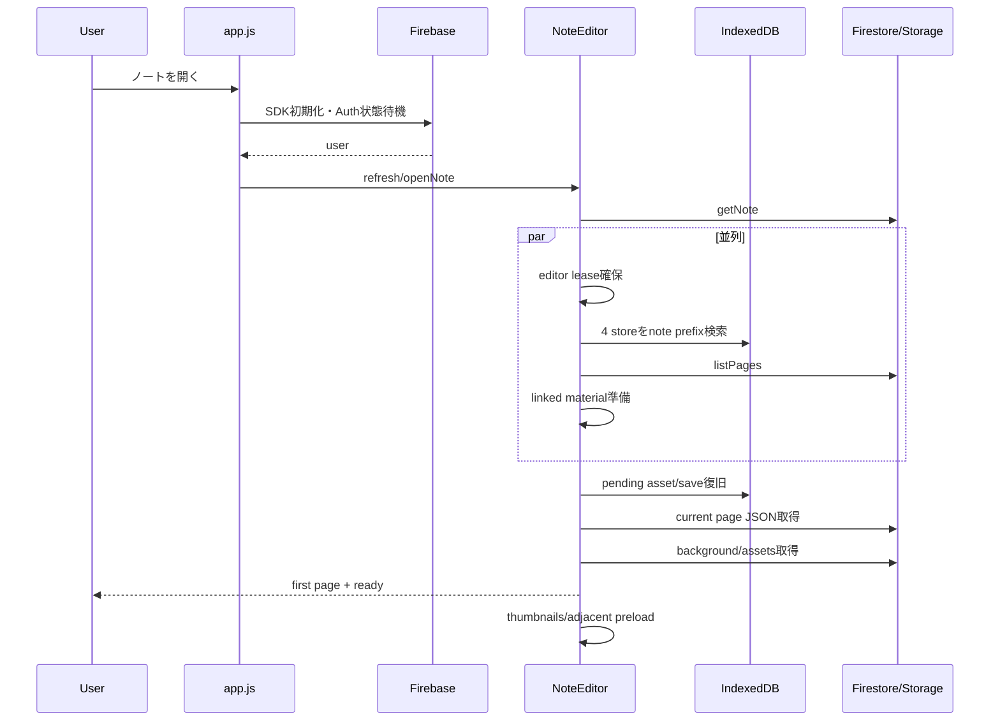
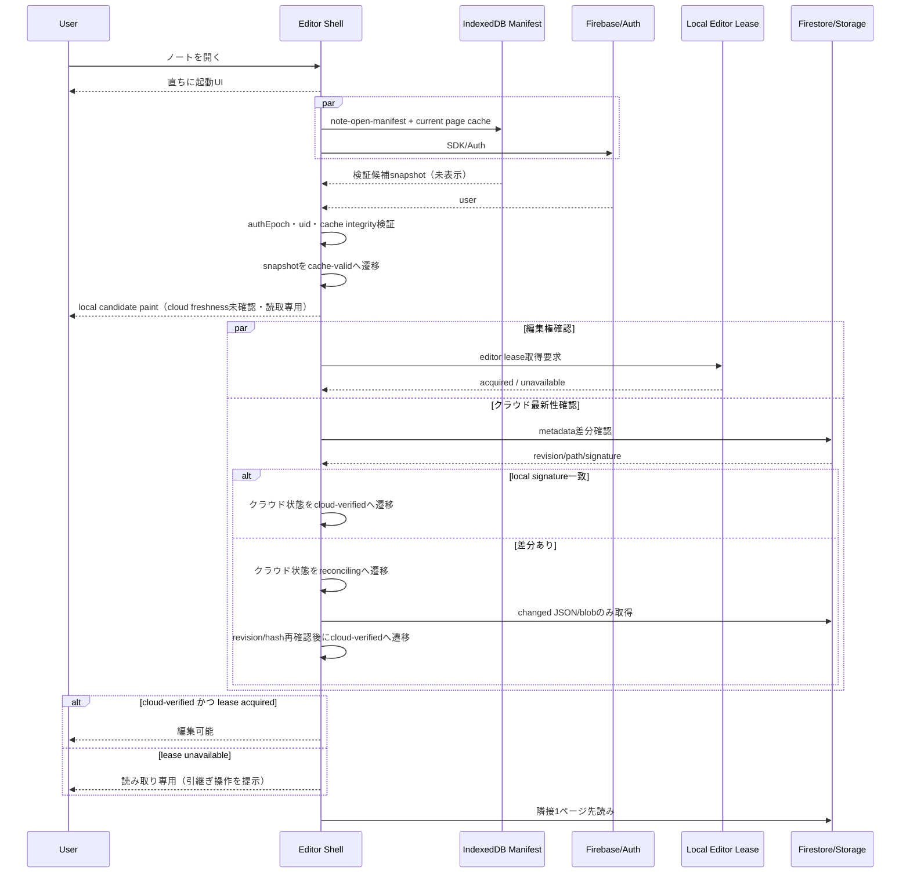
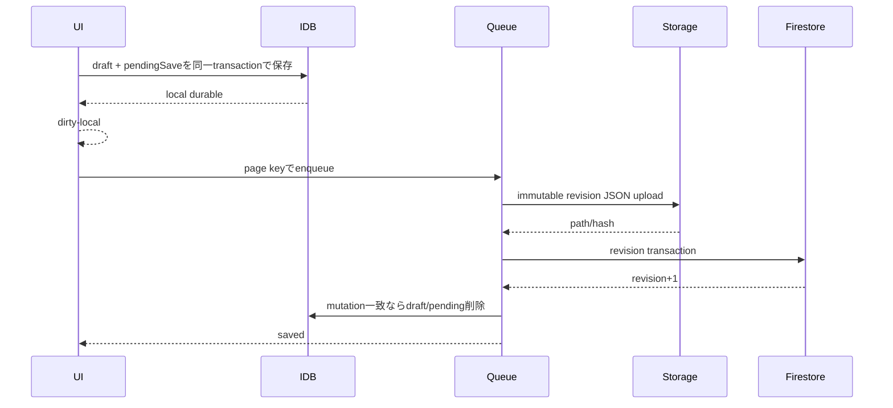

# Dental QA App 学習ノート機能 仕様書・詳細設計書

## 0. 文書情報

| 項目 | 内容 |
|---|---|
| 文書名 | Dental QA App 学習ノート機能 仕様書・詳細設計書 |
| 対象リポジトリ | `/Users/sakin/dev/dental-qa-app` |
| 調査基準HEAD | `e8c4f8e95e6401d722fa5e1dcb035ec044f583b1` |
| 作成日 | 2026-09-28 |
| 対象クライアント | iPad Safari、Desktop Safari／Chrome、ホーム画面追加版 |
| 本番配信 | GitHub Pages |
| バックエンド | Firebase Authentication、Firestore、Storage |
| ローカル検証 | Firebase Local Emulator Suite、project ID `demo-dental-qa` |
| 文書状態 | 設計ドラフト。現行実装の監査結果と目標仕様を分離して記載したもので、受入値の合意や全項目の実装済みを意味しない |
| 今回の検証 | 文書構成・整合性の確認のみ。製品コードの自動テストとiPad実機テストは未実行 |

> **最重要事項**
> 2026-09-28時点で、GitHub Pages上のiPad実機における「ノートを開いてから操作可能になるまでの時間」は、利用者が改善を体感できていない。自動テストが成功しても、それだけで実機の性能達成を意味しない。本書では読込遅延を未解決のP0として扱い、実測値が受入基準を満たすまで「改善済み」と判定しない。

---

## 1. 目的

本書は、Dental QA Appの学習ノート機能について、次を一つの基準へ統合する。

1. 利用者から見た機能仕様
2. 画面・操作・エラー時動作
3. Firestore、Storage、IndexedDBのデータ設計
4. ノート起動、描画、保存、復旧、PDF出力の内部設計
5. iPad SafariおよびApple Pencil固有の設計制約
6. 性能・可用性・セキュリティ要件
7. 自動テストとiPad実機受入テストの合格基準
8. 現行実装と目標設計の差分

本書を、今後の修正、コードレビュー、受入テスト、リリース可否判断の共通基準とする。

## 2. 適用範囲

### 2.1 対象

- 学習ノート一覧
- 白紙ノート、横罫線ノート、PDFノート、教材連携ノート
- 専用ノート編集タブ
- ペン、蛍光ペン、消しゴム
- 図形、直線、矢印、テキスト、画像
- 選択、投げ縄、移動、拡大縮小、回転、トリミング
- ノート専用暗記マスクと教材由来マスク
- Undo／Redo
- ページ追加、複製、削除、並び替え、ページ移動
- 保存、オフライン下書き、競合、編集タブロック、復旧コピー
- PDF書き出し
- Emulatorを用いるローカル確認
- 起動性能、入力性能、診断情報

### 2.2 対象外

- 問題管理機能そのもの
- 画像教材管理機能そのもの
- Firebase Hostingへの移行
- Apple Pencilの傾き・側面描画
- Safariが公開していないApple Pencil軸ダブルタップ専用イベント
- 本番データを使う自動テスト

## 3. 状態の表記

本書では、実装状況を次の4種類に分ける。

| 表記 | 意味 |
|---|---|
| 実装済み・自動検証済み | 現行コードに存在し、対応する自動テストがある |
| 実装済み・実機確認要 | 現行コードに存在するが、iPad実機での合否が必要 |
| 既知不具合 | 現行コードまたは実機で不具合が確認されている |
| 目標設計 | 今後の修正で満たすべき仕様 |

自動テストの成功、Emulator上の成功、iPad実機の成功は別の判定とし、相互に代用しない。本文で「現行」と書く場合は調査基準HEADの事実、「目標」と書く場合は未実装を含むTo-Be設計を表す。

### 3.1 章ごとの位置付け

| 領域 | 現行の位置付け | 本書での扱い |
|---|---|---|
| ノート一覧・作成・編集・PDF | 実装あり | 機能仕様と回帰条件を定義 |
| 保存queue・競合・編集lease | 実装あり | 不変revision、冪等再送、復旧の目標を追加 |
| `note-open-manifest`・`cache-valid` snapshot | 未実装 | 読込P0に対する目標設計 |
| command型Undo | 未実装または部分実装 | 入力hot pathから全ページcloneを外す目標設計 |
| `startupDebug=1`による安全な本番観測 | 未実装 | 実機P95判定の前提工程 |
| 読込性能 | 実機で未達または未立証 | P0の既知不具合 |

---

# Part I 機能仕様

## 4. 利用者と利用環境

### 4.1 利用者

- 歯科分野の学習者
- iPadとApple Pencilを用いてPDF教材へ書き込む利用者
- PCで教材・ノートを整理する利用者

### 4.2 利用環境

| 環境 | 用途 | 接続先 |
|---|---|---|
| GitHub Pages | 本番利用 | 本番Firebase |
| Mac／PC localhost | 開発確認 | `demo-dental-qa` Emulator |
| Mac LAN + iPad | iPad実機受入 | `demo-dental-qa` Emulator |

`?firebaseEmulator=1`が指定された場合はAuth、Firestore、Storageの全てをEmulatorへ接続し、一つでも接続確認に失敗した場合はクラウド操作を停止する。本番Firebaseへフォールバックしてはならない。

## 5. 画面構成

### 5.1 メイン画面

メイン画面は次を提供する。

- 学習ノート一覧
- 新規ノート作成入口
- ノートカードからの編集開始
- 削除済み／作成失敗ノートの復旧操作
- ノートの保存状態、競合状態、ページ数、マスク数、最終編集日時、先頭ページサムネイル

### 5.2 専用ノート編集画面

ノート編集は原則として専用タブで開く。

```text
固定上部バー
├─ ノート一覧へ戻る
├─ ノート名
├─ ページ番号
├─ Undo / Redo
├─ 編集 / 暗記モード
├─ 保存状態
└─ PDF書き出し

編集領域
├─ 表示切替可能なページ一覧
└─ ニュートラルグレーの作業領域
   └─ 中央の用紙

画面端
└─ 上下左右へドッキング可能なツールパレット
```

専用URLは次の形式とする。

```text
/?noteEditor=1&noteId={NOTE_ID}&editorTabId={TAB_ID}
```

Emulator利用時は次を引き継ぐ。

```text
firebaseEmulator=1
emulatorHost={MAC_LAN_IP}
```

## 6. ノート一覧

### 6.1 表示項目

各ノートカードに次を表示する。

- 実際の先頭ページを使った軽量サムネイル
- ノート名
- ノート種別
- ページ数
- 最終編集日時
- 保存状態
- 競合状態
- マスク数

サムネイルはキャッシュを利用し、一覧表示のたびに全ページを高解像度描画しない。生成失敗時のみ種別ラベルへフォールバックする。

### 6.2 一覧対象

- `status`が未設定または`ready`で、`deletedAt`がないノートだけを通常一覧へ表示する。
- `creating`、`failed`、`deleting`は通常一覧へ表示しない。
- 復旧可能な失敗ノートは、専用の復旧導線から再試行または削除できる。

## 7. ノート作成

### 7.1 ノート種別

| 種別 | `type` | 初期ページ |
|---|---|---|
| 白紙 | `standalone` | 白紙1ページ |
| 横罫線 | `standalone` | 横罫線1ページ |
| PDF | `pdf-imported` | PDF各ページを画像化したページ |
| 教材連携 | `material-linked` | 教材ページと対応するページ |

### 7.2 failure-atomicな段階作成

FirestoreとStorageを跨ぐ厳密なatomic transactionではない。すべての必須ページが完成するまで外部公開を`ready`にせず、失敗時は補償削除するfailure-atomicな段階処理とする。全種別で次の状態遷移を用いる。

```text
creating
  ↓ 全ページ作成成功
ready

creating
  ↓ 途中失敗
failed
```

作成途中に失敗した場合は次を行う。

1. `ready`へ変更しない。
2. 作成済みページを補償削除する。
3. 作成済みStorageファイルを補償削除する。
4. 削除に失敗したパスをクリーンアップ待ちキューへ記録する。
5. `failedPageIds`、`orphanedPaths`、`errorPhase`、`errorMessage`を記録する。
6. 利用者へ再試行または削除を提示する。

### 7.3 PDFノート作成

Safariのポップアップ制限を回避するため、「PDFから作成」を直接タップした同期処理内で編集タブを開き、そのタブ内でPDF選択、変換、作成、編集へ遷移する。非同期変換後に新しい`window.open()`を実行しない。

新規タブを開けない場合は同一タブへ遷移し、Safari設定変更を必須にしない。

## 8. ノート起動

### 8.1 起動状態

エディタ起動は次の状態を持つ。

```text
initializing
checking-emulator
authenticating
acquiring-editor-lock
loading-note-metadata
loading-pages
loading-content
reconciling-local-draft
loading-assets
ready
recoverable-error
fatal-error
```

`ready`になるまで、灰色背景だけを表示してはならない。現在の処理、8秒超過時の遅延案内、復旧操作を表示する。

### 8.2 復旧可能エラー

次の失敗は`recoverable-error`とする。

- ページJSON取得失敗
- 背景画像取得失敗
- IndexedDB下書き読込失敗
- 編集ロック取得失敗
- Emulator切断
- revision不整合
- 復元コピーの不整合

表示操作は次の通り。

- 再試行
- 端末内下書きから復元
- クラウド版を開く
- 読み取り専用で開く
- ノート一覧へ戻る
- 診断情報をコピー
- 診断情報をダウンロード

### 8.3 認証・キャッシュ検証gate（目標設計）

- 起動shellとIndexedDBの読込みはAuth待ちと並行できるが、ノート名、本文、背景、注釈、assetはAuth確定後かつ`manifest.uid === auth.uid`の場合だけ表示する。
- Auth確定前は機密情報を含まないshellとskeletonのみを表示する。既存の`authEpoch`、`isSyncSessionCurrent()`、`assertUserSession()`の同一世代検証をmanifestにも適用し、独立した別の認証世代を作らない。
- Authとuid一致後、cache整合性検証を通過した`cache-valid` snapshotは表示に使えるが、これはクラウド最新性の確認を意味しない。編集を開放するにはクラウド最新性の確認とローカルleaseの取得が別々に必要である。
- クラウド再検証は2秒を目安とし、`cloud-verified`（クラウドのrevision/hash一致）、`reconciling`（差分取得中）、`offline-local`（検証不能・端末内保存）を区別する。ローカルcacheの状態は`cache-valid`に固定し、クラウド最新性の状態名と混同しない。
- `offline-local`で編集する条件は、Auth済み、uid一致、ローカルlease取得済み、さらに端末下書きを耐久化できることとする。
- 再検証要求ごとに`verificationGeneration`、ローカル変更ごとに`localMutationGeneration`を持つ。timeout後に到着した古い応答は直接適用せず、世代一致を再確認し、dirtyなら直列reconcile queueへ送る。
- pending mutationが0、ローカルとクラウドのrevision/hashが一致した後だけ`saved`へ遷移する。遅延応答で新しい内容を上書きしない。

## 9. 編集ツール

### 9.1 共通規則

- 操作領域は44×44 CSS px以上とする。
- ツールは独自SVGアイコン、`aria-label`、`title`、ツールチップを持つ。
- 一時UIは同時に一種類だけ表示する。
- 別ツールへ切り替えると、前ツールの設定、選択枠、コンテキストメニュー、ポインターキャプチャ、一時プレビューを閉じる。
- 設定パネルの開閉状態は永続化しない。
- ペン色、線幅、透明度等の値はユーザー単位で端末内へ保存する。

### 9.2 ペン／蛍光ペン

- Apple Pencilおよび許可時の指入力で描画する。
- 新規ストロークは利用者が選択した固定線幅とする。
- 1点ストロークは丸い点として保存・表示する。
- 2点および短い払いを破棄しない。
- 既存線、画像、背景、マスクの上から新しいストロークを開始できる。
- 終点保持による直線補正をON／OFFできる。
- ペンと蛍光ペンは色、線幅、透明度を別々に保持する。

### 9.3 消しゴム

- オブジェクト消しゴムとピクセル消しゴムを切り替える。
- ピクセル消しゴムのカーソルは実際の消去範囲と一致する半透明の正円とする。
- カーソルは保存、Undo、PDFへ含めない。

### 9.4 図形

- 直線、矢印、四角形、角丸四角形、円、三角形、星を扱う。
- 直線と矢印は`start`、`end`を独立して保存する。
- 旧形式の`bounds`対角線データは読込時に`start`、`end`へ正規化する。
- 始点、終点、全体移動を直接操作できる。

### 9.5 テキスト

- HTML `textarea`をページ上へ重ね、日本語IME、複数行、貼り付けを扱う。
- 入力中はフォントサイズ16px以上とし、Safariの自動拡大を防ぐ。
- 明示改行と自動折返しを共通レイアウト処理へ渡す。
- `autoHeight: true`を既定とし、内容に必要な高さ未満へ切り詰めない。
- 左、中央、右揃え、フォント、太字、斜体、色、透明度、行間、ボックス幅を再編集できる。
- 編集画面とPDFで同じ行分割、行高、配置を用いる。

### 9.6 画像

画像追加メニューは次だけを表示する。

- クリップボードから貼り付け
- 写真から選択
- ファイルから選択

選択画像メニューは次だけを表示する。

- 複製
- 削除
- 固定／固定解除
- トリミング
- 左／右へ90度回転
- 前面／背面

両メニューを同時表示しない。元Blobは変更せず、トリミングは0〜1の`crop`へ保存する。

### 9.7 選択・変形

- ペン、蛍光ペン、図形、テキスト、画像、ノート専用マスクを選択できる。
- 自由形投げ縄は閉領域との交差または内包で選択する。
- 選択枠へ四隅、上下左右、回転ハンドルを表示する。
- 四隅は既定で縦横比を維持する。
- 上下左右は縦横比固定解除時に自由変形する。
- 1回のドラッグを1回のUndoとし、`pointermove`ごとに履歴を追加しない。
- 変形中もPDF背景、罫線、画像、非選択要素、マスクを表示し続ける。

## 10. ページ操作

- ページ一覧の表示／非表示を切り替える。
- ページ追加、複製、削除、並び替えを行う。
- Apple Pencilモードでは、Pencilを描画、1本指をパン／左右ページ移動、2本指をピンチズームへ割り当てる。
- ページ移動設定は「左右スワイプ」「ボタンのみ」を持つ。
- ページ切替前にIndexedDB下書きを確定し、クラウド保存は直列キューへ送る。
- 現在ページの前後1ページだけを軽量に先読みする。

## 11. ズーム・パン

- ノート内部ズーム範囲は0.8〜5倍とする。
- 上部バー、ページ一覧、ツールパレットの表示倍率は変えない。
- Safari画面全体のズームをノートズームとして扱わない。
- ピンチ中はCSS transformを`requestAnimationFrame`単位で更新し、終了時に倍率とアンカー位置を確定する。
- ピンチ中に描画、選択、ページ切替を開始しない。
- 「表示をリセット」でノート倍率とビューアスクロールを初期化する。編集内容は変更しない。

## 12. 暗記マスク

### 12.1 ノート専用マスク

- 編集画面内で矩形マスクを連続追加できる。
- 0〜1の正規化座標でページ内容JSONへ保存する。
- 移動、リサイズ、複製、削除、苦手色、レイヤー内順序変更を行える。
- 複数選択、一括削除、一括苦手設定を行える。
- 別ツールへ切り替えた時は操作UIだけを閉じ、マスクデータは残す。
- 通常編集時は薄い半透明表示または非表示を選べる。
- マスクツール以外では`pointer-events: none`とし、上から描画できる。

### 12.2 教材マスク

- 教材連携ノートで暗記モードへ表示する。
- ノート編集画面では読み取り専用とする。
- ノート専用マスクへ二重保存しない。

### 12.3 暗記モード

- 脳アイコンで直接切り替える。
- 編集アイコンで編集モードへ戻る。
- マスクをタップすると答えを表示し、再タップすると再び隠す。
- 表示済みマスクには薄い枠を残す。
- 「すべて表示」「すべて隠す」を提供する。

## 13. 保存状態

### 13.1 状態

```text
idle
editing
dirty-local
saving
saved
offline-local
recoverable-error
local-storage-error
conflict
```

### 13.2 表示

- 上部バーの固定幅・高さ44pxの角丸長方形へ短い状態名を表示する。
- 4文字分を基本とし、長い表示は三点リーダーで省略する。
- 完全な説明はタップ時ポップオーバー、`title`、`aria-label`で確認できる。
- 状態切替でヘッダー、ページ位置、ズーム、スクロール、ツールパレット位置を変えない。

### 13.3 保存失敗

IndexedDB保存に成功しクラウド保存に失敗した場合は次を表示する。

```text
クラウドへ保存できませんでした。
このiPad内には保存されています。
```

操作は次の通り。

- 再試行
- 編集を続ける
- 診断情報を見る
- ノート一覧へ戻る
- 端末下書きから復元
- 競合コピーを作成

保存失敗で編集画面全体を永久ロックしない。

## 14. 競合と複数タブ

### 14.1 保存識別子

保存は次を持つ。

```text
clientInstanceId
editorTabId
writerSessionId
clientMutationId
baseRevision
```

### 14.2 競合判定

- 自分自身の保存応答はrevision更新として受理し、競合にしない。
- 他タブ／他端末の更新でローカル変更がない場合はクラウド版を自動反映する。
- 他タブ／他端末の更新でローカル未保存変更がある場合だけ真の競合とする。
- 競合範囲は該当ノート・該当ページに限定する。

### 14.3 編集ロック

- ノート単位で`editorTabId`を所有者とする編集リースを確保する。
- BroadcastChannelを優先し、未対応時はlocalStorageの`storage`イベントを使用する。
- 2秒間隔のheartbeat、8秒TTLを基本とする。
- 同じタブの再読み込みは`sessionStorage`のIDを再利用する。
- stale lockは明示的に引き継げる。
- 読み取り専用タブはページ内容を保存しない。

## 15. 復元コピー

復元コピーは元ノートと独立させる。現行の`createRecoveredDraftCopy()`と、通常のノート複製は仕様を分けて扱う。

- `createRecoveredDraftCopy()`は新しい`noteId`と全ページの新しい`pageId`を作る。
- 背景と貼付画像は新ノートのStorage namespaceへコピーし、新しい`assetId`へ置き換え、復元コピーの要素から`assetNoteId`を削除する。元ノート削除後も復元コピーが自立して表示できることを受入条件とする。
- `createRecoveredDraftCopy()`が使う`createNote()`経路では、ページ文書の予約作成時は`contentRevision = 0`、復元内容の初回保存完了後は各ページ`contentRevision = 1`となる。完成後の初期`orderRevision`は1とする。
- `createNote()`経由の復元コピーはルート予約時から`orderRevision = 1`、`createCreatingNote()`経由の通常新規作成は予約中`orderRevision = 0`であり、関数と状態遷移を混同しない。
- `editorTabId`はタブの識別子なので、同一タブ内の復元では継続する。一方、ノート固有の`writerSessionId`、`clientMutationId`系列、pendingSave、conflict、編集lockは元ノートから引き継がない。
- 監査情報として`recoveredFromNoteId`、`recoveredAt`だけを関係情報に使い、競合判定には使わない。
- 通常複製側が`assetNoteId`でimmutable assetを共有する場合は、参照数または参照元走査で物理削除を抑止する。

## 16. PDF書き出し

### 16.1 目的

| 目的 | マスク |
|---|---|
| AI共有用 | 全て除外 |
| 学習用 | 全て不透明で表示 |
| 画面どおり | 現在の表示／非表示状態を反映 |

### 16.2 出力規則

- 編集UI、選択枠、カーソル、ツールパレットを含めない。
- IndexedDB `pendingAssets`から未送信画像を復元できる。
- 背景または画像が欠落した場合、欠けたPDFを成功扱いにしない。
- 日本語の明示改行、自動折返し、左・中央・右揃え、行間を反映する。
- ページ番号ONでは本文を縮小せず、本文下へフッター領域を追加する。
- 最終ダウンロード直前にファイル名を再サニタイズする。
- `/ \\ : * ? " < > |`、前後空白、末尾ドット、空文字、過長、`.pdf.pdf`を処理する。
- 画像取得とページ描画中はキャンセル可能にする。
- 最終シリアライズ中は「仕上げ中・キャンセル不可」を明示する。

---

# Part II 非機能仕様

## 17. 性能要件

### 17.1 計測区間

| 指標 | 開始 | 終了 |
|---|---|---|
| Launch | ノートカードのユーザー操作 | 新規タブnavigation開始 |
| Shell | navigation開始 | 起動状態UI表示 |
| First Page Metadata | navigation開始 | ノート・ページ情報取得完了 |
| First Visible Page | navigation開始 | 背景と保存済み注釈の初回表示 |
| First Visual Complete | navigation開始 | 必須背景・注釈・可視assetのdecode、最新render token、二重rAFが完了 |
| Can Edit | navigation開始 | 認証、編集リース、ローカル復旧が完了しpointer入力可能 |
| Full Auxiliary | navigation開始 | サムネイル・隣接ページ先読み完了 |

`Can Edit`は起動状態が`ready`、クラウド状態が`cloud-verified`となり、編集leaseを保持してpointer入力を受理した時点で記録する。差分があった試行も、`reconciling`完了後にrevision/hashを再確認して`cloud-verified`へ遷移するまで通常の`Can Edit`を記録しない。`offline-local`／degraded到達は同じmark名で通常性能へ混入させず、障害耐性用の別markとする。性能受入の視覚指標は現行の`first-visible-page`ではなく、目標仕様の`first-page-visual-complete`に結び付ける。

本章の`First Visual Complete`は23.6節の目標`first-page-visual-complete` markで計測する。現行実装の同名markはdecode失敗時にも記録され、完了直前のrender token再検証と二重rAFを備えていないため、17.2節のP95ゲートを有効化する前に23.6節の意味論を満たすコード修正を必須とする。

### 17.2 受入性能値

性能目標は直近2世代以内のiPad、Safari、一般的な家庭内Wi-Fiを想定する。制御した自動・反復測定は`demo-dental-qa` Emulatorまたは今後用意する専用stagingに限り、本番Firebaseで自動反復しない。GitHub Pages＋本番Firebaseでは、通常利用時に利用者が明示的に開始した安全な診断を観測値として収集する。正式判定はcoldとwarmの各条件30回以上を別々に測定しP95で判定する。

| シナリオ | First Visual Complete P95 | Can Edit P95 |
|---|---:|---:|
| キャッシュあり・白紙1ページ | 1.5秒以内 | 2.0秒以内 |
| キャッシュあり・PDF10ページ | 2.0秒以内 | 2.5秒以内 |
| キャッシュなし・白紙1ページ | 3.0秒以内 | 3.5秒以内 |
| キャッシュなし・PDF10ページ | 4.0秒以内 | 5.0秒以内 |
| 低速回線・PDF10ページ | 8.0秒以内にページ骨格、15秒以内に復旧可能な状態 |

上記は暫定目標値であり、現行HEADで達成確認されていない。実測結果をリリース報告へ添付しない限り性能修正を完了扱いにしない。

`Can Edit`の通常P95に算入するのは、起動状態`ready`かつ保存状態`saved`で`cloud-verified`へ到達した試行だけとする。差分があった試行は、`reconciling`解決後にrevision/hash一致を再確認して`cloud-verified`へ遷移した時点から算入する。`offline-local`／degradedな到達は通常P95から除外し、「障害時に端末内下書きで編集継続できた時間」として別集計する。この除外でクラウド常時失敗を性能合格に見せかけてはならない。`offline-local`で端末内編集を開始できるのは、Auth済み、uid一致、ローカルlease取得済み、かつIndexedDBへ下書きを耐久化できる場合だけとする。

無効runは事前定義したインフラ障害に限る。対象は、計測制御チャネルが`navigationStart`前に30秒応答しない場合、GitHub Pages／FirebaseがHTTP 5xxを返した場合、DNS名前解決失敗、ブラウザprocess異常終了とする。各条件30回中1回までは理由付きで別集計して補充し、2回以上発生した場合はその条件を全数再測定する。アプリ内エラー、Auth遅延、Storage遅延、decode遅延、`navigationStart`後のアプリtimeoutは無効runにせず、通常性能または障害耐性の結果へ含める。

### 17.3 入力性能

- pen `pointerdown`同期処理: 8ms未満
- pen `pointermove`受信処理: 4ms未満
- pen `pointerup`同期確定: 8ms未満
- 入力中のLong Task: 50ms超を0件とする
- 1点、2点、0〜32ms間隔の100ストロークで受信数＝session数＝commit数、破棄0
- 横型・縦型ページの9地点で再投影誤差2 CSS px以内

### 17.4 メモリ・キャッシュ

- リソースキャッシュはユーザー単位で隔離する。
- 現行既定値は最大48件、IndexedDB管理容量64MiBとする。
- quota超過時は再生成可能なリソースだけをLRU相当で削除する。
- 下書き、pending save、pending asset、conflictをキャッシュ削除対象にしない。
- Blob URLはページ切替、ノート終了、再描画で不要になった時点で解放する。

## 18. 可用性・データ保護

- クラウド保存前にIndexedDBへ下書きと保存待ちを同一transactionで記録する。
- ページ切替、終了、非表示化で保存失敗した場合は利用者へ選択肢を提示する。
- オフラインでも端末内下書きを維持する。
- Storageアップロード済み・Firestore更新失敗時は孤立ファイルを削除し、失敗時は再試行キューへ記録する。
- エラー時も一覧へ戻れる。
- どの起動失敗経路でも「読込中」「編集画面」「復旧可能エラー」「致命的エラー」のいずれかを表示する。

## 19. アクセシビリティ

- 全操作ボタンへ`aria-label`と`title`を付ける。
- 状態変更は固定レイアウトの`aria-live`領域で通知する。
- キーボード操作でEscapeによる一時UI終了、Undo／Redo、ツール選択を可能にする。
- 色だけに依存せず、枠、チェック、文字またはアイコンで選択状態を示す。
- 44×44 CSS px以上のタップ領域を確保する。

## 20. セキュリティ

- Firestore／Storageは`request.auth.uid == userId`を必須とする。
- ノートタイトル最大200文字、status・typeは許可値だけを受理する。
- `pageCount`、`orderRevision`、`contentRevision`等は非負整数とする。
- Storageパスは対象ユーザー、ノート、ページ、assetの階層に一致させる。
- ノート画像はPNG／JPEG／WebP、0超20MiB以下とする。
- ページJSONは`application/json`、0超2MiB以下とする。
- 診断JSONへパスワード、認証token、ノート本文全体、画像本体を含めない。
- Emulator URLから本番へフォールバックしない。
- Auth確定前は、他セッションのIndexedDB manifestやsnapshotをDOMへ描画しない。読込み途中のAuth変更は`authEpoch`とuidを再確認して古い応答を破棄する。
- `contentHash`はキャッシュ整合性と冪等再送の根拠であり、認可の境界ではない。認可はFirebase RulesとAuth uidで強制する。
- 現行実装は`crypto.subtle`非対応時に`Date.now()`を含む非決定的な代替値を作るため、HTTP LAN環境では同一内容のhashが変わる既知不具合がある。目標設計は同梱した決定的SHA-256 fallbackを使い、`crypto.subtle`と同じcanonical bytesから同じdigestを生成する。提供できない環境ではcloud mutationを開始せず`offline-local`とする。

---

# Part III 詳細設計

## 21. 現行モジュール構成

| ファイル | 責務 |
|---|---|
| `index.html` | メイン画面、専用エディタDOM、viewport設定 |
| `css/study-notes.css` | エディタ、レイヤー、パレット、設定、モードUI |
| `js/app.js` | Firebase初期化、Auth状態、専用ルート起動、機能依存注入 |
| `js/features/study-notes.js` | UI状態、ノート起動、描画、ページ、保存、復旧の統合制御 |
| `js/services/note-store.js` | Firestore／Storage CRUD、作成原子性、revision保存 |
| `js/core/note-local-store.js` | IndexedDB下書き・保存待ち・asset・競合・cache |
| `js/core/note-editor-lock.js` | タブ間編集リース |
| `js/core/note-page-save-queue.js` | ページ単位保存直列化 |
| `js/core/note-save-coordinator.js` | 自動保存状態と再試行調停 |
| `js/core/note-resource-cache.js` | Cache API／IndexedDB背景リソースキャッシュ |
| `js/core/note-startup-metrics.js` | 起動span、mark、counter |
| `js/core/note-stroke-session.js` | Pencilストロークsessionと点buffer |
| `js/core/note-input-guard.js` | pen／touch分離、掌抑止、入力診断capture |
| `js/core/note-geometry.js` | 正規化座標、選択、変形、投げ縄、線端点 |
| `js/core/note-renderer.js` | Canvas／PDF向け共通レンダリング |
| `js/core/note-text-layout.js` | 日本語折返し、必要高さ、行分割 |
| `js/core/note-pdf-export.js` | PDF用途、範囲、フッター、ファイル名、共有 |

### 21.1 設計上の分離目標

`study-notes.js`へ集中している責務を、次の境界で段階的に分離する。大規模一括リファクタリングは行わず、性能計測可能な単位から抽出する。

```text
NoteEditorController
├─ StartupCoordinator
├─ PageRepository
├─ LocalRecoveryCoordinator
├─ InputController
├─ RenderController
├─ SaveController
├─ EditorLeaseController
├─ TransientUiController
└─ DiagnosticController
```

### 21.2 分離の実施順序

1. 先に専用editor entryと起動state machineを分離し、メイン画面用moduleの不要な初期化を起動critical pathから外す。
2. 次にStartupCoordinatorと計測基盤を抽出し、各変更のFirst Visual/Can Editへの効果を測れるようにする。
3. その後にPageRepository、LocalRecoveryCoordinator、SaveController、InputControllerの順で、回帰テストを保ちながら抽出する。
4. 巨大ファイルの一括書き換えは行わず、データschemaとRules変更はクライアント互換期間を設ける。

## 22. データモデル

### 22.1 Firestore

#### ノートルート

```text
/users/{uid}/notes/{noteId}
```

```json
{
  "schemaVersion": 1,
  "title": "ノート名",
  "type": "standalone | pdf-imported | material-linked",
  "status": "creating | ready | failed | deleting",
  "pageCount": 10,
  "createdPageCount": 10,
  "orderRevision": 1,
  "noteMaskCount": 3,
  "sourceMaterialId": null,
  "isDefaultMaterialNote": false,
  "defaultBackground": { "type": "blank" },
  "materialRefs": [],
  "pendingStoragePaths": [],
  "failedAt": null,
  "errorPhase": null,
  "errorMessage": null,
  "failedPageIds": [],
  "orphanedPaths": [],
  "recoveredFromNoteId": null,
  "recoveredAt": null,
  "deletedAt": null,
  "deletedReason": null,
  "deletedMaterialRefs": [],
  "createdAt": "server timestamp",
  "updatedAt": "server timestamp"
}
```

`sourceMaterialId`は教材ノートの識別、`isDefaultMaterialNote`は教材の既定ノート判定、`defaultBackground`は新規ページ追加と背景変更に使う現行フィールドである。Rules/schemaを更新するときは既存データの欠落を許容しつつ新規書込みを検証する。読込みだけのために既存ページ文書を不用意に書き換えない。廃止するなら利用箇所と既存ノートの移行を先に実施する。

#### ページ

```text
/users/{uid}/notes/{noteId}/pages/{pageId}
```

```json
{
  "schemaVersion": 1,
  "noteId": "...",
  "order": 1,
  "pageType": "blank",
  "size": { "width": 1240, "height": 1754 },
  "background": { "type": "blank" },
  "contentRevision": 4,
  "contentPath": "users/.../revisions/{mutation}-{hash}.json",
  "contentHash": "sha256",
  "noteMaskCount": 2,
  "lastClientInstanceId": "...",
  "lastEditorTabId": "...",
  "lastWriterSessionId": "...",
  "lastClientMutationId": "...",
  "lastBaseRevision": 3,
  "deletedAt": null,
  "createdAt": "server timestamp",
  "updatedAt": "server timestamp"
}
```

#### assetメタデータ

```text
/users/{uid}/notes/{noteId}/assets/{assetId}
```

```json
{
  "schemaVersion": 1,
  "storagePath": "users/{uid}/notes/{noteId}/assets/{assetId}/original.png",
  "mimeType": "image/png",
  "naturalWidth": 1200,
  "naturalHeight": 900,
  "byteSize": 123456,
  "hash": "sha256",
  "createdAt": "server timestamp",
  "deletedAt": null
}
```

### 22.2 Storage

```text
users/{uid}/notes/{noteId}/sourcePages/{pageId}/{filename}
users/{uid}/notes/{noteId}/assets/{assetId}/{filename}
users/{uid}/notes/{noteId}/pages/{pageId}/revisions/{mutationId}-{hash}.json
```

ページJSONは不変revisionとして保存し、Firestoreページ文書の`contentPath`だけをtransactionで最新へ切り替える。ただし現行Storage Rulesはrevision pathの`update`も許可しており、不変性は未達である。以下のクライアント変更とRules変更を同一リリース単位で行う。Rulesの`update`拒否だけを先行させない。

1. 新規revision pathはcreateのみ許可し、既存objectのupdateを拒否する。
2. 同一`clientMutationId`の再送は、永続化済みの同一canonical payloadと同一hash/pathを再利用する。編集内容が変わった場合は新しいmutation、hash、pathを発行する。
3. createが「既存」で失敗した場合は既存objectを読み、hash一致時だけupload済みとみなす。hash不一致は破損またはmutation ID再利用として停止し、Firestore revision競合としてrebaseしない。
4. 同一writerの自動rebase回数上限はFirestore transactionのexpected revision不一致にだけ適用する。rebaseごとに新しいmutation/pathを発行し、古いuploadはjournalの補償削除対象とする。Storage既存object、hash不一致、認可エラーをrebase回数で吸収しない。
5. Storage Rulesはobject本文のSHA-256を計算できない。create/updateの許可・拒否はRules test、hash一致の冪等成功とhash不一致停止は保存coordinatorのunit/Emulator integration testで検証する。

### 22.3 ページ内容JSON

```json
{
  "schemaVersion": 1,
  "noteId": "...",
  "pageId": "...",
  "revision": 4,
  "savedAt": "ISO-8601",
  "clientInstanceId": "...",
  "editorTabId": "...",
  "writerSessionId": "...",
  "clientMutationId": "...",
  "baseRevision": 3,
  "elements": [],
  "noteMasks": []
}
```

#### element共通

```json
{
  "id": "uuid",
  "type": "stroke | highlighter | shape | text | image",
  "zIndex": 10
}
```

#### ストローク

```json
{
  "id": "uuid",
  "type": "stroke",
  "points": [{ "x": 0.2, "y": 0.3, "pressure": 0.5 }],
  "style": { "color": "#111111", "widthRatio": 0.0025, "opacity": 1 },
  "pressureEnabled": false
}
```

#### 直線／矢印

```json
{
  "id": "uuid",
  "type": "shape",
  "shapeType": "arrow",
  "start": { "x": 0.2, "y": 0.3 },
  "end": { "x": 0.6, "y": 0.5 },
  "style": {
    "strokeColor": "#111111",
    "strokeWidthRatio": 0.0025,
    "strokeOpacity": 1,
    "lineStyle": "solid"
  }
}
```

#### テキスト

```json
{
  "id": "uuid",
  "type": "text",
  "text": "日本語の\n複数行",
  "bounds": { "x": 0.1, "y": 0.1, "width": 0.4, "height": 0.12 },
  "rotation": 0,
  "autoHeight": true,
  "style": {
    "fontFamily": "system-sans",
    "fontSizeRatio": 0.025,
    "fontWeight": "normal",
    "fontStyle": "normal",
    "textAlign": "left",
    "lineHeight": 1.25,
    "color": "#111111",
    "opacity": 1
  }
}
```

#### 画像

```json
{
  "id": "uuid",
  "type": "image",
  "assetId": "uuid",
  "assetNoteId": "owning-note-id",
  "bounds": { "x": 0.1, "y": 0.1, "width": 0.4, "height": 0.3 },
  "crop": { "x": 0, "y": 0, "width": 1, "height": 1 },
  "rotation": 0,
  "opacity": 1,
  "locked": false,
  "aspectLocked": true
}
```

#### ノート専用マスク

```json
{
  "id": "uuid",
  "x": 0.2,
  "y": 0.15,
  "width": 0.3,
  "height": 0.1,
  "weak": false
}
```

### 22.4 IndexedDB

DB名は`dentalQaNoteLocal`、現行versionは2とする。

| Store | 用途 | 削除方針 |
|---|---|---|
| `pageDrafts` | 最新の端末内ページ下書き | クラウド確定とmutation一致後だけ削除 |
| `pendingSaves` | クラウド再送待ち | クラウド確定後だけ削除 |
| `pendingAssets` | 未送信画像Blob | asset確定後だけ削除 |
| `conflicts` | ローカル／クラウド競合 | ユーザー解決後だけ削除 |
| `pendingCleanups` | Storage削除再試行 | 削除成功後だけ削除 |
| `thumbnails` | サムネイルと再生成可能なresource cache | 容量制限で削除可能 |

キーは次を基本とする。

```text
{uid}|{noteId}|{pageId}|{suffix}
```

ユーザー切替時に他ユーザーのrecordを読まない。

version upgradeは`onblocked`を表示し、旧タブの`versionchange`でDBをcloseさせる。複数タブが残っている状態でupgrade transactionを無限待ちせず、読み取り専用、再試行、一覧へ戻る操作を示す。

`cache-valid`ページsnapshotとresourceは`contentHash`、byte size、MIME、asset signatureを持つindex recordから参照する。dirty draft、pending save、pending asset、conflictは再生成可能なresource cacheと同じprune対象に入れない。

## 23. ノート起動詳細設計

### 23.1 現行起動フロー



### 23.2 現行の性能上の問題候補

次はコードから確認できるクリティカルパスであり、実機計測により寄与率を確定する。

1. Firebase SDK初期化とAuth状態確定がノートmetadata取得より前に必要。
2. Firestoreのノートルート取得とページ一覧取得が別round trip。
3. 編集リースのclaim確認待ちが初回編集可能時刻へ含まれる。
4. IndexedDBの4 store検索とBlob復元が初回表示前へ入る。
5. pending asset復旧とpending save復旧が、データが存在する場合に直列となる。
6. 現在ページJSON、背景Blob、貼付画像の取得が初回表示のcritical pathへ入る一方、現行の`first-visible-page`系markは画像decodeと実paintの完了を保証しない。
7. iPad SafariではCache APIの永続性・quota・process再起動後の挙動が不安定になり得る。
8. GitHub Pages配信、Firebase CDN module、Firestore、Storageの複数origin通信がcold startで重なる。
9. 「キャッシュhitでStorageリクエスト0」というEmulator E2Eは、iPad実機のdecode、DOM、Auth、Firestore時間を保証しない。

### 23.3 目標起動フロー

機密情報を含まないshell表示と、認証後の本文表示、編集権限の確定を分離する。IndexedDB読込みはAuthと並行化しても、Auth確定前に本文を描画しない。



### 23.4 `note-open-manifest`

目標設計ではIndexedDBへ、初回表示専用の小さなmanifestを追加する。既存storeへ混在させる場合も`kind`を明示する。

```json
{
  "kind": "note-open-manifest",
  "schemaVersion": 1,
  "uid": "...",
  "noteId": "...",
  "title": "...",
  "type": "pdf-imported",
  "orderRevision": 3,
  "pageCount": 10,
  "cacheValidatedAt": "ISO-8601",
  "pageIds": ["..."],
  "currentPageId": "...",
  "currentPage": {
    "pageId": "...",
    "order": 1,
    "size": { "width": 2200, "height": 1556 },
    "backgroundSignature": "...",
    "contentRevision": 4,
    "contentPath": "...",
    "contentHash": "sha256:...",
    "cacheValidatedSnapshotKey": "{uid}|snapshot|{noteId}|{pageId}|{contentRevision}|{contentHash}",
    "assetSignatures": [{
      "assetId": "...",
      "storagePath": "...",
      "generation": "...",
      "hash": "sha256:...",
      "byteSize": 1234
    }]
  },
  "updatedAt": "ISO-8601"
}
```

用途は表示の高速化に限定し、権限、競合判定、最新revisionの正本にしない。Auth確定前はmanifest/snapshotの読込みが完了しても本文、背景、注釈、タイトルを表示しない。Auth確定後、`uid`一致、`contentHash`、背景signature、必要asset signatureが一致する`cache-valid` snapshotだけを初回描画に使う。hash照合はcache整合性検査でありセキュリティ境界ではなく、クラウド最新性を示す`cloud-verified`とも別状態である。

URLの`noteId`とmanifestの`currentPageId`から、Firestoreはノートrootと現在pageの単一documentを先に取得する。全page collectionの一覧取得は初回表示後へ遅延し、`orderRevision`不一致時だけページリストを差し替える。クラウド側に別manifest documentを追加する場合は、root/pageとの原子性とRulesコストを事前に評価する。

### 23.5 起動タスクの優先度

| 優先度 | タスク |
|---|---|
| P0 blocking | Auth、note存在確認、current page metadata、local draft reconcile、editor lease |
| P0 visual | current page content、背景、可視領域のasset |
| P1 near-visible | 隣接ページmetadata／背景 |
| P2 idle | 全サムネイル、一覧情報更新、cache trim、cleanup retry |

P2処理は`requestIdleCallback`を優先し、未対応時は入力のない時間帯へ遅延する。P2処理が`Can Edit`を遅らせてはならない。

### 23.6 起動計測

`globalThis.__noteEditorStartupMetrics`へ次を公開する。

- `firebase-initialization`
- `auth-state-wait`
- `note-metadata`
- `editor-lock`
- `local-record-scan`
- `page-metadata`
- `pending-asset-recovery`
- `pending-save-recovery`
- `page-content-json`
- `current-page-background`
- `current-page-background-decode`
- `current-page-assets`
- `current-page-assets-decode`
- `first-visible-page`（現行mark。DOM更新開始を示し、decode/paint完了は保証しない）
- `first-visible-page-painted`（現行mark。画像decode成功の保証には使わない）
- `first-page-visual-complete`（現行に同名markあり。受入用意味論は目標設計）
- `can-edit`
- `thumbnail-queue-drain`

計測値はspan、mark、counterを分ける。spanは開始、終了、duration、結果件数、cache hit/missを持つ。現行の`first-page-visual-complete`はdecode失敗時にも記録され得て、render tokenの再確認と二重rAFを保証しないため、そのまま受入P95に使わない。目標の同名markは背景と可視assetのdecode成功、対象render tokenの最新性、注釈DOM更新、その後の連続2回の`requestAnimationFrame`を満たしたときにだけ記録する。別ページの古いdecode完了はrender token不一致として破棄する。

利用者が「遅い」と報告した場合、同じ実機セッションのJSONを取得できるようにする。将来の本番観測用`startupDebug=1`は明示操作でだけ起動し、`runId`、build commit SHA、ブラウザ、viewport、network span、cache counter、Long Taskを相関づける。`PerformanceObserver`非対応は0件ではなく`unsupported`と記録し、rAF/main-thread gapを代替指標にする。診断にノート本文、画像、Auth tokenを含めない。

## 24. キャッシュ詳細設計

### 24.1 キャッシュ階層

```text
L0: メモリ Map
L1: IndexedDB resource cache
L2: Cache API（利用可能な場合の補助）
L3: Firebase Storage
```

L1をiPad再起動後の主キャッシュとし、Cache APIだけへ依存しない。

### 24.2 キー

```text
{uid}|resource|{noteId}|{pageId}|{kind}|{signature}
```

`signature`はStorage path、content hash、page source情報を含み、古いBlobを最新データとして誤利用しない。

### 24.3 読込

1. 未送信assetのIndexedDB Blobを確認する。
2. メモリcacheを確認する。
3. IndexedDB resource cacheを確認する。
4. Cache APIを確認する。
5. Storageから取得する。
6. decode成功したBlobだけをL0/L1/L2へ保存する。

クラウドassetとpending assetが両方ある場合は、mutationとhashが一致する最新の正常データを選ぶ。

### 24.4 書込

cache書込は初回表示と入力を阻害しない。Storage取得結果を画面へ利用可能にした後、idle queueで永続化する。

### 24.5 manifest/snapshotの保持と容量

- manifestは1ノートに最新1件、`cache-valid` snapshotは1ページに最大2世代を保持する。2世代保持の目的は、新世代Nのhash/decode/renderが成功し、実際に1回の起動で利用されるまで世代N-1をfallbackとして残すことである。
- promotion順序は「Nを検証候補として書込む→manifestをNへ切替→Nの完全表示と検証成功を記録→N-2を削除」とする。Nの検証または利用に失敗した場合はNを破棄し、N-1を再度参照する。
- manifest/snapshot/resourceはIndexedDBの64MiB管理容量に算入する。そのうちmanifest/snapshotの固定サブバジェットを最大16MiB、再生成可能な背景/resource cacheのバジェットを最大48MiBとする。サブバジェットを跨いでdirtyデータを削除しない。
- `selectNoteResourceCacheEvictions()`の対象`kind`を`note-open-manifest`と`cache-valid-page-snapshot`へ無条件に広げず、promotion状態と世代を理解する専用pruneを使う。現行の`kind === "note-resource"`だけのpruneでは不十分である。
- dirty draft、pending save、pending asset、conflict、参照中のsnapshotはpruneしない。
- quota超過でmanifest/snapshotの書込みに失敗した場合、既存下書きを削除せず、その次の起動をcache missとしてクラウドから安全に読み込む。

## 25. ページ座標・レンダリング

### 25.1 ページ座標root

```text
page-coordinate-root
├─ paper/background layer
├─ pasted image layer
├─ annotation SVG
├─ mask layer
├─ stable drawing-input-surface
└─ selection/transform overlay
```

全レイヤーの`getBoundingClientRect()`は1 CSS px以内で一致させる。

### 25.2 正本寸法

PDFページはPDF.jsのrotation適用後の最終viewport、または生成画像の`naturalWidth/naturalHeight`のどちらか一つを正本とする。変換前PDF寸法と生成画像寸法を混在させない。rotationは1回だけ適用する。

```json
{
  "sourceWidth": 2200,
  "sourceHeight": 1556,
  "aspectRatio": 1.4139,
  "rotationApplied": 90,
  "orientation": "landscape"
}
```

`orientation`は診断・表示に用い、座標計算でx/yを場当たり的に交換しない。

### 25.3 座標変換

```javascript
function clientToNormalizedPagePoint(clientX, clientY, pageRoot) {
  const rect = pageRoot.getBoundingClientRect();
  return {
    x: (clientX - rect.left) / rect.width,
    y: (clientY - rect.top) / rect.height
  };
}
```

次を追加補正しない。

- `window.scrollX / scrollY`
- `viewer.scrollLeft / scrollTop`
- `visualViewport.offsetLeft / offsetTop`
- `devicePixelRatio`
- zoomの再除算
- orientationによるx/y交換

### 25.4 レイヤー更新

- 背景は静的レイヤーへ保持する。
- 非選択要素は静的レイヤーへ保持する。
- 変形中は選択要素プレビューとUIだけを更新する。
- 背景Blobを`pointermove`ごとに再取得・再decodeしない。

## 26. Apple Pencil入力詳細設計

### 26.1 stable input surface

`drawing-input-surface`はエディタの生存期間中同じDOMノードを維持する。ページ変更は参照modelと寸法だけを更新し、保存状態、設定開閉、再描画でDOMやlistenerを差し替えない。

### 26.2 event所有権

| 入力 | 動作 |
|---|---|
| `pointerType=pen` | drawing input surfaceで描画 |
| touch 1本 | パン／ページスワイプ |
| touch 2本 | ピンチズーム／パン |
| mouse | 選択ツールに応じた操作 |

Palm Guardの接触面積、cooldownはtouchだけへ適用し、penを拒否しない。

### 26.3 ストロークsession

```json
{
  "strokeSessionId": "uuid",
  "pointerId": 12,
  "tool": "pen",
  "startedAt": 123.4,
  "points": [],
  "pendingPoints": [],
  "isFinalizing": false,
  "straighteningTimer": null
}
```

`pointerdown`の同期経路は次だけに限定する。

1. `preventDefault`
2. 一時UIを閉じる
3. Selection解除
4. 前sessionが残る場合は最小処理で確定
5. 新session作成
6. 最初の点を追加
7. pointer capture
8. draft表示開始

Firestore、Storage、IndexedDB snapshot、全要素clone、サムネイル、全ページrenderを入れない。

### 26.4 点buffer

- `pointerrawupdate`対応時は点収集へ使用する。
- 未対応時は`pointermove`と`getCoalescedEvents()`を使用する。
- rawupdateとpointermoveで同じ物理sampleを二重追加しない。
- dedupeは`strokeSessionId`内だけに限定する。
- 受信点は即時bufferへ追加し、画面反映だけをrAFで間引く。

### 26.5 確定

`pointerup`の同期処理は次の順序とする。

1. 最終coalesced pointを追加
2. pending pointをflush
3. 1点以上ならmodelへ確定
4. `activePenSession`を解除
5. pointer captureを解放
6. draft pathを確定pathへ昇格

Undo command、IndexedDB、クラウド保存、サムネイルは後続queueへ送る。`pointercancel`と`lostpointercapture`でも有効点が1点以上なら可能な限り確定する。

### 26.6 Undo

この節は入力hot pathを軽量化するための**目標設計**である。

ページ全体の深いcloneを描画hot pathで作らず、次のcommandを基本とする。

```text
AddStrokeCommand
├─ pageId
├─ strokeId
├─ insertIndex
└─ strokeData
```

Undoは`strokeId`削除、Redoは同じ位置への再追加とする。

## 27. 保存詳細設計

### 27.1 ローカル先行保存



### 27.2 直列化

同一`uid|noteId|pageId`へ同時に一つのクラウド保存だけを許可する。保存中の変更は最新snapshotとして一回に集約する。古い完了通知で新しいexpectedRevisionを上書きしない。

### 27.3 Storage journal

アップロード前にルート文書の`pendingStoragePaths`へpathを追加する。Firestore確定後にjournalから外す。失敗時は物理削除し、削除失敗は`pendingCleanups`へ記録する。

### 27.4 hash・再送・遅延応答

- JSONはキー順、数値表現、改行、Unicodeを固定したcanonical bytesからSHA-256を作る。Blobはそのbyte sequence自体をhash化する。
- `crypto.subtle`がないHTTP LAN環境でも同一digestになる決定的fallbackを同梱する。現行の時刻依存fallbackは冪等性を満たさないため使用しない。
- mutationごとにcanonical payload、hash、pathを`pendingSaves`へ先に耐久化し、結果不明の再送で同じ組を使う。
- Firestore transactionのexpected revision不一致だけをrebaseの契機とし、Storageの既存object、hash不一致、認可失敗は別エラーとする。
- クラウド再検証やsave応答は`authEpoch`、`verificationGeneration`、`localMutationGeneration`、`clientMutationId`を照合し、古い世代の応答で現在のrevisionやsave stateを上書きしない。

### 27.5 データライフサイクル

| 対象 | 保持・削除規則 |
|---|---|
| immutable page revision | Firestoreが参照する最新版と、pending/undo/復旧で参照中の版は保持。非参照の旧版は定期GC対象 |
| 論理削除ノート | `deletedAt`設定後は通常一覧から除外。復元保持期間経過後にpage/revision/background/assetを参照走査して物理削除 |
| source page/background | 対象pageが存在する間は保持。背景変更後の旧objectはjournalと参照確認後にGC |
| note asset | asset metadataの`createdAt`、`deletedAt`、所有namespaceを管理。通常複製の共有参照が1件でも残る間は物理削除しない |
| pending cleanup | 失敗path、発生日時、最終試行、retry count、エラー分類を保持し、指数backoffで再試行 |

GCは保存hot pathで同期実行しない。物理削除前にFirestoreの参照とIndexedDBのpendingを再確認し、結果不明時は削除せず再試行する。

## 28. 一時UI詳細設計

```json
{
  "type": "closed",
  "ownerTool": null,
  "targetElementIds": [],
  "anchor": null
}
```

許可値は次の通り。

```text
closed
pen-settings
highlighter-settings
eraser-settings
shape-settings
text-settings
input-settings
color-palette
image-source-menu
selection-context-menu
crop-editor
save-status-popover
local-environment-popover
```

状態遷移時は前UIのDOM、pointer capture、focus trap、`inert`、透明blockerを完全に解除する。

## 29. PDF詳細設計

1. 対象ページ範囲を検証する。
2. 各ページのsource sizeを基準に画質presetの長辺へ縮小する。
3. 背景、annotation、asset、maskをCanvasへ合成する。
4. JPEG化する。
5. pdf-libへ埋め込む。
6. ページ番号ONなら本文外のfooterへ番号を描く。
7. 全ページ完了後に最終serializeする。
8. ダウンロード直前にファイル名を再サニタイズする。

Canvas描画は編集画面と共通の`note-renderer.js`および`note-text-layout.js`を利用し、見た目の差を最小化する。

## 30. 診断情報

診断JSONに次を含める。

### 30.1 起動

- route開始時刻
- `runId`、配信build SHA、schema version、実行環境
- Firebase初期化、Auth、metadata、pages、IDB、lease、content、背景、asset、decodeのspan
- cache hit/miss/write/eviction
- first visible、first paint、first-page-visual-complete、can edit
- page count、element count、asset count
- `PerformanceObserver`やLong Task APIが利用できない場合は0件とせず`unsupported`と記録

`startupDebug=1`は将来実装する利用者明示opt-inの診断モードとする。診断UIから当該runのJSONを表示・コピー・ダウンロードできるようにし、認証token、本文、画像本体、署名付きURL、完全なStorage pathを含めない。通常利用者のバックグラウンド送信や本番での自動反復に使わない。

### 30.2 保存

- noteId、pageId、note type
- editorTabId、writerSessionId、clientMutationId
- expectedRevision、cloudRevision、local draft revision
- save state、last success、last error
- pending save／asset／conflict件数
- lock owner、lock age

### 30.3 入力・座標

- window／document／editor root／input surfaceのpen pointerdown件数
- pointerup、pointercancel、lostcapture
- session作成、commit、discard、最後の破棄理由
- raw/coalesced point件数
- pointer handler最大時間、rAF間隔、Long Task
- page root、background、SVG、input surface、maskのrect
- source size、orientation、PDF rotation、viewBox、CSS transform
- pointerdownのclient座標、normalized座標、再投影誤差（全点列は含めない）

## 31. エラー分類

| 分類 | 例 | UI |
|---|---|---|
| 認証 | userなし、token失効 | 再ログイン、一覧へ戻る |
| 権限 | insufficient permissions | 対象pathとrules versionの診断、再試行不可なら一覧 |
| ネットワーク | offline、timeout | 端末保存、再試行、編集継続 |
| Storage | 404、decode失敗 | 欠落対象を明示、cache／pendingから復元 |
| revision | expectedとcloud不一致 | 比較、クラウド、競合コピー |
| editor lease | 他タブ所有、stale | 読み取り、引継ぎ、既存タブ |
| IndexedDB | quota、transaction abort | 端末保存失敗を明示、メモリ内容を維持 |
| invalid data | schema、page ID、size不正 | fatalまたは復旧コピー |

### 31.1 外部依存と供給網

| 依存 | 現行 | 目標 |
|---|---|---|
| Firebase browser SDK | Google CDN (`www.gstatic.com`) の固定version module | npmと同じ固定versionをbundleまたは自己hostし、cold startの外部originと供給網リスクを減らす |
| pdf.js | PDF取込時の外部CDN依存 | workerを含め固定versionを同梱し、SRI/CSPと更新手順を持つ |
| pdf-lib・その他 | 実行方式をbuildごとに確認 | lockfileで固定し、脆弱性確認とブラウザE2Eを通して更新 |

自己host化は性能だけでなくCSP、キャッシュ失効、rollback、license表示を含むリリース手順として扱う。

---

# Part IV 検証設計

## 32. テスト階層

| 階層 | 目的 | 接続先 |
|---|---|---|
| Unit | 純粋関数、queue、layout、geometry、state | なし |
| Rules | Firestore／Storage許可・拒否 | Emulator |
| E2E unauthenticated | UI、ルート、入力、PDF mock | ローカルHTTP |
| E2E authenticated | 実Auth／Firestore／Storage処理 | `demo-dental-qa` Emulator |
| iPad実機 | Pencil、Safari、体感性能、gesture | LAN Emulator／本番候補 |

## 33. 起動性能テスト

### 33.1 データセット

- 白紙1ページ、element 0
- PDF10ページ、各ページ背景1、stroke 100、画像2、mask 10
- PDF50ページ、現在ページのみheavy
- pending save 10、pending asset 3、conflict 0
- 復元コピー

### 33.2 条件

- cold browser process
- warm reload
- Cache APIあり／なし
- IndexedDB resource hit／miss
- Wi-Fi fast、latency 100ms、低速回線
- iPad Portrait／Landscape

### 33.3 合格条件

- 17.2のP95を満たす。
- 8秒を超える時は現在処理と復旧操作を表示する。
- 初回表示前に全ページサムネイルを生成しない。
- warm reloadでsignature一致の背景をStorageから再取得しない。
- `first-page-visual-complete`は必須decode完了、最新render token一致、二重rAF通過後だけ記録し、placeholder、古いrender、decode失敗では記録しない。
- `Can Edit`後のidle処理がPencil入力を欠落させない。

## 34. 入力・座標テスト

- 1点100本、2点100本、同一座標100本、交差線100本
- 0／4／8／16／32ms間隔で各100本
- pointercancel、lostpointercapture
- rawupdate／coalesced event
- A4縦、A4横、16:9、90度、270度、縦横混在PDF
- 各ページ9地点、zoom 0.8／1／2／5、side bar表示／非表示
- window／document／surface／session／commit件数一致
- 最大再投影誤差2 CSS px以内

合成PointerEventの成功だけでApple Pencil受入をPASSにしない。

## 35. 保存・復旧テスト

- Auth変更中に古いmanifest、snapshot、クラウド応答が完了しても、同一`authEpoch`とuidの再確認により画面とcacheへ適用されない
- Auth確定前はmanifest/snapshotの読込みが完了しても本文、背景、注釈、タイトルを表示しない
- 自動保存とページ切替flushの直列化
- 保存中の再読み込み
- offline-local再読み込み
- 同じタブのeditorTabId再利用
- stale lock引継ぎ
- 読み取り専用タブが保存しない
- 自分の保存通知を競合にしない
- 真の別端末更新だけを競合にする
- 復元コピーのID、revision、pending、lock独立性
- Storage upload成功／Firestore失敗時のcleanup
- cleanup失敗のretry queue
- **Unit**: `crypto.subtle`あり／なしで、同一canonical bytesのJSON・Blobが同一hashになる
- **Authenticated E2E / Emulator integration**: HTTP LAN相当で同一mutation/hashを再送し、同一revision pathで冪等成功
- **Storage Rules**: revision Storage pathのcreate許可と同一path update拒否
- **Unit + Authenticated E2E**: 同一mutation／同一hashの再送は冪等成功し、同一mutation／異なるhashは破損として停止
- **Authenticated E2E**: Storage既存object／hash不一致／認可エラーで自動rebaseせず、Firestore expected revision不一致だけが同一writer rebase回数に算入される
- **Authenticated E2E**: クラウド再検証timeout→ローカル編集→旧Firestore応答完了で古いrevisionを直接適用しない
- **Authenticated E2E**: 遅延応答を直列reconcileし、pendingが残る間は`saved`へ遷移しない
- **Authenticated E2E**: pending mutationが0件かつrevision/hash一致を確認する前に`saved`へ遷移しない

## 36. PDFテスト

- AI共有用、学習用、画面どおり
- 日本語3行、明示改行、自動折返し、中央／右寄せ
- offline pending image
- 欠落画像エラー
- 横向きページ
- ページ番号footer
- ファイル名サニタイズ
- 可能な範囲でPDFを画像化し主要領域を比較する。

## 37. iPad実機受入

少なくとも次を利用者が確認する。Codexや自動テストが代わりにPASSを付けない。

1. ノート一覧タップからFirst Visible／Can Editまでの実時間
2. 同一ノートの初回／2回目／再起動後の時間
3. Apple Pencilの通常速度日本語20回で画の欠落がない
4. 横型・縦型PDFの四隅と中央で位置ずれがない
5. 掌接触中もpen入力が継続する
6. ピンチ、パン、ページスワイプが描画と競合しない
7. 保存中、offline、再読み込み、タブ再表示から復旧できる
8. PDF背景、画像、手書き、テキスト上のマスクが動作する

---

# Part V 現状評価と実装優先順位

## 38. 現状評価

### 38.1 確認できる実装

- Firebase SDKはブラウザとnpmで12.16.0へ固定されている。
- 専用エディタルートでは画像暗記・問題管理moduleの動的importを省略する。
- 起動spanとcounterを`__noteEditorStartupMetrics`へ公開する。
- note metadata取得後、editor lease、IndexedDB、page metadata、教材準備を並行開始する。
- Cache APIとIndexedDBに背景resource cacheを持つ。
- page単位保存queue、mutation識別子、編集リース、復旧状態を持つ。
- 起動エラーUI、保存状態、診断JSON、ローカルEmulator接続が実装されている。

| 事実 | 主な実symbol／ファイル | 対応テスト | 今回の実行状態 |
|---|---|---|---|
| SDK 12.16.0固定 | `package.json`、`js/config/firebase.js`、`js/app.js` | Firebase/Emulator E2E | 未実行 |
| page単位保存queue | `note-page-save-queue.js`、`note-save-coordinator.js` | unit/E2E | 未実行 |
| 編集lease | `note-editor-lock.js` | unit/E2E | 未実行 |
| 起動計測 | `note-startup-metrics.js`、`__noteEditorStartupMetrics` | unit/E2E | 未実行 |
| resource cache | `note-resource-cache.js`、IndexedDB | unit/E2E | 未実行 |
| Pencil session | `note-stroke-session.js`、`note-input-guard.js` | unit/WebKit E2E | 未実行／iPad実機は別判定 |
| Auth世代検証 | `js/app.js`と`js/features/study-notes.js`のAuth状態・`assertUserSession()` | unit/E2E | 未実行 |
| 作成中revision | `note-store.js` の`createNote()`、`createCreatingNote()`、`pageDocument()`、`finalizeNoteCreation()` | unit/Emulator E2E | 未実行 |
| 復元コピーの自立化 | `study-notes.js` の`createRecoveredDraftCopy()` | authenticated E2E | 未実行 |

この表はコード上の存在とテストの存在を示すだけで、本書作成時点のテスト成功を意味しない。

### 38.2 未解決

| ID | 未解決事項 | 重要度 |
|---|---|---|
| GAP-PERF-01 | GitHub Pages上のiPad実機でノート読込の体感が改善していない | P0 |
| GAP-PERF-02 | 本番実機のphase別計測値とP95が記録されていない | P0 |
| GAP-PERF-03 | EmulatorのStorage request削減テストが実機のAuth／decode／DOM時間を包含しない | P0 |
| GAP-CACHE-01 | iPad SafariでCache API／IndexedDBが実際にhitした証跡が不足 | P0 |
| GAP-ARCH-01 | 起動・描画・保存・UI責務が巨大な`study-notes.js`へ集中 | P1 |
| GAP-ASSET-01 | PDF取込用pdf.jsが外部CDN依存 | P1 |
| GAP-ASSET-02 | Firebase browser moduleが`www.gstatic.com`外部originに依存 | P1 |
| GAP-DEVICE-01 | Apple Pencil／gestureは自動テストだけで完全再現できない | P0実機確認 |
| GAP-HASH-01 | HTTP LANで`crypto.subtle`がない場合の現行hashが非決定的 | P0 |
| GAP-STAGING-01 | 本番相当の専用performance stagingがない | P1 |
| GAP-RACE-01 | cloud再検証timeout後の遅延応答を世代で無効化する仕組みが未実装 | P0 |

### 38.3 結論

現行実装には性能対策のコードがあるが、利用者が報告した実機遅延は解決したと判断できない。次の作業は新しい最適化案の追加ではなく、同一実機のstartup診断を採取し、最長spanとLong Taskを特定し、1ボトルネックずつ除去してP95を再測定することから開始する。

## 39. 実装優先順位

### Phase 0-0: 診断基盤の実装と取得可能性確認

1. プライバシー制約を満たす`startupDebug=1`、`runId`、build SHA、visual-complete mark、Long Task/main-thread gap、network span、cache counterを実装する。
2. 本文、画像、認証token、署名付きURL、完全なStorage pathを含まないことを自動テストする。
3. GitHub Pagesを通常利用するiPad上で、診断UIから同一runのJSONをダウンロードでき、必須項目が欠落しないことを1回確認する。
4. この確認前に本番観測値の比較やP95判定を始めない。

### Phase 0: 予備計測と証拠採取

1. ボトルネック特定用の予備計測としてcold 10回、warm 20回を計測する。この回数は正式P95判定に使わない。
2. startup JSON、Network waterfall、Long Task、cache hit/missを同一run IDで紐付ける。
3. First VisibleとCan Editの差を明示する。
4. 最長spanがAuth、Firestore、IDB、Storage、decode、renderのどれかを確定する。

### Phase 1: 最長クリティカルパスの除去

- Authが主因なら、機密情報を含まないshellだけをAuth待ちから分離する。本文描画はAuth確定とmanifest uid一致後に限る。
- Firestoreが主因なら、note-open-manifestとmetadata round trip削減を行う。
- IDBが主因なら、4 store全件復元をmetadata scanとBlob遅延読込へ分割する。
- Storageが主因なら、signature付きL1 cacheの実機hit率と永続性を改善する。
- decode/renderが主因なら、初回viewport以外のdecodeとサムネイルをidleへ移す。

### Phase 2: 回帰と実機受入

1. `npm run local:smoke`
2. `npm run test:all`
3. LAN EmulatorでiPad cold／warm試験
4. coldとwarmそれぞれ30回以上の正式P95測定（制御試験はEmulator/専用staging）
5. GitHub Pages本番は通常利用の観測診断のみとし、本番Firebaseを自動・反復テストに使わない
6. 17.2を満たした実測JSONを保存

## 40. リリース判定

次を全て満たした場合だけ、読込性能の改善を完了とする。

- 自動テストが成功している。
- iPad実機で機能回帰がない。
- cold／warmのP95が17.2を満たす。
- startup診断に計測欠落がない。
- cache hit／missとStorage request数が説明できる。
- エラー時に灰色画面、データ消失、永久ロックがない。
- 本番Firebaseルールとクライアントschemaの互換性を確認している。

## 41. 設計リスクと統制

| リスク | 影響 | 統制 |
|---|---|---|
| Auth前cache表示 | 別ユーザーのノート露出 | shellのみ先行、Auth/uid/authEpoch一致後だけ描画 |
| 遅延cloud応答 | 新しい編集の上書き、誤った`saved` | verification/local mutation世代、直列reconcile |
| 非決定hash | 同一mutationの重複object、冪等性破綻 | 決定的SHA-256 fallback、不可時はoffline-local |
| Rules先行厳格化 | 現行retryの権限エラー | client idempotency/rebase変更とRulesを同時リリース |
| snapshot無制限増加 | IndexedDB quota超過、下書き保存失敗 | 保持世代上限、64MiB管理、dirty保護、cache-miss fallback |
| 性能計測の誤判定 | 障害到達を通常性能合格と扱う | `cloud-verified`到達のみP95、`offline-local`は別集計 |
| 外部CDN cold start/供給網 | 起動遅延、供給停止 | 固定versionのbundle/自己host、CSP、rollback |
| iPad Safariのキャッシュ破棄 | warm起動の劣化 | L1 IndexedDB主体、miss時の安全なcloud取得 |

通常性能、障害耐性、データ安全性、実機入力性能は別々に判定する。一つの指標が合格しても他の未達を完了扱いしない。

---

## 付録A ローカル検証コマンド

```bash
# PCブラウザ
npm run local:start

# MacホストからiPadへLAN公開
npm run local:start:lan:host

# 疎通確認
npm run local:smoke

# 全自動テスト
npm run test:all
```

LAN環境はHTTPのため、Clipboard APIとWeb Share APIを利用できない場合がある。長押しペースト、写真／ファイル選択、PDFダウンロードを代替とする。

## 付録B 設計レビュー用チェックリスト

- [ ] 変更はFirst VisibleまたはCan Editのどちらを改善するか明記したか
- [ ] 実機startup JSONで改善対象spanを特定したか
- [ ] 起動blocking taskを増やしていないか
- [ ] ページ全体clone／renderを入力hot pathへ追加していないか
- [ ] IndexedDB下書きとpending assetを失わないか
- [ ] cacheを正本として競合判定していないか
- [ ] 縦型・横型で同じ正規化座標関数を使うか
- [ ] 失敗時に復旧UIと一覧へ戻る操作があるか
- [ ] Emulator以外の本番データをテストで操作していないか
- [ ] 自動テスト結果とiPad実機結果を混同していないか
